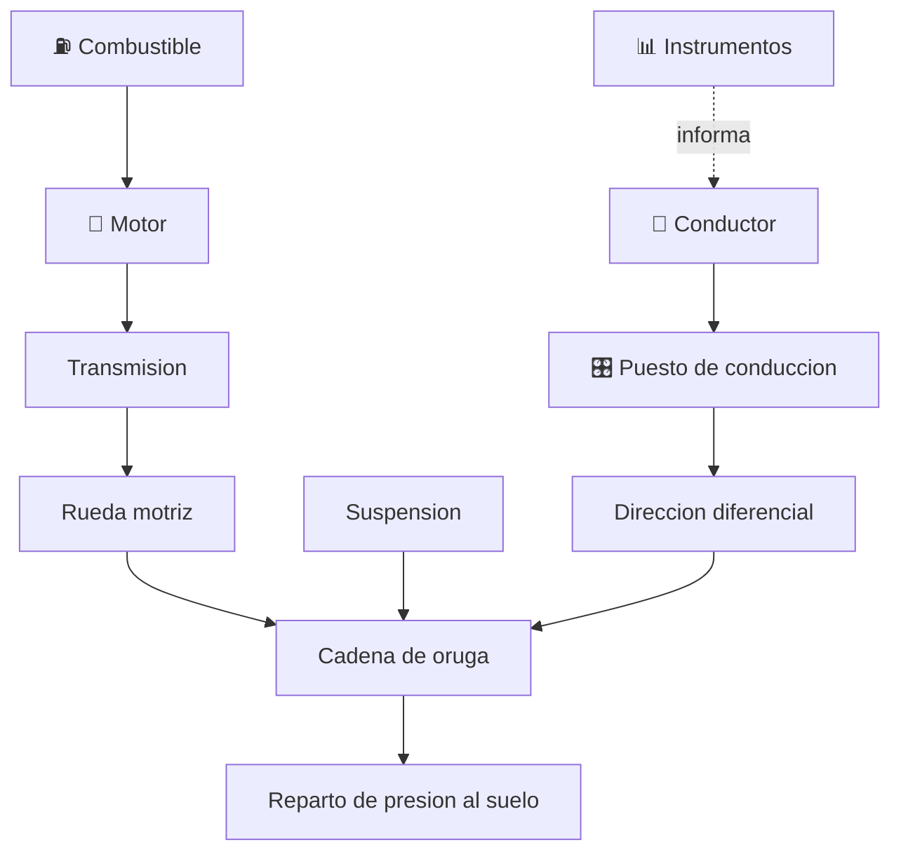

# 🪖 Curso: Tanques

[🏠 Inicio](../../README.md) · [🚙 Catalogo de vehiculos](../README.md) · [🎓 Guia de curso](../../docs/08-guia-de-estilo-y-curso.md)

> **Curso de marco publico e historico.** Documenta el carro de combate solo
> desde la historia publica, la fisica general del vehiculo con orugas y los
> principios de movilidad. **No** incluye tactica, sistemas de armas, blindaje
> ofensivo ni procedimientos operativos. Ver
> [🦺 docs/04-seguridad-y-limites.md](../../docs/04-seguridad-y-limites.md).

---

## 🎯 Objetivos de aprendizaje

Al terminar este curso deberias poder:

- Explicar como un vehiculo de orugas se mueve, gira y reparte su peso al suelo.
- Conocer la historia publica del carro de combate y su evolucion tecnica.
- Identificar el tren de rodaje, la suspension y la cadena cinematica general.
- Comprender la fisica de la movilidad: presion sobre el suelo y potencia/peso.
- Distinguir el marco institucional publico (Ejercito, Ley 18.948).
- Traducir la fisica del vehiculo en variables de un simulador educativo.

---

## 🛡️ Alcance y limites

Este curso se mantiene en el **marco publico y divulgativo**. Solo trata
historia publica, fisica del vehiculo y principios de movilidad. Quedan
**fuera** los sistemas de armas, el blindaje ofensivo, la tactica, la doctrina y
los procedimientos operativos, segun
[🦺 docs/04-seguridad-y-limites.md](../../docs/04-seguridad-y-limites.md). La
proteccion se menciona solo de forma divulgativa como masa que influye en la
movilidad.

---

## 🗺️ Mapa del vehiculo

---

## 📚 Modulos del curso

| # | Modulo | Contenido | Enlace |
| :-: | --- | --- | --- |
| 1 | 📜 Historia | Historia publica del carro de combate, linea de tiempo. | [Abrir](historia/historia-tanque.md) |
| 2 | 📋 Caracteristicas | Que es, tipos generales y para que se usa. | [Abrir](operacion/caracteristicas-tanque.md) |
| 3 | 🔧 Sistemas mecanicos | Tren de rodaje de orugas, suspension, motor y movilidad. | [Abrir](operacion/sistemas-mecanicos-tanque.md) |
| 4 | 🎛️ Mandos e instrumentos | Puesto del conductor a nivel general educativo. | [Abrir](mandos/manual-mandos-tanque.md) |
| 5 | 🧪 Principios y operacion | Fisica de la movilidad y fases generales. | [Abrir](operacion/principios-tanque.md) |
| 6 | 🌍 Entornos de trabajo | Terrenos, pendientes y obstaculos. | [Abrir](operacion/entornos-tanque.md) |
| 7 | ⚖️ Reglamentos | Marco institucional publico (Ejercito, Ley 18.948). | [Abrir](reglamentos/reglamentos-tanque.md) |
| 8 | 🎮 Diseno de simulacion | Variables de movilidad, ciclo y modos educativos. | [Abrir](simulacion/diseno-simulador-tanque.md) |
| 9 | 🧰 Recursos | Glosario, enlaces y diagramas. | [Abrir](recursos/recursos-tanque.md) |

---

## 🧩 Requisitos previos

Ninguno especifico. Ayuda haber visto antes un vehiculo con motor y transmision,
como los [🚗 automoviles](../automoviles/README.md), para entender la cadena
cinematica. Este curso la adapta al tren de rodaje de orugas desde un enfoque
solo divulgativo. Marco legal comun en
[⚖️ docs/07-marco-legal-chile.md](../../docs/07-marco-legal-chile.md), seccion
1.10 (tanques).

---

[➡️ Empezar por el Modulo 1: Historia](historia/historia-tanque.md)
