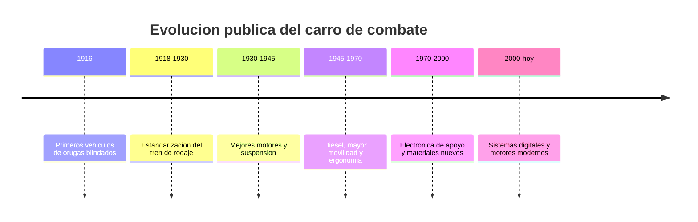

# 📜 Historia del tanque (marco publico)

[🏠 Inicio](../../../README.md) · [🪖 Curso: Tanques](../README.md) · 📜 Historia

Historia publica y divulgativa. Solo evolucion tecnica general del vehiculo, sin
tactica ni sistemas de armas. Ver
[`docs/04-seguridad-y-limites.md`](../../../docs/04-seguridad-y-limites.md).

## Origen

El carro de combate aparece a inicios del siglo XX como un vehiculo capaz de
cruzar terreno dificil gracias a las orugas. La idea central, desde el punto de
vista tecnico, es repartir el peso del vehiculo sobre una gran superficie para
moverse por barro y obstaculos donde una rueda se hundiria.

## Linea de tiempo

| Periodo | Hito tecnico publico | Importancia |
| --- | --- | --- |
| 1916 | Primeros vehiculos de orugas | Prueba del concepto de movilidad todo terreno. |
| 1918-1930 | Estandarizacion del tren de rodaje | Ruedas motriz, tensora y rodillos definidos. |
| 1930-1945 | Mejores motores y suspension | Mayor velocidad y confort de marcha. |
| 1945-1970 | Motores diesel | Mas autonomia y menor riesgo de incendio. |
| 1970-2000 | Electronica de apoyo | Instrumentos y ayudas a la conduccion. |
| 2000-presente | Sistemas digitales | Diagnostico y gestion moderna del vehiculo. |

## Evolucion tecnologica (aspectos publicos)

- **Movilidad**: del paso lento a mayor velocidad y autonomia.
- **Suspension**: de sistemas rigidos a barras de torsion e hidroneumaticas.
- **Motor**: de gasolina a diesel y turbina, buscando potencia/peso.
- **Ergonomia**: puestos mas comodos e instrumentos claros.
- **Materiales**: estructuras mas eficientes en peso y rigidez.
- **Electronica**: diagnostico, sensores y ayudas a la conduccion.

## Nota sobre alcance

Este modulo describe solo la evolucion del **vehiculo** como maquina de
movilidad. No trata armamento, blindaje ofensivo, tactica ni doctrina, en linea
con [`docs/04-seguridad-y-limites.md`](../../../docs/04-seguridad-y-limites.md).

## Fuentes

- Registrar aqui las fuentes publicas consultadas.
- Enlazar cada fuente tambien en [`manuales/fuentes.md`](../../../manuales/fuentes.md).

---

[🎓 Portada del curso](../README.md) · [➡️ Siguiente: Caracteristicas](../operacion/caracteristicas-tanque.md)
