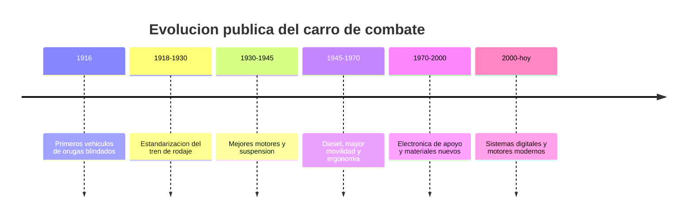

<!-- clase-meta
tipo_documento: clase
clase: 1
codigo: TANQUES-01
curso: tanques
titulo: "Historia del tanque (marco público)"
modalidad: "teórica dialogada"
duracion_minutos: 45
nivel: introductorio
prerrequisito: ninguno
competencia: "contexto_historico"
resultados_aprendizaje:
  - "Explicar origen, evolución tecnológica, variantes representativas e impacto con vocabulario propio de Tanques."
  - "Aplicar esos conceptos a una decisión segura o a un escenario de simulación de Tanques."
evidencia: "Línea de tiempo comentada con cuatro hitos o más."
criterio_aprobacion: "Los hitos están ordenados, son pertinentes y dos relaciones de causa y efecto quedan justificadas."
fuentes: manuales/fuentes.md
ultima_revision: 2026-09-10
-->

# 📜 Historia del tanque (marco público)

[🏠 Inicio](../../../README.md) · [🪖 Curso: Tanques](../README.md) · 📜 Historia

Historia pública y divulgativa. Solo evolución técnica general del vehículo, sin
táctica ni sistemas de armas. Ver
[`docs/04-seguridad-y-limites.md`](../../../docs/04-seguridad-y-limites.md).

```mermaid
timeline
    title Evolucion publica del carro de combate
    1916 : Primeros vehiculos de orugas blindados
    1918-1930 : Estandarizacion del tren de rodaje
    1930-1945 : Mejores motores y suspension
    1945-1970 : Diesel, mayor movilidad y ergonomia
    1970-2000 : Electronica de apoyo y materiales nuevos
    2000-hoy : Sistemas digitales y motores modernos
```

## Origen

El carro de combate aparece a inicios del siglo XX como un vehículo capaz de
cruzar terreno difícil gracias a las orugas. La idea central, desde el punto de
vista técnico, es repartir el peso del vehículo sobre una gran superficie para
moverse por barro y obstáculos donde una rueda se hundiría.

## Línea de tiempo

| Periodo | Hito técnico público | Importancia |
| --- | --- | --- |
| 1916 | Primeros vehículos de orugas | Prueba del concepto de movilidad todo terreno. |
| 1918-1930 | Estandarización del tren de rodaje | Ruedas motriz, tensora y rodillos definidos. |
| 1930-1945 | Mejores motores y suspensión | Mayor velocidad y confort de marcha. |
| 1945-1970 | Motores diesel | Más autonomía y menor riesgo de incendio. |
| 1970-2000 | Electrónica de apoyo | Instrumentos y ayudas a la conducción. |
| 2000-presente | Sistemas digitales | Diagnóstico y gestión moderna del vehículo. |

## Evolución tecnológica (aspectos públicos)

- **Movilidad**: del paso lento a mayor velocidad y autonomía.
- **Suspensión**: de sistemas rígidos a barras de torsión e hidroneumaticas.
- **Motor**: de gasolina a diesel y turbina, buscando potencia/peso.
- **Ergonomia**: puestos más cómodos e instrumentos claros.
- **Materiales**: estructuras más eficientes en peso y rigidez.
- **Electrónica**: diagnóstico, sensores y ayudas a la conducción.

## Nota sobre alcance

Esta clase describe solo la evolución del **vehículo** como máquina de
movilidad. No trata armamento, blindaje ofensivo, táctica ni doctrina, en línea
con [`docs/04-seguridad-y-limites.md`](../../../docs/04-seguridad-y-limites.md).

## 🧭 Guía de estudio aplicada

### Pregunta guía

¿Cómo ayuda **Origen, Línea de tiempo, Evolución tecnológica (aspectos públicos) y Nota sobre alcance** a **explicar cómo la evolución hizo posibles alternativas como carro pesado frente a vehículo blindado ligero**?

### Explicación razonada

La evolución de Tanques se comprende mejor como una sucesión de respuestas a problemas, no como una lista de fechas. Los cambios en motor, transmisión, ruedas tractoras y orugas alteraron qué podía hacer la máquina, quién podía usarla y qué riesgos debían controlarse. El contraste «carro pesado frente a vehículo blindado ligero» permite observar qué decisiones de diseño permanecieron y cuáles cambiaron con la tecnología y el propósito.

Esta clase se conecta con el resto del curso mediante **tracción y presión sobre el terreno condicionadas por masa, reparto y resistencia al avance**. El hilo de
seguridad consiste en reconocer a tiempo **atasco, pérdida de movilidad o exposición por elegir una ruta incompatible** y poder justificar la decisión
**reconocer capacidad del terreno y escoger ruta, velocidad y orientación del casco**; en clases posteriores cambiará el ángulo de análisis, no esa relación causal.
La lectura funcional común sigue **motor → transmisión → ruedas tractoras → orugas**, de modo que cada concepto pueda
ubicarse dentro del funcionamiento completo y no quede como un dato aislado.

**Apoyo documental:** [Tank Collection](https://tankmuseum.org/tank-nuts/tank-collection) aporta historia pública de vehículos blindados;
[Vehicle Safety](https://www.nhtsa.gov/vehicle-safety) se usa para seguridad de vehículos terrestres. Estas fuentes
se contrastan con el alcance de la clase y no sustituyen un manual de equipo concreto.

### Caso resuelto: de la observación a la decisión

1. **Situar:** ordena los hitos que explican cómo se llegó a **carro pesado frente a vehículo blindado ligero** y describe la necesidad que impulsó cada cambio.
2. **Relacionar:** explica qué se modificó en **motor**, **transmisión**, **ruedas tractoras** o **orugas**; una fecha sin mecanismo no basta.
3. **Interpretar:** vincula el cambio con una capacidad nueva y también con el riesgo **atasco, pérdida de movilidad o exposición por elegir una ruta incompatible**.
4. **Transferir:** usa la evolución para justificar por qué hoy conviene **reconocer capacidad del terreno y escoger ruta, velocidad y orientación del casco**.

### Comprueba tu comprensión

1. ¿Qué necesidad histórica impulsó un cambio en **motor** o **transmisión**?
2. ¿Qué hito modificó la relación entre capacidad y **atasco, pérdida de movilidad o exposición por elegir una ruta incompatible**?
3. ¿Por qué **carro pesado frente a vehículo blindado ligero** no puede explicarse como una simple diferencia estética?

Orientación para revisar tus respuestas

- La primera respuesta debe relacionar el eslabón elegido con un efecto posterior, no solo nombrarlo.
- La segunda debe proponer una señal medible u observable y explicar qué tendencia sería preocupante.
- La tercera debe cambiar al menos una variable de capacidad, mando, entorno o margen de seguridad.

## 🎓 Cierre de clase

- **Actividad:** Construye una línea de tiempo de Tanques y explica cómo dos cambios históricos transformaron su función o su puesto de mando.
- **Evidencia:** Línea de tiempo comentada con cuatro hitos o más.
- **Criterio de aprobación:** Los hitos están ordenados, son pertinentes y dos relaciones de causa y efecto quedan justificadas.
- **Transferencia:** explica qué cambiaría al pasar a otra variante de esta máquina.

### Fuentes de esta clase

- [TANK-MUSEUM](https://tankmuseum.org/tank-nuts/tank-collection): Tank Collection, The Tank Museum. Uso: historia pública de vehículos blindados.
- [US-NHTSA](https://www.nhtsa.gov/vehicle-safety): Vehicle Safety, NHTSA. Uso: seguridad de vehículos terrestres.
- [NASA-FLIGHT](https://www1.grc.nasa.gov/beginners-guide-to-aeronautics/): Beginner's Guide to Aeronautics, NASA. Uso: contraste con física y vuelo reales.

> Las fuentes sostienen el marco conceptual y normativo; esta clase no reemplaza el manual
> del fabricante, la formación certificada ni la habilitación exigida para operar equipos reales.

---

[🎓 Portada del curso](../README.md) · [➡️ Siguiente: Características](../operacion/caracteristicas-tanque.md)
