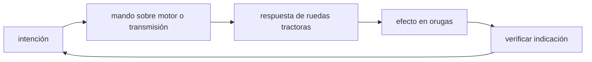

<!-- clase-meta
tipo_documento: clase
clase: 5
codigo: TANQUES-05
curso: tanques
titulo: "Mandos e instrumentos del tanque (marco público)"
modalidad: "taller de simulación"
duracion_minutos: 60
nivel: introductorio
prerrequisito: TANQUES-04
competencia: "lectura_y_mando"
resultados_aprendizaje:
  - "Explicar controles, instrumentos, entradas y estados del sistema con vocabulario propio de Tanques."
  - "Aplicar esos conceptos a una decisión segura o a un escenario de simulación de Tanques."
evidencia: "Mapa de mandos y resolución de dos estados del tablero."
criterio_aprobacion: "Reconoce los controles críticos y responde a los estados sin introducir acciones inseguras."
fuentes: manuales/fuentes.md
ultima_revision: 2026-09-10
-->

# 🎛️ Mandos e instrumentos del tanque (marco público)

[🏠 Inicio](../../../README.md) · [🪖 Curso: Tanques](../README.md) · 🎛️ Mandos

## Vista general

Esta clase describe **solo el puesto del conductor** a nivel general educativo:
cómo se mueve el vehículo. No trata puestos ni sistemas de combate, en línea con
[`docs/04-seguridad-y-limites.md`](../../../docs/04-seguridad-y-limites.md). El
conductor gobierna motor, transmisión y dirección diferencial, guiado por
instrumentos de movilidad.

## Mapa de controles de conducción

| Zona | Control | Tipo | Función | Prioridad | Comentarios |
| --- | --- | --- | --- | --- | --- |
| Manos | Dirección | Palancas o volante | Variar velocidad de cada oruga | Alta | Dirección diferencial. |
| Pies | Acelerador | Pedal | Regular potencia del motor | Alta | Progresivo. |
| Pies | Freno | Pedal | Reducir velocidad | Alta | Frena ambas orugas. |
| Mano | Cambio de marcha | Palanca o selector | Adaptar fuerza y velocidad | Alta | Según transmisión. |
| Panel | Arranque y paro | Botones | Encender o apagar motor | Alta | Incluye corte del motor. |
| Panel | Luces | Interruptores | Iluminación de marcha | Media | Conducción de día y noche. |
| Puesto | Escotilla | Palanca | Abrir o cerrar la posición | Media | Conducción abierta o cerrada. |

## Instrumentos de movilidad

| Instrumento | Mide o muestra | Unidad | Importancia | Notas |
| --- | --- | --- | --- | --- |
| Velocímetro | Velocidad | km/h | Alta | Para marcha segura. |
| Tacómetro | Régimen del motor | rpm | Media | Ayuda a elegir la marcha. |
| Temperatura del motor | Estado térmico | grados | Alta | Evita sobrecalentar. |
| Nivel de combustible | Combustible restante | fracción | Alta | Autonomía. |
| Presión de aceite | Lubricación | bar | Media | Fiabilidad del motor. |
| Testigos | Estado de sistemas | luz | Alta | Alertas de conducción. |

## Entradas de simulación

| Acción | Teclado | Controlador | Comentarios |
| --- | --- | --- | --- |
| Acelerar | Flecha arriba | Gatillo derecho | Progresivo. |
| Frenar | Flecha abajo | Gatillo izquierdo | Frena ambas orugas. |
| Girar izquierda | Flecha izquierda | Stick izquierdo | Reduce la oruga izquierda. |
| Girar derecha | Flecha derecha | Stick derecho | Reduce la oruga derecha. |
| Cambiar marcha | E / Q | Cruceta | Subir o bajar según transmisión. |
| Luces | Tecla L | Botón asignado | Día o noche. |

## Estados del sistema

| Estado | Descripción | Indicadores | Acciones disponibles |
| --- | --- | --- | --- |
| Apagado | Motor detenido | Panel off | Encender. |
| Preparado | Motor encendido, detenido | Testigos normales | Meter marcha, avanzar. |
| En movimiento | Avanzando en terreno | Velocímetro activo | Acelerar, frenar, girar. |
| Obstáculo | Pendiente o zanja | Alerta de inclinación | Reducir, elegir línea. |
| Alerta | Falla o riesgo | Testigos de alerta | Detener, revisar. |

## Observaciones ergonomicas

- Velocímetro, temperatura y combustible deben verse siempre.
- La dirección diferencial debe sentirse clara: girar es variar cada oruga.
- El corte de motor debe ser accesible y reconocible.
- La simulación se limita a la conducción; no representa sistemas sensibles.

## 🧭 Guía de estudio aplicada

### Pregunta guía

¿Cómo ayuda **Vista general, Mapa de controles de conducción, Instrumentos de movilidad y Entradas de simulación** a **interpretar mandos e indicaciones durante cruce simulado de suelo blando con cambio de pendiente**?

### Explicación razonada

Un mando no se aprende memorizando su nombre, sino recorriendo el ciclo intención → acción → indicación → verificación. En Tanques, el operador actúa sobre motor o transmisión, observa la respuesta en ruedas tractoras y confirma el efecto en orugas. Una indicación inesperada exige detener la secuencia mental, identificar el modo activo y evitar una segunda orden que agrave el estado.

Esta clase se conecta con el resto del curso mediante **tracción y presión sobre el terreno condicionadas por masa, reparto y resistencia al avance**. El hilo de
seguridad consiste en reconocer a tiempo **atasco, pérdida de movilidad o exposición por elegir una ruta incompatible** y poder justificar la decisión
**reconocer capacidad del terreno y escoger ruta, velocidad y orientación del casco**; en clases posteriores cambiará el ángulo de análisis, no esa relación causal.
La lectura funcional común sigue **motor → transmisión → ruedas tractoras → orugas**, de modo que cada concepto pueda
ubicarse dentro del funcionamiento completo y no quede como un dato aislado.

**Apoyo documental:** [Tank Collection](https://tankmuseum.org/tank-nuts/tank-collection) aporta historia pública de vehículos blindados;
[Vehicle Safety](https://www.nhtsa.gov/vehicle-safety) se usa para seguridad de vehículos terrestres. Estas fuentes
se contrastan con el alcance de la clase y no sustituyen un manual de equipo concreto.

### Caso resuelto: de la observación a la decisión

1. **Intención:** formula qué cambio se necesita durante **cruce simulado de suelo blando con cambio de pendiente**.
2. **Mando:** identifica el control que actúa sobre **motor** o **transmisión** y el modo que debe estar activo.
3. **Lectura:** localiza la indicación que confirma la respuesta de **ruedas tractoras** y el efecto en **orugas**.
4. **Verificación:** si la lectura no coincide, no acumules órdenes; estabiliza e investiga el estado.

### Comprueba tu comprensión

1. ¿Qué mando inicia la respuesta y qué instrumento confirma que el modo correcto está activo?
2. ¿Qué indicación temprana advertiría **atasco, pérdida de movilidad o exposición por elegir una ruta incompatible**?
3. ¿Qué secuencia usarías si la respuesta de **orugas** no coincide con la orden?

Orientación para revisar tus respuestas

- La primera respuesta debe relacionar el eslabón elegido con un efecto posterior, no solo nombrarlo.
- La segunda debe proponer una señal medible u observable y explicar qué tendencia sería preocupante.
- La tercera debe cambiar al menos una variable de capacidad, mando, entorno o margen de seguridad.

## 🎓 Cierre de clase

- **Actividad:** Recorre el puesto de mando simulado de Tanques: localiza los controles de controles, instrumentos, entradas y estados del sistema y asocia cada indicación con una decisión.
- **Evidencia:** Mapa de mandos y resolución de dos estados del tablero.
- **Criterio de aprobación:** Reconoce los controles críticos y responde a los estados sin introducir acciones inseguras.
- **Transferencia:** explica qué cambiaría al pasar a otra variante de esta máquina.

### Fuentes de esta clase

- [TANK-MUSEUM](https://tankmuseum.org/tank-nuts/tank-collection): Tank Collection, The Tank Museum. Uso: historia pública de vehículos blindados.
- [US-NHTSA](https://www.nhtsa.gov/vehicle-safety): Vehicle Safety, NHTSA. Uso: seguridad de vehículos terrestres.
- [NASA-FLIGHT](https://www1.grc.nasa.gov/beginners-guide-to-aeronautics/): Beginner's Guide to Aeronautics, NASA. Uso: contraste con física y vuelo reales.

> Las fuentes sostienen el marco conceptual y normativo; esta clase no reemplaza el manual
> del fabricante, la formación certificada ni la habilitación exigida para operar equipos reales.

---

[⬅️ Anterior: Sistemas mecánicos](../operacion/sistemas-mecanicos-tanque.md) · [➡️ Siguiente: Principios y operación](../operacion/principios-tanque.md)
