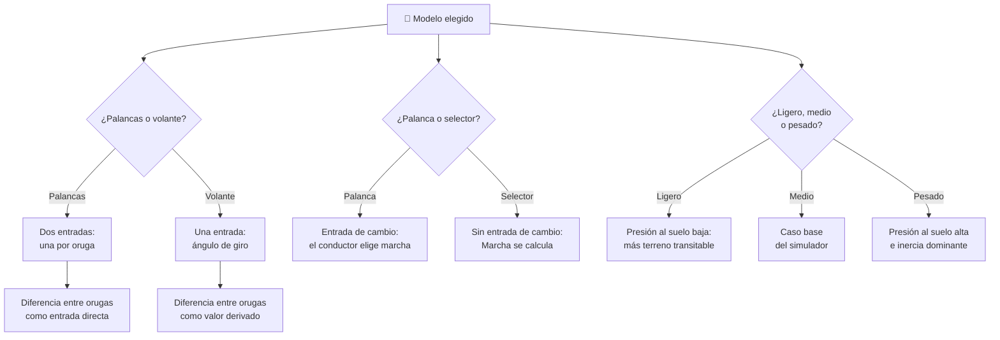

<!-- clase-meta
tipo_documento: clase
clase: 3
codigo: TANQUES-03
curso: tanques
titulo: "Modelos y variantes del tanque"
modalidad: "comparativa guiada"
duracion_minutos: 60
nivel: introductorio
prerrequisito: TANQUES-02
competencia: "seleccion_de_configuracion"
resultados_aprendizaje:
  - "Explicar manejo, arquitectura de mandos y variables de simulación con vocabulario propio de Tanques."
  - "Aplicar esos conceptos a una decisión segura o a un escenario de simulación de Tanques."
evidencia: "Matriz comparativa y decisión justificada."
criterio_aprobacion: "La elección considera función, límites, mando y efecto en la simulación; no se apoya solo en preferencias."
fuentes: manuales/fuentes.md
ultima_revision: 2026-09-10
-->

# 🧩 Modelos y variantes del tanque

[🏠 Inicio](../../../README.md) · [🪖 Curso: Tanques](../README.md) · 🧩 Modelos

El [Clase 2](../operacion/caracteristicas-tanque.md) ya dijo qué familias
existen según su movilidad: ligero, medio, pesado, y con suspensión de barras de
torsión o hidroneumática. Esta clase responde a lo siguiente: **no todos se
conducen igual**, y esa diferencia no es de matiz. Cambia qué mandos tiene la
máquina y, por tanto, qué debe modelar el simulador.

> 🎯 **La idea que sostiene el módulo.** "Un tanque" no es una sola máquina desde
> el punto de vista del mando. Un vehículo con dos palancas de dirección y uno
> con volante no ofrecen el mismo control: no es que uno sea más difícil, es que
> **la entrada es otra**. Aquí los modelos se distinguen solo por movilidad —
> peso, dirección, tren de rodaje y relación potencia/peso — en línea con
> [`docs/04-seguridad-y-limites.md`](../../../docs/04-seguridad-y-limites.md).
> Nada de armamento, táctica ni doctrina.

---

## 🧭 Por qué el modelo decide el simulador

El [Clase 5](../mandos/manual-mandos-tanque.md) describe la dirección como
"palancas o volante" y el cambio de marcha como "palanca o selector, según
transmisión". Esa disyuntiva no está resuelta: el propio curso admite que hay
dos puestos de conducción distintos bajo el mismo módulo.

El [Clase 9](../simulacion/diseno-simulador-tanque.md) expone la variable
`Diferencia entre orugas` con rango `-1..1`. En un vehículo de palancas esa
diferencia **es lo que el conductor manda**: cada palanca controla una oruga y
el conductor las combina. En un vehículo de volante, `Diferencia entre orugas`
deja de ser una entrada y pasa a ser un valor **calculado** por la transmisión a
partir de un ángulo de giro único.

Si el simulador se construye sobre el esquema de palancas y luego se le "añade"
el volante, el resultado es un volante que manda dos orugas por separado, que no
es lo que hace un volante.

---

## 🗂️ Qué cambia en el manejo

| Modelo | Qué cambia al conducirlo |
| --- | --- |
| Ligero | Menos masa y menos presión sobre el suelo: acelera y frena antes, y mantiene movilidad en terreno blando donde otro se hundiría. |
| Medio | La referencia del curso: equilibrio entre peso y movilidad, sin extremos en ningún sentido. |
| Pesado | Mucha inercia: entra y sale de todo con retraso. Sube la presión sobre el suelo y exige más motor para la misma pendiente. |
| Suspensión de barras de torsión | Marcha robusta y previsible; la oruga salta más en terreno irregular y obliga a bajar la velocidad segura. |
| Suspensión hidroneumática | Mejor apoyo de la oruga y control de altura: permite mantener velocidad donde la torsión obliga a levantar el pie. |
| Dirección por palancas | Girar es un acto de dos manos: se combinan dos entradas independientes, una por oruga. |
| Dirección por volante | Girar es un acto de una entrada: se pide un radio y la transmisión reparte. |
| Relación potencia/peso alta | Arranca en terreno difícil y sube pendiente sin agotar la marcha. |
| Relación potencia/peso baja | Obliga a anticipar: hay que elegir la marcha corta antes del obstáculo, no durante. |

---

## 🎛️ Qué cambia en el mando

| Modelo | Qué mando aparece o desaparece | Consecuencia |
| --- | --- | --- |
| Ligero, Medio, Pesado | Ninguno: el mapa de controles del Clase 5 aplica tal cual. | Cambian los rangos y los tiempos de respuesta, no los controles. |
| Suspensión de torsión / hidroneumática | Ninguno en la conducción básica. La hidroneumática puede **añadir** un control de altura de marcha. | Un mando más de ajuste, no una forma distinta de conducir. |
| Dirección por palancas | La dirección son **dos** mandos: una palanca por oruga. | Ambas manos quedan ocupadas en la dirección; el conductor manda cada lado por separado. |
| Dirección por volante | Las dos palancas **desaparecen** y se sustituyen por **un** mando único. | Una mano basta para dirigir; el reparto entre orugas deja de ser decisión del conductor. |
| Transmisión con palanca de cambio | El cambio de marcha es un mando explícito, como declara el Clase 5. | El conductor elige la marcha antes del obstáculo. |
| Transmisión con selector | La elección de marcha individual **desaparece** de la mano del conductor. | El pie derecho asume lo que antes decidía la mano; el error de "marcha larga en pendiente" deja de ser posible. |

---

## 🎮 Qué cambia en el simulador

Contrastado con las variables del
[Clase 9](../simulacion/diseno-simulador-tanque.md):

| Modelo | Variables que cambian | Esquema de control |
| --- | --- | --- |
| Medio | Ninguna: es el caso base. | El del Clase 5. |
| Ligero | `Presión sobre el suelo` baja y deja de limitar en barro. `Velocidad` usa la parte alta del rango `0-70 km/h`. | El mismo, con respuesta más viva. |
| Pesado | `Presión sobre el suelo` sube y condiciona el terreno transitable. `Pendiente` exige más par para el mismo grado. | El mismo, con respuesta más lenta. |
| Suspensión de torsión | `Adherencia` se degrada en terreno irregular porque la oruga pierde apoyo a velocidad alta. | El mismo. |
| Suspensión hidroneumática | `Adherencia` se sostiene mejor en irregular; aparece la altura de marcha como entrada opcional. | El mismo, más un ajuste de altura. |
| Dirección por palancas | `Diferencia entre orugas` es una **entrada directa**: el usuario fija el valor `-1..1` combinando dos ejes. | Dos entradas independientes de dirección. |
| Dirección por volante | `Diferencia entre orugas` deja de ser entrada y pasa a ser **derivada** de un ángulo de giro único. | Una sola entrada de dirección. |
| Transmisión con selector | `Marcha` deja de ser entrada del usuario y se calcula desde `Velocidad` y demanda de par. | Sin entrada de cambio de marcha. |
| Relación potencia/peso baja | `Pendiente` y `Temperatura del motor` se acoplan: sostener la subida calienta. `Combustible` cae más rápido por esfuerzo. | El mismo. |

---

## 🗺️ Del modelo al esquema de control

```mermaid
flowchart TD
    Modelo[🧩 Modelo elegido] --> Dir{¿Palancas o volante?}
    Dir -- Palancas --> Dos[Dos entradas:<br/>una por oruga]
    Dir -- Volante --> Una[Una entrada:<br/>ángulo de giro]
    Dos --> VarA[Diferencia entre orugas<br/>como entrada directa]
    Una --> VarB[Diferencia entre orugas<br/>como valor derivado]
    Modelo --> Trans{¿Palanca o selector?}
    Trans -- Palanca --> Manual[Entrada de cambio:<br/>el conductor elige marcha]
    Trans -- Selector --> Auto[Sin entrada de cambio:<br/>Marcha se calcula]
    Modelo --> Peso{¿Ligero, medio<br/>o pesado?}
    Peso -- Ligero --> Pres1[Presión al suelo baja:<br/>más terreno transitable]
    Peso -- Medio --> Pres2[Caso base<br/>del simulador]
    Peso -- Pesado --> Pres3[Presión al suelo alta<br/>e inercia dominante]
```

---

## ⚠️ Qué modelos no comparten simulador

Dos separaciones no se resuelven con un ajuste de parámetros, porque su esquema
de control es otro:

- **El volante frente a las palancas**: no es una dirección más cómoda, es una
  entrada menos. Con palancas, `Diferencia entre orugas` la escribe el usuario;
  con volante, la escribe la transmisión. Son dos modos de control distintos, no
  dos dificultades distintas. Un simulador que solo ofrezca un stick por lado
  está representando el vehículo de palancas, aunque diga representarlos todos.
- **El selector frente a la palanca de cambio**: obliga a que `Marcha` cambie de
  naturaleza. Deja de ser una entrada y pasa a ser un estado interno que el
  simulador calcula. Con ello desaparece del juego uno de los errores que el
  [Clase 6](../operacion/principios-tanque.md) quiere enseñar a evitar: subir
  una pendiente en marcha larga.

El resto de modelos —ligero, medio, pesado, y las dos suspensiones— sí caben en
un mismo simulador ajustando rangos, tal como plantean los
[niveles de realismo](../../../docs/03-niveles-de-realismo.md): en el nivel 1
casi todos se comportan igual, y las diferencias de masa, presión sobre el suelo
y potencia/peso solo emergen cuando el nivel sube.

> ⚖️ **El principio detrás de todo esto.** Cuánto pesa la carga y dónde va no cambia
> solo los números: cambia qué puede hacer el operador. La física común a todas las
> máquinas del catálogo —sostener, girar, equilibrar y la masa que cambia en
> marcha— está en [⚖️ carga y manejo](../../../docs/09-carga-y-manejo.md).

## 🧭 Guía de estudio aplicada

### Pregunta guía

¿Cómo ayuda **Por qué el modelo decide el simulador, Qué cambia en el manejo, Qué cambia en el mando y Qué cambia en el simulador** a **comparar carro pesado frente a vehículo blindado ligero frente al mismo encargo**?

### Explicación razonada

Las variantes «carro pesado frente a vehículo blindado ligero» resuelven prioridades distintas. Una comparación profesional sigue la cadena motor → transmisión → ruedas tractoras → orugas: cada cambio de arquitectura modifica mandos, respuesta, mantenimiento y variables que una simulación debe representar. Elegir un modelo significa justificar qué compromiso sirve mejor al caso, no declarar un favorito.

Esta clase se conecta con el resto del curso mediante **tracción y presión sobre el terreno condicionadas por masa, reparto y resistencia al avance**. El hilo de
seguridad consiste en reconocer a tiempo **atasco, pérdida de movilidad o exposición por elegir una ruta incompatible** y poder justificar la decisión
**reconocer capacidad del terreno y escoger ruta, velocidad y orientación del casco**; en clases posteriores cambiará el ángulo de análisis, no esa relación causal.
La lectura funcional común sigue **motor → transmisión → ruedas tractoras → orugas**, de modo que cada concepto pueda
ubicarse dentro del funcionamiento completo y no quede como un dato aislado.

**Apoyo documental:** [Tank Collection](https://tankmuseum.org/tank-nuts/tank-collection) aporta historia pública de vehículos blindados;
[Vehicle Safety](https://www.nhtsa.gov/vehicle-safety) se usa para seguridad de vehículos terrestres. Estas fuentes
se contrastan con el alcance de la clase y no sustituyen un manual de equipo concreto.

### Caso resuelto: de la observación a la decisión

1. **Mantener el encargo constante:** ambas variantes deben evaluarse ante **cruce simulado de suelo blando con cambio de pendiente**.
2. **Trazar consecuencias:** para cada variante sigue el efecto desde **motor** hasta **orugas**.
3. **Comparar el puesto de mando:** determina qué debe percibir y controlar el operador en cada arquitectura.
4. **Justificar:** elige una variante y explica qué sacrifica; toda selección técnica contiene un compromiso.

### Comprueba tu comprensión

1. ¿Qué cambia en la cadena **motor → transmisión → ruedas tractoras → orugas** entre las dos variantes?
2. ¿Qué indicación o mando adicional necesitaría una de ellas?
3. ¿Cuál elegirías para «cruce simulado de suelo blando con cambio de pendiente» y qué desventaja aceptarías?

Orientación para revisar tus respuestas

- La primera respuesta debe relacionar el eslabón elegido con un efecto posterior, no solo nombrarlo.
- La segunda debe proponer una señal medible u observable y explicar qué tendencia sería preocupante.
- La tercera debe cambiar al menos una variable de capacidad, mando, entorno o margen de seguridad.

## 🎓 Cierre de clase

- **Actividad:** Compara variantes de Tanques mediante los ejes «manejo, arquitectura de mandos y variables de simulación» y elige una para un caso de uso razonado.
- **Evidencia:** Matriz comparativa y decisión justificada.
- **Criterio de aprobación:** La elección considera función, límites, mando y efecto en la simulación; no se apoya solo en preferencias.
- **Transferencia:** explica qué cambiaría al pasar a otra variante de esta máquina.

### Fuentes de esta clase

- [TANK-MUSEUM](https://tankmuseum.org/tank-nuts/tank-collection): Tank Collection, The Tank Museum. Uso: historia pública de vehículos blindados.
- [US-NHTSA](https://www.nhtsa.gov/vehicle-safety): Vehicle Safety, NHTSA. Uso: seguridad de vehículos terrestres.
- [NASA-FLIGHT](https://www1.grc.nasa.gov/beginners-guide-to-aeronautics/): Beginner's Guide to Aeronautics, NASA. Uso: contraste con física y vuelo reales.

> Las fuentes sostienen el marco conceptual y normativo; esta clase no reemplaza el manual
> del fabricante, la formación certificada ni la habilitación exigida para operar equipos reales.

---

[⬅️ Anterior: Características](../operacion/caracteristicas-tanque.md) · [➡️ Siguiente: Sistemas mecánicos](../operacion/sistemas-mecanicos-tanque.md)
