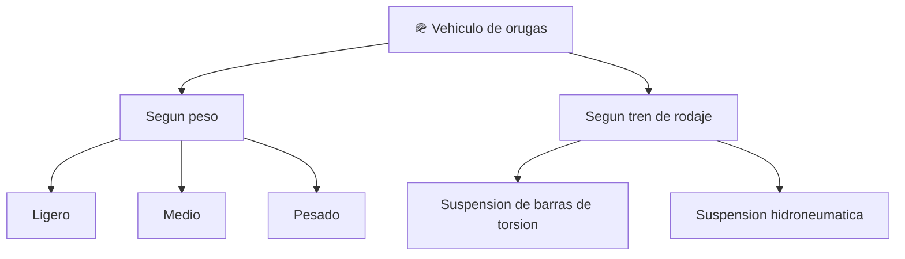

# 📋 Caracteristicas funcionales del tanque (marco publico)

[🏠 Inicio](../../../README.md) · [🪖 Curso: Tanques](../README.md) · 📋 Caracteristicas

Que es un carro de combate como vehiculo, que familias existen segun su movilidad
y para que sirve el tren de orugas. Solo enfoque publico y divulgativo; sin
armamento ni tactica. Este modulo da contexto antes de la mecanica (Modulo 3).

---

## 🧭 Definicion

Un carro de combate es un vehiculo terrestre de orugas, pesado y de alta
movilidad en terreno dificil. Desde el punto de vista tecnico que trata este
curso, es una plataforma que reparte un gran peso sobre el suelo mediante orugas
para avanzar donde las ruedas se hundirian.

---

## 🧬 Caracteristicas clave (aspectos publicos)

| Caracteristica | Descripcion |
| --- | --- |
| Traccion por orugas | Reparte el peso en una superficie amplia y da agarre en barro. |
| Baja presion sobre el suelo | Menor hundimiento que una rueda para el mismo peso. |
| Direccion diferencial | Gira frenando o acelerando una oruga respecto a la otra. |
| Alta masa | Gran peso que exige mucho motor y afecta la inercia. |
| Movilidad todo terreno | Supera pendientes, zanjas y obstaculos. |
| Proteccion como masa | El blindaje se menciona solo como peso que influye en la movilidad. |

---

## 🗂️ Familias por movilidad

| Familia | Rasgo de movilidad | Nota |
| --- | --- | --- |
| Ligero | Mas velocidad y menos presion al suelo | Mejor en terreno blando. |
| Medio | Equilibrio entre peso y movilidad | Uso general historico. |
| Pesado | Mas masa y menos agilidad | Exige mas motor y consumo. |
| Suspension de torsion | Marcha robusta y sencilla | Muy comun historicamente. |
| Suspension hidroneumatica | Mejor confort y control de altura | Solucion mas moderna. |

---

## 🎯 Para que se usa (enfoque publico)

- Movilidad en terreno dificil donde una rueda se hundiria.
- Estudio de la fisica de vehiculos de orugas.
- Contexto historico e institucional publico.
- Simulacion educativa de conduccion todo terreno, sin contenido sensible.

---

[⬅️ Anterior: Historia](../historia/historia-tanque.md) · [➡️ Siguiente: Sistemas mecanicos](sistemas-mecanicos-tanque.md)
