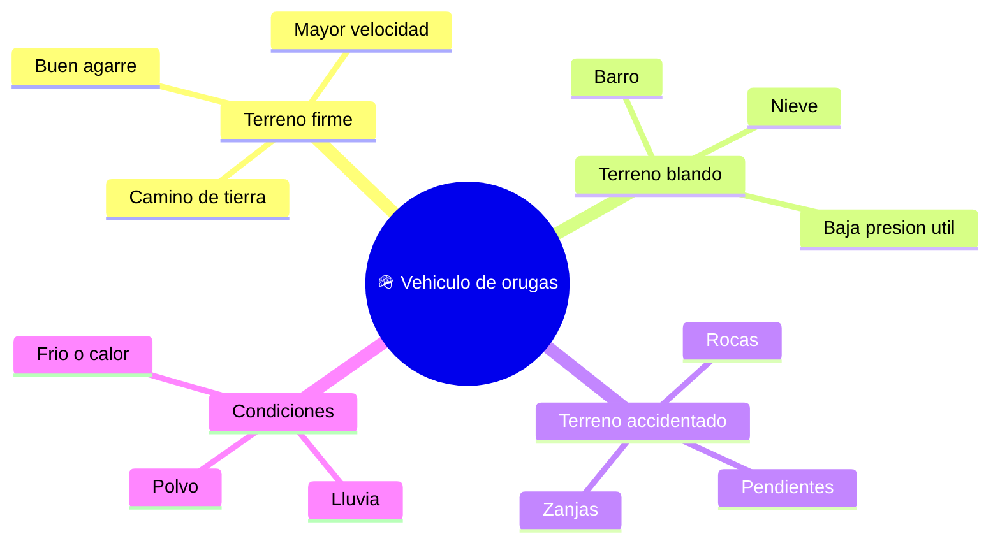

# 🌍 Entornos de trabajo del tanque (marco publico)

[🏠 Inicio](../../../README.md) · [🪖 Curso: Tanques](../README.md) · 🌍 Entornos

Donde se mueve un vehiculo de orugas y como cambia la conduccion segun el
terreno. Solo enfoque de movilidad; sin contenido sensible. Cada entorno implica
riesgos y ajustes distintos, y en simulacion se traduce en escenarios diferentes.

---

## 🗺️ Entornos principales

| Entorno | Caracteristicas | Riesgos tipicos | Ajuste de conduccion |
| --- | --- | --- | --- |
| Terreno firme | Tierra compacta, buen agarre. | Exceso de velocidad. | Marcha normal, buena visibilidad. |
| Terreno blando | Barro o nieve. | Patinaje y atasco. | Marcha corta, avance constante. |
| Terreno accidentado | Rocas, zanjas, pendientes. | Descarrilar una oruga. | Baja velocidad, linea cuidada. |
| Lluvia / polvo | Baja visibilidad. | No ver obstaculos. | Reducir, aumentar distancia. |
| Frio / calor | Estres del motor. | Sobrecalentar o congelar. | Vigilar temperatura y niveles. |

---

## 🌦️ Factores del entorno

- **Superficie**: tierra, barro, roca o nieve cambian el agarre y la presion util.
- **Pendiente**: subir o bajar exige fuerza y control del acelerador.
- **Obstaculos**: zanjas y escalones ponen a prueba el tren de rodaje.
- **Clima**: lluvia, polvo y temperatura afectan visibilidad y motor.

---

## 🎮 Traduccion a simulacion

Cada entorno es un escenario con su superficie, pendiente y clima. Ver como se
modela en el
[Modulo 8: Diseno de simulacion](../simulacion/diseno-simulador-tanque.md).

---

[⬅️ Anterior: Principios y operacion](principios-tanque.md) · [➡️ Siguiente: Reglamentos](../reglamentos/reglamentos-tanque.md)
