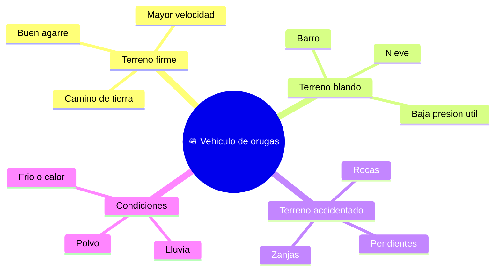

# 🌍 Entornos de trabajo del tanque (marco público)

[🏠 Inicio](../../../README.md) · [🪖 Curso: Tanques](../README.md) · 🌍 Entornos

Dónde se mueve un vehículo de orugas y cómo cambia la conducción según el
terreno. Solo enfoque de movilidad; sin contenido sensible. Cada entorno implica
riesgos y ajustes distintos, y en simulación se traduce en escenarios diferentes.

---

## 🗺️ Entornos principales

| Entorno | Características | Riesgos típicos | Ajuste de conducción |
| --- | --- | --- | --- |
| Terreno firme | Tierra compacta, buen agarre. | Exceso de velocidad. | Marcha normal, buena visibilidad. |
| Terreno blando | Barro o nieve. | Patinaje y atasco. | Marcha corta, avance constante. |
| Terreno accidentado | Rocas, zanjas, pendientes. | Descarrilar una oruga. | Baja velocidad, línea cuidada. |
| Lluvia / polvo | Baja visibilidad. | No ver obstáculos. | Reducir, aumentar distancia. |
| Frío / calor | Estres del motor. | Sobrecalentar o congelar. | Vigilar temperatura y niveles. |

---

## 🌦️ Factores del entorno

- **Superficie**: tierra, barro, roca o nieve cambian el agarre y la presión útil.
- **Pendiente**: subir o bajar exige fuerza y control del acelerador.
- **Obstáculos**: zanjas y escalones ponen a prueba el tren de rodaje.
- **Clima**: lluvia, polvo y temperatura afectan visibilidad y motor.

---

## 🎮 Traducción a simulación

Cada entorno es un escenario con su superficie, pendiente y clima. Ver cómo se
modela en el
[Módulo 8: Diseño de simulación](../simulacion/diseno-simulador-tanque.md).

---

[⬅️ Anterior: Principios y operación](principios-tanque.md) · [➡️ Siguiente: Reglamentos](../reglamentos/reglamentos-tanque.md)
