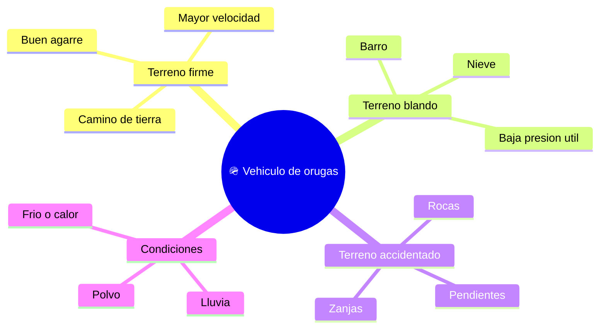

# 🌍 Entornos de trabajo del tanque (marco público)

[🏠 Inicio](../../../README.md) · [🪖 Curso: Tanques](../README.md) · 🌍 Entornos

Dónde se mueve un vehículo de orugas y cómo cambia la conducción según el
terreno. Solo enfoque de movilidad; sin contenido sensible. Cada entorno implica
riesgos y ajustes distintos, y en simulación se traduce en escenarios diferentes.

---

## 🗺️ Entornos principales

```mermaid
mindmap
  root((🪖 Vehiculo de orugas))
    Terreno firme
      Camino de tierra
      Buen agarre
      Mayor velocidad
    Terreno blando
      Barro
      Nieve
      Baja presion util
    Terreno accidentado
      Rocas
      Pendientes
      Zanjas
    Condiciones
      Lluvia
      Polvo
      Frio o calor
```

| Entorno | Características | Riesgos típicos | Ajuste de conducción |
| --- | --- | --- | --- |
| Terreno firme | Tierra compacta, buen agarre. | Exceso de velocidad. | Marcha normal, buena visibilidad. |
| Terreno blando | Barro o nieve. | Patinaje y atasco. | Marcha corta, avance constante. |
| Terreno accidentado | Rocas, zanjas, pendientes. | Descarrilar una oruga. | Baja velocidad, línea cuidada. |
| Lluvia / polvo | Baja visibilidad. | No ver obstáculos. | Reducir, aumentar distancia. |
| Frío / calor | Estres del motor. | Sobrecalentar o congelar. | Vigilar temperatura y niveles. |

---

## 🌦️ Factores del entorno

- **Superficie**: tierra, barro, roca o nieve cambian el agarre y la presión útil.
- **Pendiente**: subir o bajar exige fuerza y control del acelerador.
- **Obstáculos**: zanjas y escalones ponen a prueba el tren de rodaje.
- **Clima**: lluvia, polvo y temperatura afectan visibilidad y motor.

---

## 🎮 Traducción a simulación

Cada entorno es un escenario con su superficie, pendiente y clima. Ver cómo se
modela en el
[Módulo 9: Diseño de simulación](../simulacion/diseno-simulador-tanque.md).

## 🎓 Cierre de clase

- **Actividad:** Contrasta tres entornos de Tanques a partir de entornos, factores ambientales, riesgos y respuesta de simulación y determina cómo cambian variables, percepción, riesgos y respuesta.
- **Evidencia:** Matriz entorno–cambio–riesgo–respuesta.
- **Criterio de aprobación:** Cada respuesta se adapta al entorno y distingue riesgos que no son intercambiables entre escenarios.
- **Transferencia:** explica qué cambiaría al pasar a otra variante de esta máquina.

### Fuentes de esta clase

- [TANK-MUSEUM](https://tankmuseum.org/tank-nuts/tank-collection): Tank Collection, The Tank Museum. Uso: historia pública de vehículos blindados.
- [US-NHTSA](https://www.nhtsa.gov/vehicle-safety): Vehicle Safety, NHTSA. Uso: seguridad de vehículos terrestres.
- [NASA-FLIGHT](https://www1.grc.nasa.gov/beginners-guide-to-aeronautics/): Beginner's Guide to Aeronautics, NASA. Uso: contraste con física y vuelo reales.

> Las fuentes sostienen el marco conceptual y normativo; esta clase no reemplaza el manual
> del fabricante, la formación certificada ni la habilitación exigida para operar equipos reales.

---

[⬅️ Anterior: Principios y operación](principios-tanque.md) · [➡️ Siguiente: Reglamentos](../reglamentos/reglamentos-tanque.md)
