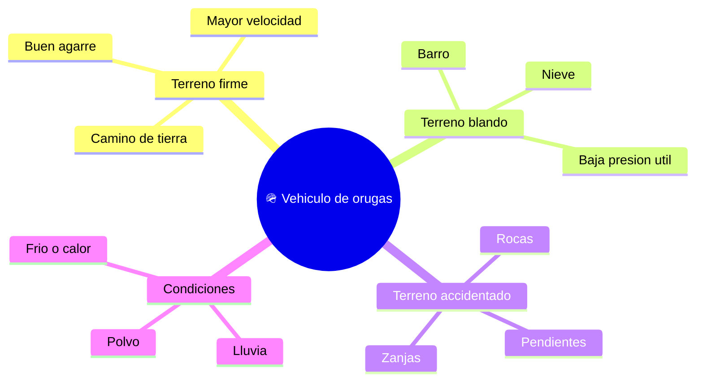

<!-- clase-meta
tipo_documento: clase
clase: 7
codigo: TANQUES-07
curso: tanques
titulo: "Entornos de trabajo del tanque (marco público)"
modalidad: "análisis de escenarios"
duracion_minutos: 60
nivel: introductorio
prerrequisito: TANQUES-06
competencia: "adaptacion_al_entorno"
resultados_aprendizaje:
  - "Explicar entornos, factores ambientales, riesgos y respuesta de simulación con vocabulario propio de Tanques."
  - "Aplicar esos conceptos a una decisión segura o a un escenario de simulación de Tanques."
evidencia: "Matriz entorno–cambio–riesgo–respuesta."
criterio_aprobacion: "Cada respuesta se adapta al entorno y distingue riesgos que no son intercambiables entre escenarios."
fuentes: manuales/fuentes.md
ultima_revision: 2026-09-10
-->

# 🌍 Entornos de trabajo del tanque (marco público)

[🏠 Inicio](../../../README.md) · [🪖 Curso: Tanques](../README.md) · 🌍 Entornos

Dónde se mueve un vehículo de orugas y cómo cambia la conducción según el
terreno. Solo enfoque de movilidad; sin contenido sensible. Cada entorno implica
riesgos y ajustes distintos, y en simulación se traduce en escenarios diferentes.

---

## 🗺️ Entornos principales

```mermaid
mindmap
  root((🪖 Vehiculo de orugas))
    Terreno firme
      Camino de tierra
      Buen agarre
      Mayor velocidad
    Terreno blando
      Barro
      Nieve
      Baja presion util
    Terreno accidentado
      Rocas
      Pendientes
      Zanjas
    Condiciones
      Lluvia
      Polvo
      Frio o calor
```

| Entorno | Características | Riesgos típicos | Ajuste de conducción |
| --- | --- | --- | --- |
| Terreno firme | Tierra compacta, buen agarre. | Exceso de velocidad. | Marcha normal, buena visibilidad. |
| Terreno blando | Barro o nieve. | Patinaje y atasco. | Marcha corta, avance constante. |
| Terreno accidentado | Rocas, zanjas, pendientes. | Descarrilar una oruga. | Baja velocidad, línea cuidada. |
| Lluvia / polvo | Baja visibilidad. | No ver obstáculos. | Reducir, aumentar distancia. |
| Frío / calor | Estres del motor. | Sobrecalentar o congelar. | Vigilar temperatura y niveles. |

---

## 🌦️ Factores del entorno

- **Superficie**: tierra, barro, roca o nieve cambian el agarre y la presión útil.
- **Pendiente**: subir o bajar exige fuerza y control del acelerador.
- **Obstáculos**: zanjas y escalones ponen a prueba el tren de rodaje.
- **Clima**: lluvia, polvo y temperatura afectan visibilidad y motor.

---

## 🎮 Traducción a simulación

Cada entorno es un escenario con su superficie, pendiente y clima. Ver cómo se
modela en el
[Clase 9: Diseño de simulación](../simulacion/diseno-simulador-tanque.md).

## 🧭 Guía de estudio aplicada

### Pregunta guía

¿Cómo ayuda **Entornos principales, Factores del entorno, Traducción a simulación y Guía de estudio aplicada** a **adaptar cruce simulado de suelo blando con cambio de pendiente a tres condiciones ambientales distintas**?

### Explicación razonada

El entorno no es decoración: modifica las fuerzas, la percepción y el tiempo disponible. En el caso «cruce simulado de suelo blando con cambio de pendiente», cambia el comportamiento de orugas y aumenta la probabilidad de atasco, pérdida de movilidad o exposición por elegir una ruta incompatible. La respuesta correcta empieza por reconocer qué variable cambió y después adaptar límites, ruta o misión.

Esta clase se conecta con el resto del curso mediante **tracción y presión sobre el terreno condicionadas por masa, reparto y resistencia al avance**. El hilo de
seguridad consiste en reconocer a tiempo **atasco, pérdida de movilidad o exposición por elegir una ruta incompatible** y poder justificar la decisión
**reconocer capacidad del terreno y escoger ruta, velocidad y orientación del casco**; en clases posteriores cambiará el ángulo de análisis, no esa relación causal.
La lectura funcional común sigue **motor → transmisión → ruedas tractoras → orugas**, de modo que cada concepto pueda
ubicarse dentro del funcionamiento completo y no quede como un dato aislado.

**Apoyo documental:** [Tank Collection](https://tankmuseum.org/tank-nuts/tank-collection) aporta historia pública de vehículos blindados;
[Vehicle Safety](https://www.nhtsa.gov/vehicle-safety) se usa para seguridad de vehículos terrestres. Estas fuentes
se contrastan con el alcance de la clase y no sustituyen un manual de equipo concreto.

### Caso resuelto: de la observación a la decisión

1. **Escenario base:** conserva la misión «cruce simulado de suelo blando con cambio de pendiente» para poder comparar.
2. **Cambiar una condición:** modifica sucesivamente superficie o medio, visibilidad y perturbación externa.
3. **Recalcular margen:** explica cómo cada cambio afecta **orugas** y acerca o aleja **atasco, pérdida de movilidad o exposición por elegir una ruta incompatible**.
4. **Adaptar:** cambia límite, ruta, configuración o incluso cancela; no mantengas la misma respuesta por hábito.

### Comprueba tu comprensión

1. ¿Cómo cambiaría **orugas** si empeora la perturbación externa?
2. ¿Qué condición ambiental acerca más el escenario a **atasco, pérdida de movilidad o exposición por elegir una ruta incompatible**?
3. ¿Cuándo adaptarías la maniobra y cuándo la cancelarías?

Orientación para revisar tus respuestas

- La primera respuesta debe relacionar el eslabón elegido con un efecto posterior, no solo nombrarlo.
- La segunda debe proponer una señal medible u observable y explicar qué tendencia sería preocupante.
- La tercera debe cambiar al menos una variable de capacidad, mando, entorno o margen de seguridad.

## 🎓 Cierre de clase

- **Actividad:** Contrasta tres entornos de Tanques a partir de entornos, factores ambientales, riesgos y respuesta de simulación y determina cómo cambian variables, percepción, riesgos y respuesta.
- **Evidencia:** Matriz entorno–cambio–riesgo–respuesta.
- **Criterio de aprobación:** Cada respuesta se adapta al entorno y distingue riesgos que no son intercambiables entre escenarios.
- **Transferencia:** explica qué cambiaría al pasar a otra variante de esta máquina.

### Fuentes de esta clase

- [TANK-MUSEUM](https://tankmuseum.org/tank-nuts/tank-collection): Tank Collection, The Tank Museum. Uso: historia pública de vehículos blindados.
- [US-NHTSA](https://www.nhtsa.gov/vehicle-safety): Vehicle Safety, NHTSA. Uso: seguridad de vehículos terrestres.
- [NASA-FLIGHT](https://www1.grc.nasa.gov/beginners-guide-to-aeronautics/): Beginner's Guide to Aeronautics, NASA. Uso: contraste con física y vuelo reales.

> Las fuentes sostienen el marco conceptual y normativo; esta clase no reemplaza el manual
> del fabricante, la formación certificada ni la habilitación exigida para operar equipos reales.

---

[⬅️ Anterior: Principios y operación](principios-tanque.md) · [➡️ Siguiente: Reglamentos](../reglamentos/reglamentos-tanque.md)
