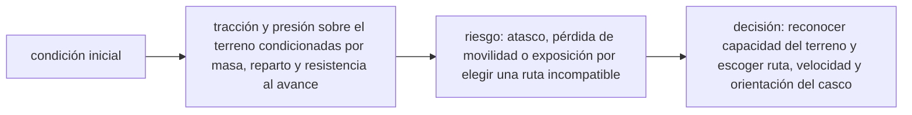

<!-- clase-meta
tipo_documento: clase
clase: 6
codigo: TANQUES-06
curso: tanques
titulo: "Principios y operación del tanque (marco público)"
modalidad: "resolución de problemas"
duracion_minutos: 90
nivel: introductorio
prerrequisito: TANQUES-05
competencia: "razonamiento_operacional"
resultados_aprendizaje:
  - "Explicar principios físicos, fases de operación, decisiones y errores frecuentes con vocabulario propio de Tanques."
  - "Aplicar esos conceptos a una decisión segura o a un escenario de simulación de Tanques."
evidencia: "Resolución argumentada de un escenario operacional."
criterio_aprobacion: "Aplica los principios correctos, anticipa consecuencias y respeta los límites del curso."
fuentes: manuales/fuentes.md
ultima_revision: 2026-09-10
-->

# 🧪 Principios y operación del tanque (marco público)

[🏠 Inicio](../../../README.md) · [🪖 Curso: Tanques](../README.md) · 🧪 Principios

Documento general y educativo, **solo de movilidad**. No sustituye formación real
ni trata contenido sensible, en línea con
[`docs/04-seguridad-y-limites.md`](../../../docs/04-seguridad-y-limites.md).
Describe cómo se mueve el vehículo en simulación y que física conviene
representar.

## Principios de movilidad

- **Propulsión**: el motor entrega par a la rueda motriz, que mueve la cadena de
  oruga; el acelerador regula esa entrega.
- **Dirección diferencial**: el vehículo gira variando la velocidad de cada
  oruga, no orientando ruedas.
- **Reparto de presión**: al apoyar el peso en una gran superficie, el vehículo
  avanza por terreno blando sin hundirse.
- **Relación potencia/peso**: define la aceleración y la capacidad de subir
  pendientes con mucha masa.
- **Adherencia**: la oruga limita cuanta fuerza se puede aplicar antes de patinar
  en barro, roca o hielo.

## Fases de operación (movilidad)

| Fase | Que ocurre | Puntos clave |
| --- | --- | --- |
| Inspección previa | Revisión básica | Orugas, tensión, combustible, niveles. |
| Arranque | Encender el motor | Punto muerto, testigos normales. |
| Puesta en marcha | Iniciar avance | Marcha corta, acelerar suave. |
| Marcha | Avanzar por terreno | Elegir línea, mantener régimen adecuado. |
| Obstáculos | Pendiente, zanja, barro | Reducir, aproximar de frente, control fino. |
| Detención | Parar de forma segura | Frenar progresivo, dejar en marcha o freno. |
| Cierre | Dejar seguro | Motor apagado, freno puesto. |

## Superar un obstáculo: idea general

1. Aproximarse de frente y a baja velocidad.
2. Elegir una marcha corta para tener fuerza.
3. Mantener el acelerador constante sin golpes.
4. Cuidar el ángulo para no perder apoyo de las orugas.
5. Recuperar velocidad una vez superado el obstáculo.

## Errores comunes que la simulación puede enseñar a evitar

- Girar de forma brusca y perder tensión o apoyo de la oruga.
- Subir una pendiente en marcha larga sin fuerza suficiente.
- Acelerar de golpe en barro y hacer patinar las orugas.
- Ignorar la temperatura del motor con mucha carga.
- Abordar un obstáculo en ángulo y descarrilar una oruga.

## Relación con los niveles de realismo

- **Nivel 1 (educativo)**: avanzar, frenar y girar por dirección diferencial.
- **Nivel 2 (simplificado)**: agregar inercia, pendientes y límite de adherencia.
- **Nivel 3 (técnico)**: sumar marchas, potencia/peso y presión sobre el suelo.

Ver [`docs/03-niveles-de-realismo.md`](../../../docs/03-niveles-de-realismo.md) para el detalle de cada nivel.

## 🧭 Guía de estudio aplicada

### Pregunta guía

¿Cómo ayuda **Principios de movilidad, Fases de operación (movilidad), Superar un obstáculo: idea general y Errores comunes que la simulación puede enseñar a evitar** a **resolver cruce simulado de suelo blando con cambio de pendiente sin agotar el margen operacional**?

### Explicación razonada

El principio rector puede resumirse así: tracción y presión sobre el terreno condicionadas por masa, reparto y resistencia al avance. Esto explica por qué una misma orden produce resultados distintos cuando cambian velocidad, carga, configuración o entorno. Operar bien consiste en leer la tendencia antes de agotar el margen y tomar esta decisión: reconocer capacidad del terreno y escoger ruta, velocidad y orientación del casco.

Esta clase se conecta con el resto del curso mediante **tracción y presión sobre el terreno condicionadas por masa, reparto y resistencia al avance**. El hilo de
seguridad consiste en reconocer a tiempo **atasco, pérdida de movilidad o exposición por elegir una ruta incompatible** y poder justificar la decisión
**reconocer capacidad del terreno y escoger ruta, velocidad y orientación del casco**; en clases posteriores cambiará el ángulo de análisis, no esa relación causal.
La lectura funcional común sigue **motor → transmisión → ruedas tractoras → orugas**, de modo que cada concepto pueda
ubicarse dentro del funcionamiento completo y no quede como un dato aislado.

**Apoyo documental:** [Tank Collection](https://tankmuseum.org/tank-nuts/tank-collection) aporta historia pública de vehículos blindados;
[Vehicle Safety](https://www.nhtsa.gov/vehicle-safety) se usa para seguridad de vehículos terrestres. Estas fuentes
se contrastan con el alcance de la clase y no sustituyen un manual de equipo concreto.

### Caso resuelto: de la observación a la decisión

1. **Datos:** reconoce condiciones, configuración y margen disponibles en **cruce simulado de suelo blando con cambio de pendiente**.
2. **Modelo:** aplica **tracción y presión sobre el terreno condicionadas por masa, reparto y resistencia al avance** para predecir una tendencia antes de actuar.
3. **Riesgo:** explica mediante qué cadena de causas podría ocurrir **atasco, pérdida de movilidad o exposición por elegir una ruta incompatible**.
4. **Decisión:** ejecuta mentalmente **reconocer capacidad del terreno y escoger ruta, velocidad y orientación del casco** y define qué observación confirmaría que funcionó.

### Comprueba tu comprensión

1. ¿Qué variable del principio «tracción y presión sobre el terreno condicionadas por masa, reparto y resistencia al avance» cambia primero en el caso?
2. ¿Cómo se propaga ese cambio hasta **orugas**?
3. ¿Qué evidencia confirmaría que **reconocer capacidad del terreno y escoger ruta, velocidad y orientación del casco** conservó margen operacional?

Orientación para revisar tus respuestas

- La primera respuesta debe relacionar el eslabón elegido con un efecto posterior, no solo nombrarlo.
- La segunda debe proponer una señal medible u observable y explicar qué tendencia sería preocupante.
- La tercera debe cambiar al menos una variable de capacidad, mando, entorno o margen de seguridad.

## 🎓 Cierre de clase

- **Actividad:** Resuelve un escenario de Tanques explicando, paso a paso, cómo intervienen principios físicos, fases de operación, decisiones y errores frecuentes.
- **Evidencia:** Resolución argumentada de un escenario operacional.
- **Criterio de aprobación:** Aplica los principios correctos, anticipa consecuencias y respeta los límites del curso.
- **Transferencia:** explica qué cambiaría al pasar a otra variante de esta máquina.

### Fuentes de esta clase

- [TANK-MUSEUM](https://tankmuseum.org/tank-nuts/tank-collection): Tank Collection, The Tank Museum. Uso: historia pública de vehículos blindados.
- [US-NHTSA](https://www.nhtsa.gov/vehicle-safety): Vehicle Safety, NHTSA. Uso: seguridad de vehículos terrestres.
- [NASA-FLIGHT](https://www1.grc.nasa.gov/beginners-guide-to-aeronautics/): Beginner's Guide to Aeronautics, NASA. Uso: contraste con física y vuelo reales.

> Las fuentes sostienen el marco conceptual y normativo; esta clase no reemplaza el manual
> del fabricante, la formación certificada ni la habilitación exigida para operar equipos reales.

---

[⬅️ Anterior: Mandos](../mandos/manual-mandos-tanque.md) · [➡️ Siguiente: Entornos de trabajo](entornos-tanque.md)
