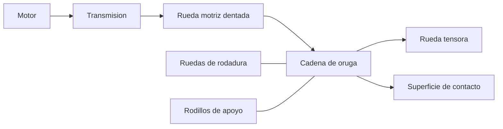
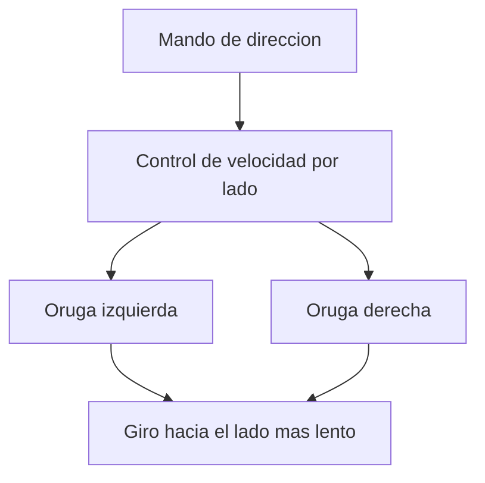

# 🔧 Sistemas mecanicos del tanque (marco publico)

[🏠 Inicio](../../../README.md) · [🪖 Curso: Tanques](../README.md) · 🔧 Sistemas mecanicos

Este modulo abre el vehiculo por dentro **solo en su fisica de movilidad**:
tren de rodaje de orugas, suspension, motor y direccion. **No** trata armamento,
blindaje ofensivo, tactica ni procedimientos, segun
[`docs/04-seguridad-y-limites.md`](../../../docs/04-seguridad-y-limites.md). Es
la base para entender los mandos (Modulo 4) y la fisica (Modulo 5).

---

## 1. 🔗 Tren de rodaje de orugas

El tren de rodaje es el corazon de la movilidad. Convierte el giro del motor en
avance sobre una cadena que se apoya en el suelo.

| Componente | Funcion |
| --- | --- |
| Rueda motriz dentada | Engrana con la cadena y la mueve. |
| Rueda tensora | Mantiene la tension correcta de la oruga. |
| Ruedas de rodadura | Reparten el peso a lo largo de la cadena. |
| Rodillos de apoyo | Sostienen el tramo superior de la oruga. |
| Cadena de oruga | Superficie continua que apoya en el suelo. |

---

## 2. 🌊 Suspension

Mantiene las orugas en contacto con el terreno y absorbe los baches, lo que
permite avanzar mas rapido y con mas control.

- **Barras de torsion**: barras que se retuercen y actuan como resorte; robustas
  y muy usadas.
- **Hidroneumatica**: usa gas y aceite; da mejor confort y puede regular altura.
- **Rueda de rodadura**: cada una lleva su elemento de suspension.
- **Efecto**: sin buena suspension, la oruga "salta" y pierde apoyo, reduciendo
  velocidad segura y control.

---

## 3. ⚙️ Motor y cadena cinematica

El motor entrega potencia; la transmision la adapta a la rueda motriz.

- **Motor**: normalmente diesel o de turbina, buscando buena relacion
  potencia/peso para mover mucha masa.
- **Transmision**: adapta fuerza y velocidad, como en un vehiculo de ruedas.
- **Relacion potencia/peso**: clave para la aceleracion y para subir pendientes.

| Parametro | Efecto en la movilidad |
| --- | --- |
| Potencia del motor | Capacidad de mover la masa y subir pendientes. |
| Relacion potencia/peso | Aceleracion y agilidad para el peso del vehiculo. |
| Par a bajas vueltas | Fuerza para arrancar en terreno dificil. |
| Consumo | Autonomia disponible. |

---

## 4. 🧭 Direccion diferencial

Un vehiculo de orugas no gira las ruedas: gira variando la velocidad de cada
oruga.

- **Giro suave**: se reduce la velocidad de una oruga respecto a la otra.
- **Giro cerrado**: mayor diferencia entre ambas orugas.
- **Giro sobre el eje**: las orugas se mueven en sentido contrario, girando casi
  en el sitio.

---

## 5. ⬇️ Reparto de presion sobre el suelo

La razon por la que un vehiculo pesado de orugas no se hunde es que reparte su
peso sobre una gran superficie de contacto.

- **Presion sobre el suelo**: peso dividido por la superficie de las orugas.
- **Menor hundimiento**: a igual peso, la oruga presiona menos que una rueda.
- **Terreno blando**: en barro o nieve, la baja presion mantiene la movilidad.
- **Proteccion como masa**: el blindaje agrega peso, lo que sube la presion al
  suelo y exige mas motor; se menciona solo en este sentido divulgativo.

---

## 🔁 Como se conecta todo

1. El **motor** genera potencia.
2. La **transmision** la adapta y mueve la **rueda motriz**.
3. La **cadena de oruga** convierte ese giro en avance.
4. La **suspension** mantiene el apoyo en terreno irregular.
5. La **direccion diferencial** cambia el rumbo variando cada oruga.
6. El **reparto de presion** permite avanzar sin hundirse.

Con esto entendido, el
[Modulo 4: Mandos](../mandos/manual-mandos-tanque.md) muestra el puesto de
conduccion a nivel general educativo.

---

[⬅️ Anterior: Caracteristicas](caracteristicas-tanque.md) · [➡️ Siguiente: Mandos e instrumentos](../mandos/manual-mandos-tanque.md)
