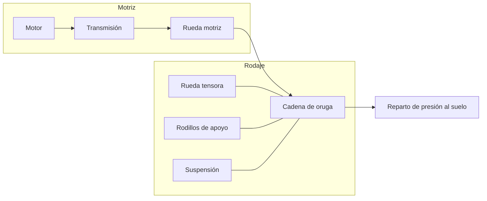

# 🔧 Sistemas mecánicos del tanque (marco público)

[🏠 Inicio](../../../README.md) · [🪖 Curso: Tanques](../README.md) · 🔧 Sistemas mecánicos

Este módulo abre el vehículo por dentro **solo en su física de movilidad**:
tren de rodaje de orugas, suspensión, motor y dirección. **No** trata armamento,
blindaje ofensivo, táctica ni procedimientos, según
[`docs/04-seguridad-y-limites.md`](../../../docs/04-seguridad-y-limites.md). Es
la base para entender los mandos (Módulo 5) y la física (Módulo 6).

---

## 1. 🔗 Tren de rodaje de orugas

El tren de rodaje es el corazón de la movilidad. Convierte el giro del motor en
avance sobre una cadena que se apoya en el suelo.

| Componente | Función |
| --- | --- |
| Rueda motriz dentada | Engrana con la cadena y la mueve. |
| Rueda tensora | Mantiene la tensión correcta de la oruga. |
| Ruedas de rodadura | Reparten el peso a lo largo de la cadena. |
| Rodillos de apoyo | Sostienen el tramo superior de la oruga. |
| Cadena de oruga | Superficie continua que apoya en el suelo. |

---

## 2. 🌊 Suspensión

Mantiene las orugas en contacto con el terreno y absorbe los baches, lo que
permite avanzar más rápido y con más control.

- **Barras de torsión**: barras que se retuercen y actuan como resorte; robustas
  y muy usadas.
- **Hidroneumatica**: usa gas y aceite; da mejor confort y puede regular altura.
- **Rueda de rodadura**: cada una lleva su elemento de suspensión.
- **Efecto**: sin buena suspensión, la oruga "salta" y pierde apoyo, reduciendo
  velocidad segura y control.

---

## 3. ⚙️ Motor y cadena cinemática

El motor entrega potencia; la transmisión la adapta a la rueda motriz.

- **Motor**: normalmente diesel o de turbina, buscando buena relación
  potencia/peso para mover mucha masa.
- **Transmisión**: adapta fuerza y velocidad, como en un vehículo de ruedas.
- **Relación potencia/peso**: clave para la aceleración y para subir pendientes.

| Parámetro | Efecto en la movilidad |
| --- | --- |
| Potencia del motor | Capacidad de mover la masa y subir pendientes. |
| Relación potencia/peso | Aceleración y agilidad para el peso del vehículo. |
| Par a bajas vueltas | Fuerza para arrancar en terreno difícil. |
| Consumo | Autonomía disponible. |

---

## 4. 🧭 Dirección diferencial

Un vehículo de orugas no gira las ruedas: gira variando la velocidad de cada
oruga.

- **Giro suave**: se reduce la velocidad de una oruga respecto a la otra.
- **Giro cerrado**: mayor diferencia entre ambas orugas.
- **Giro sobre el eje**: las orugas se mueven en sentido contrario, girando casi
  en el sitio.

---

## 5. ⬇️ Reparto de presión sobre el suelo

La razón por la que un vehículo pesado de orugas no se hunde es que reparte su
peso sobre una gran superficie de contacto.

- **Presión sobre el suelo**: peso dividido por la superficie de las orugas.
- **Menor hundimiento**: a igual peso, la oruga presiona menos que una rueda.
- **Terreno blando**: en barro o nieve, la baja presión mantiene la movilidad.
- **Protección como masa**: el blindaje agrega peso, lo que sube la presión al
  suelo y exige más motor; se menciona solo en este sentido divulgativo.

---

## 🔁 Cómo se conecta todo

1. El **motor** genera potencia.
2. La **transmisión** la adapta y mueve la **rueda motriz**.
3. La **cadena de oruga** convierte ese giro en avance.
4. La **suspensión** mantiene el apoyo en terreno irregular.
5. La **dirección diferencial** cambia el rumbo variando cada oruga.
6. El **reparto de presión** permite avanzar sin hundirse.

Con esto entendido, el
[Módulo 5: Mandos](../mandos/manual-mandos-tanque.md) muestra el puesto de
conducción a nivel general educativo.

---

[⬅️ Anterior: Modelos y variantes](../modelos/modelos-tanque.md) · [➡️ Siguiente: Mandos e instrumentos](../mandos/manual-mandos-tanque.md)
