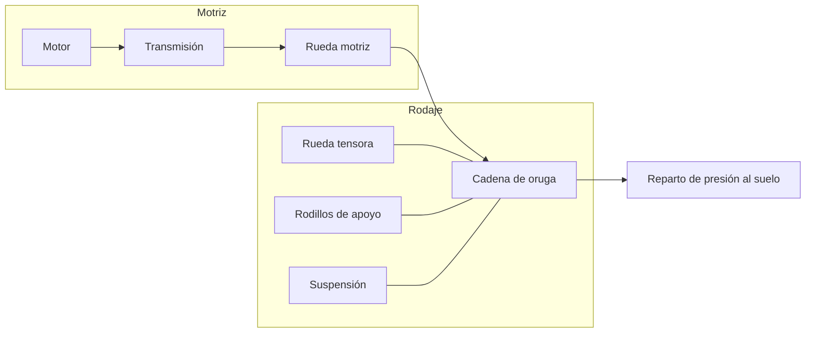
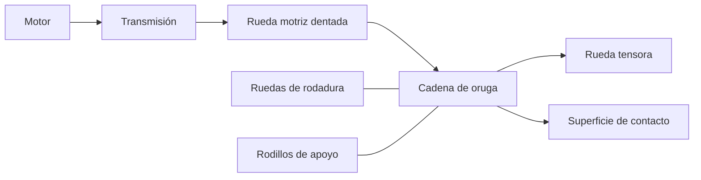
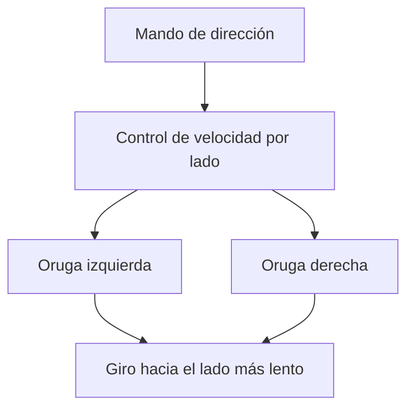
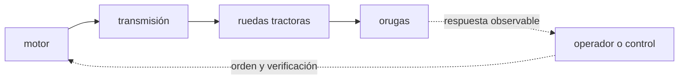

<!-- clase-meta
tipo_documento: clase
clase: 4
codigo: TANQUES-04
curso: tanques
titulo: "Sistemas mecánicos del tanque (marco público)"
modalidad: "teórica aplicada"
duracion_minutos: 90
nivel: introductorio
prerrequisito: TANQUES-03
competencia: "comprension_de_sistemas"
resultados_aprendizaje:
  - "Explicar Tren de rodaje de orugas, Suspensión, Motor y cadena cinemática y Dirección diferencial con vocabulario propio de Tanques."
  - "Aplicar esos conceptos a una decisión segura o a un escenario de simulación de Tanques."
evidencia: "Esquema con flujos de energía, materia o información anotados."
criterio_aprobacion: "Las conexiones esenciales son correctas y la consecuencia de la falla se propaga de manera coherente."
fuentes: manuales/fuentes.md
ultima_revision: 2026-09-10
-->

# 🔧 Sistemas mecánicos del tanque (marco público)

[🏠 Inicio](../../../README.md) · [🪖 Curso: Tanques](../README.md) · 🔧 Sistemas mecánicos

Esta clase abre el vehículo por dentro **solo en su física de movilidad**:
tren de rodaje de orugas, suspensión, motor y dirección. **No** trata armamento,
blindaje ofensivo, táctica ni procedimientos, según
[`docs/04-seguridad-y-limites.md`](../../../docs/04-seguridad-y-limites.md). Es
la base para entender los mandos (Clase 5) y la física (Clase 6).

```mermaid
flowchart LR
    subgraph Motriz
        Mo[Motor] --> Tr[Transmisión] --> Rm[Rueda motriz]
    end
    subgraph Rodaje
        Rm --> Or[Cadena de oruga]
        Rt[Rueda tensora] --- Or
        Ro[Rodillos de apoyo] --- Or
        Su[Suspensión] --- Or
    end
    Or --> Su2[Reparto de presión al suelo]
```

---

## 1. 🔗 Tren de rodaje de orugas

El tren de rodaje es el corazón de la movilidad. Convierte el giro del motor en
avance sobre una cadena que se apoya en el suelo.

```mermaid
flowchart LR
    Motor[Motor] --> Trans[Transmisión]
    Trans --> Motriz[Rueda motriz dentada]
    Motriz --> Cadena[Cadena de oruga]
    Cadena --> Tensora[Rueda tensora]
    Rodillos[Ruedas de rodadura] --- Cadena
    Apoyo[Rodillos de apoyo] --- Cadena
    Cadena --> Suelo[Superficie de contacto]
```

| Componente | Función |
| --- | --- |
| Rueda motriz dentada | Engrana con la cadena y la mueve. |
| Rueda tensora | Mantiene la tensión correcta de la oruga. |
| Ruedas de rodadura | Reparten el peso a lo largo de la cadena. |
| Rodillos de apoyo | Sostienen el tramo superior de la oruga. |
| Cadena de oruga | Superficie continua que apoya en el suelo. |

---

## 2. 🌊 Suspensión

Mantiene las orugas en contacto con el terreno y absorbe los baches, lo que
permite avanzar más rápido y con más control.

- **Barras de torsión**: barras que se retuercen y actuan como resorte; robustas
  y muy usadas.
- **Hidroneumatica**: usa gas y aceite; da mejor confort y puede regular altura.
- **Rueda de rodadura**: cada una lleva su elemento de suspensión.
- **Efecto**: sin buena suspensión, la oruga "salta" y pierde apoyo, reduciendo
  velocidad segura y control.

---

## 3. ⚙️ Motor y cadena cinemática

El motor entrega potencia; la transmisión la adapta a la rueda motriz.

- **Motor**: normalmente diesel o de turbina, buscando buena relación
  potencia/peso para mover mucha masa.
- **Transmisión**: adapta fuerza y velocidad, como en un vehículo de ruedas.
- **Relación potencia/peso**: clave para la aceleración y para subir pendientes.

| Parámetro | Efecto en la movilidad |
| --- | --- |
| Potencia del motor | Capacidad de mover la masa y subir pendientes. |
| Relación potencia/peso | Aceleración y agilidad para el peso del vehículo. |
| Par a bajas vueltas | Fuerza para arrancar en terreno difícil. |
| Consumo | Autonomía disponible. |

---

## 4. 🧭 Dirección diferencial

Un vehículo de orugas no gira las ruedas: gira variando la velocidad de cada
oruga.

```mermaid
flowchart TD
    Mando[Mando de dirección] --> Control[Control de velocidad por lado]
    Control --> Izq[Oruga izquierda]
    Control --> Der[Oruga derecha]
    Izq --> Giro[Giro hacia el lado más lento]
    Der --> Giro
```

- **Giro suave**: se reduce la velocidad de una oruga respecto a la otra.
- **Giro cerrado**: mayor diferencia entre ambas orugas.
- **Giro sobre el eje**: las orugas se mueven en sentido contrario, girando casi
  en el sitio.

---

## 5. ⬇️ Reparto de presión sobre el suelo

La razón por la que un vehículo pesado de orugas no se hunde es que reparte su
peso sobre una gran superficie de contacto.

- **Presión sobre el suelo**: peso dividido por la superficie de las orugas.
- **Menor hundimiento**: a igual peso, la oruga presiona menos que una rueda.
- **Terreno blando**: en barro o nieve, la baja presión mantiene la movilidad.
- **Protección como masa**: el blindaje agrega peso, lo que sube la presión al
  suelo y exige más motor; se menciona solo en este sentido divulgativo.

---

## 🔁 Cómo se conecta todo

1. El **motor** genera potencia.
2. La **transmisión** la adapta y mueve la **rueda motriz**.
3. La **cadena de oruga** convierte ese giro en avance.
4. La **suspensión** mantiene el apoyo en terreno irregular.
5. La **dirección diferencial** cambia el rumbo variando cada oruga.
6. El **reparto de presión** permite avanzar sin hundirse.

Con esto entendido, el
[Clase 5: Mandos](../mandos/manual-mandos-tanque.md) muestra el puesto de
conducción a nivel general educativo.

## 🧭 Guía de estudio aplicada

### Pregunta guía

¿Cómo ayuda **Tren de rodaje de orugas, Suspensión, Motor y cadena cinemática y Dirección diferencial** a **seguir una alteración desde motor hasta orugas durante cruce simulado de suelo blando con cambio de pendiente**?

### Explicación razonada

El funcionamiento puede leerse como una cadena causal: motor entrega o transforma energía; transmisión la adapta; ruedas tractoras la transmite o gobierna; y orugas produce el efecto observable. La cadena no es lineal en sentido estricto: sensores, estructura y operador cierran el lazo. Si un eslabón se degrada, la señal importante es cómo cambia el estado de orugas y qué margen queda.

```mermaid
flowchart LR
    A["motor"] --> B["transmisión"] --> C["ruedas tractoras"] --> D["orugas"]
    D -. respuesta observable .-> O["operador o control"]
    O -. orden y verificación .-> A
```

Esta clase se conecta con el resto del curso mediante **tracción y presión sobre el terreno condicionadas por masa, reparto y resistencia al avance**. El hilo de
seguridad consiste en reconocer a tiempo **atasco, pérdida de movilidad o exposición por elegir una ruta incompatible** y poder justificar la decisión
**reconocer capacidad del terreno y escoger ruta, velocidad y orientación del casco**; en clases posteriores cambiará el ángulo de análisis, no esa relación causal.
La lectura funcional común sigue **motor → transmisión → ruedas tractoras → orugas**, de modo que cada concepto pueda
ubicarse dentro del funcionamiento completo y no quede como un dato aislado.

**Apoyo documental:** [Tank Collection](https://tankmuseum.org/tank-nuts/tank-collection) aporta historia pública de vehículos blindados;
[Vehicle Safety](https://www.nhtsa.gov/vehicle-safety) se usa para seguridad de vehículos terrestres. Estas fuentes
se contrastan con el alcance de la clase y no sustituyen un manual de equipo concreto.

### Caso resuelto: de la observación a la decisión

1. **Entrada:** identifica el estado inicial de **motor** durante **cruce simulado de suelo blando con cambio de pendiente**.
2. **Transformación:** explica qué hacen **transmisión** y **ruedas tractoras**, y qué magnitud cambia en cada paso.
3. **Salida:** comprueba el efecto esperado en **orugas** y busca una desviación temprana.
4. **Falla razonada:** si aparece **atasco, pérdida de movilidad o exposición por elegir una ruta incompatible**, retrocede por la cadena antes de ordenar otra acción.

### Comprueba tu comprensión

1. Si se degrada **transmisión**, ¿qué efecto esperarías primero en **ruedas tractoras** y después en **orugas**?
2. ¿Qué observación ayudaría a diferenciar una falla de **motor** de una falla de **ruedas tractoras**?
3. ¿Por qué una segunda orden podría agravar **atasco, pérdida de movilidad o exposición por elegir una ruta incompatible**?

Orientación para revisar tus respuestas

- La primera respuesta debe relacionar el eslabón elegido con un efecto posterior, no solo nombrarlo.
- La segunda debe proponer una señal medible u observable y explicar qué tendencia sería preocupante.
- La tercera debe cambiar al menos una variable de capacidad, mando, entorno o margen de seguridad.

## 🎓 Cierre de clase

- **Actividad:** Dibuja un esquema funcional de Tanques que conecte Tren de rodaje de orugas, Suspensión, Motor y cadena cinemática y Dirección diferencial; después predice el efecto de una falla simulada.
- **Evidencia:** Esquema con flujos de energía, materia o información anotados.
- **Criterio de aprobación:** Las conexiones esenciales son correctas y la consecuencia de la falla se propaga de manera coherente.
- **Transferencia:** explica qué cambiaría al pasar a otra variante de esta máquina.

### Fuentes de esta clase

- [TANK-MUSEUM](https://tankmuseum.org/tank-nuts/tank-collection): Tank Collection, The Tank Museum. Uso: historia pública de vehículos blindados.
- [US-NHTSA](https://www.nhtsa.gov/vehicle-safety): Vehicle Safety, NHTSA. Uso: seguridad de vehículos terrestres.
- [NASA-FLIGHT](https://www1.grc.nasa.gov/beginners-guide-to-aeronautics/): Beginner's Guide to Aeronautics, NASA. Uso: contraste con física y vuelo reales.

> Las fuentes sostienen el marco conceptual y normativo; esta clase no reemplaza el manual
> del fabricante, la formación certificada ni la habilitación exigida para operar equipos reales.

---

[⬅️ Anterior: Modelos y variantes](../modelos/modelos-tanque.md) · [➡️ Siguiente: Mandos e instrumentos](../mandos/manual-mandos-tanque.md)
