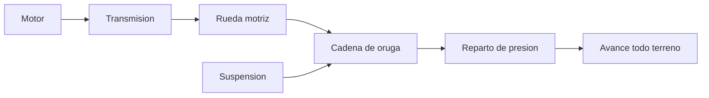

# 🧰 Recursos del tanque (marco publico)

[🏠 Inicio](../../../README.md) · [🪖 Curso: Tanques](../README.md) · 🧰 Recursos

Glosario especifico, enlaces y diagramas de apoyo del curso de tanques, **solo
de movilidad e historia publica**. Amplia el
[glosario general](../../../docs/05-glosario-general.md).

---

## 📖 Glosario especifico

| Termino | Definicion |
| --- | --- |
| Tren de rodaje | Conjunto de ruedas y cadena que permite avanzar sobre orugas. |
| Oruga | Cadena continua que reparte el peso y da agarre en terreno dificil. |
| Rueda motriz | Rueda dentada que engrana y mueve la cadena. |
| Rueda tensora | Mantiene la tension correcta de la oruga. |
| Direccion diferencial | Giro logrado variando la velocidad de cada oruga. |
| Presion sobre el suelo | Peso repartido por la superficie de las orugas. |
| Relacion potencia/peso | Potencia del motor frente a la masa del vehiculo. |
| Barra de torsion | Elemento de suspension que se retuerce como resorte. |

---

## 🗺️ Diagrama de movilidad

---

## 🔗 Enlaces y fuentes

- Seguridad y limites: [🦺 docs/04-seguridad-y-limites.md](../../../docs/04-seguridad-y-limites.md)
- Marco institucional: [⚖️ docs/07-marco-legal-chile.md](../../../docs/07-marco-legal-chile.md)
- Registro de fuentes: [📚 manuales/fuentes.md](../../../manuales/fuentes.md)

Registrar cada recurso nuevo con su origen y licencia, siguiendo
[`recursos/README.md`](../../../recursos/README.md). Solo fuentes publicas.

---

[🎓 Portada del curso](../README.md) · [⬅️ Anterior: Diseno de simulacion](../simulacion/diseno-simulador-tanque.md)
