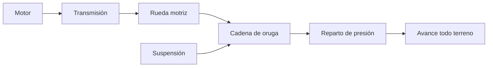

<!-- clase-meta
tipo_documento: clase
clase: 10
codigo: TANQUES-10
curso: tanques
titulo: "Recursos del tanque (marco público)"
modalidad: "taller documental"
duracion_minutos: 45
nivel: introductorio
prerrequisito: TANQUES-09
competencia: "alfabetizacion_tecnica"
resultados_aprendizaje:
  - "Explicar glosario, esquemas y trazabilidad de fuentes con vocabulario propio de Tanques."
  - "Aplicar esos conceptos a una decisión segura o a un escenario de simulación de Tanques."
evidencia: "Glosario aplicado y ficha breve de trazabilidad."
criterio_aprobacion: "Los términos permiten interpretar el curso y las fuentes se distinguen por autoridad, alcance y vigencia."
fuentes: manuales/fuentes.md
ultima_revision: 2026-09-10
-->

# 🧰 Recursos del tanque (marco público)

[🏠 Inicio](../../../README.md) · [🪖 Curso: Tanques](../README.md) · 🧰 Recursos

Glosario específico, enlaces y diagramas de apoyo del curso de tanques, **solo
de movilidad e historia pública**. Amplia el
[glosario general](../../../docs/05-glosario-general.md).

---

## 📖 Glosario específico

| Término | Definición |
| --- | --- |
| Tren de rodaje | Conjunto de ruedas y cadena que permite avanzar sobre orugas. |
| Oruga | Cadena continua que reparte el peso y da agarre en terreno difícil. |
| Rueda motriz | Rueda dentada que engrana y mueve la cadena. |
| Rueda tensora | Mantiene la tensión correcta de la oruga. |
| Dirección diferencial | Giro logrado variando la velocidad de cada oruga. |
| Presión sobre el suelo | Peso repartido por la superficie de las orugas. |
| Relación potencia/peso | Potencia del motor frente a la masa del vehículo. |
| Barra de torsión | Elemento de suspensión que se retuerce como resorte. |

---

## 🗺️ Diagrama de movilidad

```mermaid
flowchart LR
    Motor[Motor] --> Trans[Transmisión]
    Trans --> Motriz[Rueda motriz]
    Motriz --> Oruga[Cadena de oruga]
    Oruga --> Presion[Reparto de presión]
    Presion --> Avance[Avance todo terreno]
    Susp[Suspensión] --> Oruga
```

---

## 🔗 Enlaces y fuentes

- Seguridad y límites: [🦺 docs/04-seguridad-y-limites.md](../../../docs/04-seguridad-y-limites.md)
- Marco institucional: [⚖️ docs/07-marco-legal-chile.md](../../../docs/07-marco-legal-chile.md)
- Registro de fuentes: [📚 manuales/fuentes.md](../../../manuales/fuentes.md)

Registrar cada recurso nuevo con su origen y licencia, siguiendo
[`recursos/README.md`](../../../recursos/README.md). Solo fuentes públicas.

## 🧭 Guía de estudio aplicada

### Pregunta guía

¿Cómo ayuda **Glosario específico, Diagrama de movilidad, Enlaces y fuentes y Guía de estudio aplicada** a **explicar con fuentes los términos motor, transmisión, ruedas tractoras y orugas**?

### Explicación razonada

El vocabulario técnico organiza relaciones: motor, transmisión, ruedas tractoras y orugas nombran partes distintas de una misma cadena funcional. Una fuente se usa para sostener una afirmación concreta —principio, límite, procedimiento o contexto— y debe distinguirse del manual particular de un fabricante o de una regla narrativa.

Esta clase se conecta con el resto del curso mediante **tracción y presión sobre el terreno condicionadas por masa, reparto y resistencia al avance**. El hilo de
seguridad consiste en reconocer a tiempo **atasco, pérdida de movilidad o exposición por elegir una ruta incompatible** y poder justificar la decisión
**reconocer capacidad del terreno y escoger ruta, velocidad y orientación del casco**; en clases posteriores cambiará el ángulo de análisis, no esa relación causal.
La lectura funcional común sigue **motor → transmisión → ruedas tractoras → orugas**, de modo que cada concepto pueda
ubicarse dentro del funcionamiento completo y no quede como un dato aislado.

**Apoyo documental:** [Tank Collection](https://tankmuseum.org/tank-nuts/tank-collection) aporta historia pública de vehículos blindados;
[Vehicle Safety](https://www.nhtsa.gov/vehicle-safety) se usa para seguridad de vehículos terrestres. Estas fuentes
se contrastan con el alcance de la clase y no sustituyen un manual de equipo concreto.

### Caso resuelto: de la observación a la decisión

1. **Definir en contexto:** explica **motor**, **transmisión**, **ruedas tractoras** y **orugas** por su función y relación.
2. **Respaldar:** enlaza cada afirmación importante con una fuente identificable y declara su alcance.
3. **Contrastar:** separa principios generales, requisitos locales, manual de fabricante y —si aplica— canon ficticio.
4. **Reformular:** convierte una definición copiada en una explicación propia con un ejemplo de **Tanques**.

### Comprueba tu comprensión

1. Explica la diferencia funcional entre **transmisión** y **ruedas tractoras** sin copiar una definición.
2. ¿Qué fuente respalda el principio «tracción y presión sobre el terreno condicionadas por masa, reparto y resistencia al avance» y cuál es su alcance?
3. ¿Qué dato exigiría un manual de fabricante en vez de una fuente general?

Orientación para revisar tus respuestas

- La primera respuesta debe relacionar el eslabón elegido con un efecto posterior, no solo nombrarlo.
- La segunda debe proponer una señal medible u observable y explicar qué tendencia sería preocupante.
- La tercera debe cambiar al menos una variable de capacidad, mando, entorno o margen de seguridad.

## 🎓 Cierre de clase

- **Actividad:** Selecciona términos de glosario, esquemas y trazabilidad de fuentes, explícalos en contexto de Tanques y verifica la procedencia de las fuentes utilizadas.
- **Evidencia:** Glosario aplicado y ficha breve de trazabilidad.
- **Criterio de aprobación:** Los términos permiten interpretar el curso y las fuentes se distinguen por autoridad, alcance y vigencia.
- **Transferencia:** explica qué cambiaría al pasar a otra variante de esta máquina.

### Fuentes de esta clase

- [TANK-MUSEUM](https://tankmuseum.org/tank-nuts/tank-collection): Tank Collection, The Tank Museum. Uso: historia pública de vehículos blindados.
- [US-NHTSA](https://www.nhtsa.gov/vehicle-safety): Vehicle Safety, NHTSA. Uso: seguridad de vehículos terrestres.
- [NASA-FLIGHT](https://www1.grc.nasa.gov/beginners-guide-to-aeronautics/): Beginner's Guide to Aeronautics, NASA. Uso: contraste con física y vuelo reales.

> Las fuentes sostienen el marco conceptual y normativo; esta clase no reemplaza el manual
> del fabricante, la formación certificada ni la habilitación exigida para operar equipos reales.

---

[🎓 Portada del curso](../README.md) · [⬅️ Anterior: Diseño de simulación](../simulacion/diseno-simulador-tanque.md) · [➡️ Siguiente: Ejercicios](../ejercicios/ejercicios-tanque.md)
