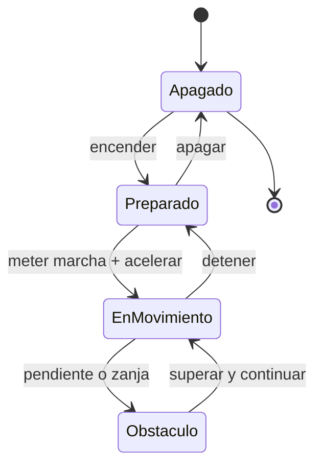

# 🎮 Diseno de simulacion del tanque (marco publico)

[🏠 Inicio](../../../README.md) · [🪖 Curso: Tanques](../README.md) · 🎮 Simulacion

Simulacion **solo de movilidad**, sin contenido sensible, en linea con
[`docs/04-seguridad-y-limites.md`](../../../docs/04-seguridad-y-limites.md).

## Objetivo de la simulacion

Que el usuario aprenda a mover un vehiculo de orugas: avanzar, frenar, girar por
direccion diferencial, elegir la marcha y superar obstaculos, de forma segura y
progresiva. No se representan sistemas de combate.

## Nivel de realismo

- Nivel elegido: se ofrece del 1 al 3 (ver `docs/03-niveles-de-realismo.md`).
- Justificacion: el vehiculo de orugas ensena movilidad todo terreno y direccion
  diferencial, distintas de un vehiculo de ruedas.

## Variables principales

| Variable | Tipo | Rango | Afecta a | Comentarios |
| --- | --- | --- | --- | --- |
| Velocidad | numerica | 0-70 km/h | Movimiento | Central para todo. |
| Marcha | discreta | N,1..n | Fuerza y velocidad | Segun transmision. |
| Diferencia entre orugas | numerica | -1..1 | Radio de giro | Base de la direccion. |
| Adherencia | numerica | 0-1 | Traccion y giro | Baja en barro o hielo. |
| Presion sobre el suelo | numerica | derivada | Hundimiento | Depende de peso y superficie. |
| Pendiente | numerica | grados | Fuerza necesaria | Sube la demanda de par. |
| Combustible | numerica | 0-100% | Autonomia | Consumo por esfuerzo. |
| Temperatura del motor | numerica | grados | Fiabilidad | Sube con carga. |

## Ciclo basico

1. Leer entrada del usuario (acelerador, freno, giro, marcha).
2. Actualizar estado del motor y la transmision.
3. Calcular fuerzas: propulsion, resistencia del terreno y adherencia.
4. Aplicar restricciones del entorno (superficie, pendiente, obstaculo).
5. Actualizar velocidad, posicion y presion sobre el suelo.
6. Refrescar instrumentos y retroalimentacion (sonido, vibracion, testigos).

## Modos de juego futuros

- Tutorial guiado de conduccion y direccion diferencial.
- Practica libre en terreno mixto.
- Circuito de obstaculos (pendientes, zanjas, barro).
- Desafios de movilidad y control fino.
- Escenarios de clima adverso, sin contenido sensible.

## Elementos fuera de alcance

- Cualquier sistema de armas, tactica o procedimiento operativo.
- Blindaje ofensivo mas alla de la masa que influye en la movilidad.
- Datos tecnicos sensibles o no publicos.

## Pendientes

- [ ] Definir valores por defecto de movilidad por tipo de terreno.
- [ ] Prototipar la direccion diferencial en un motor simple.
- [ ] Ajustar el modelo de presion sobre el suelo.
- [ ] Agregar fuentes publicas a [`manuales/fuentes.md`](../../../manuales/fuentes.md).

---

[⬅️ Anterior: Reglamentos](../reglamentos/reglamentos-tanque.md) · [➡️ Siguiente: Recursos](../recursos/recursos-tanque.md)
