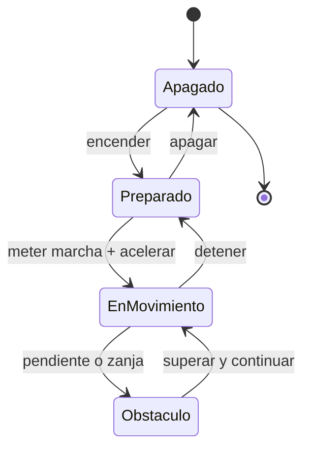

# 🎮 Diseño de simulación del tanque (marco público)

[🏠 Inicio](../../../README.md) · [🪖 Curso: Tanques](../README.md) · 🎮 Simulación

Simulación **solo de movilidad**, sin contenido sensible, en línea con
[`docs/04-seguridad-y-limites.md`](../../../docs/04-seguridad-y-limites.md).

## Objetivo de la simulación

Que el usuario aprenda a mover un vehículo de orugas: avanzar, frenar, girar por
dirección diferencial, elegir la marcha y superar obstáculos, de forma segura y
progresiva. No se representan sistemas de combate.

## Nivel de realismo

- Nivel elegido: se ofrece del 1 al 3 (ver `docs/03-niveles-de-realismo.md`).
- Justificación: el vehículo de orugas enseña movilidad todo terreno y dirección
  diferencial, distintas de un vehículo de ruedas.

## Variables principales

| Variable | Tipo | Rango | Afecta a | Comentarios |
| --- | --- | --- | --- | --- |
| Velocidad | numérica | 0-70 km/h | Movimiento | Central para todo. |
| Marcha | discreta | N,1..n | Fuerza y velocidad | Según transmisión. |
| Diferencia entre orugas | numérica | -1..1 | Radio de giro | Base de la dirección. |
| Adherencia | numérica | 0-1 | Tracción y giro | Baja en barro o hielo. |
| Presión sobre el suelo | numérica | derivada | Hundimiento | Depende de peso y superficie. |
| Pendiente | numérica | grados | Fuerza necesaria | Sube la demanda de par. |
| Combustible | numérica | 0-100% | Autonomía | Consumo por esfuerzo. |
| Temperatura del motor | numérica | grados | Fiabilidad | Sube con carga. |

## Ciclo básico

1. Leer entrada del usuario (acelerador, freno, giro, marcha).
2. Actualizar estado del motor y la transmisión.
3. Calcular fuerzas: propulsión, resistencia del terreno y adherencia.
4. Aplicar restricciones del entorno (superficie, pendiente, obstáculo).
5. Actualizar velocidad, posición y presión sobre el suelo.
6. Refrescar instrumentos y retroalimentación (sonido, vibración, testigos).

## Modos de juego futuros

- Tutorial guiado de conducción y dirección diferencial.
- Práctica libre en terreno mixto.
- Circuito de obstáculos (pendientes, zanjas, barro).
- Desafíos de movilidad y control fino.
- Escenarios de clima adverso, sin contenido sensible.

## Elementos fuera de alcance

- Cualquier sistema de armas, táctica o procedimiento operativo.
- Blindaje ofensivo más allá de la masa que influye en la movilidad.
- Datos técnicos sensibles o no públicos.

## Pendientes

- [ ] Definir valores por defecto de movilidad por tipo de terreno.
- [ ] Prototipar la dirección diferencial en un motor simple.
- [ ] Ajustar el modelo de presión sobre el suelo.
- [ ] Agregar fuentes públicas a [`manuales/fuentes.md`](../../../manuales/fuentes.md).

---

[⬅️ Anterior: Reglamentos](../reglamentos/reglamentos-tanque.md) · [➡️ Siguiente: Recursos](../recursos/recursos-tanque.md)
