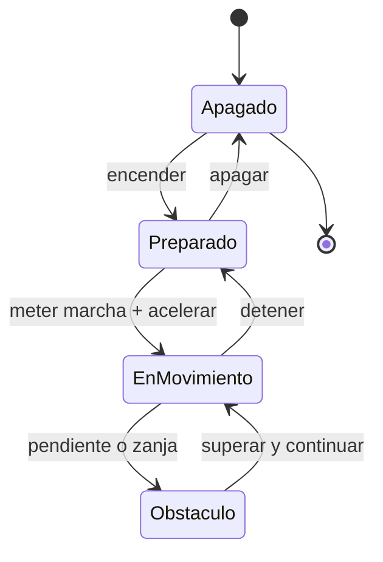
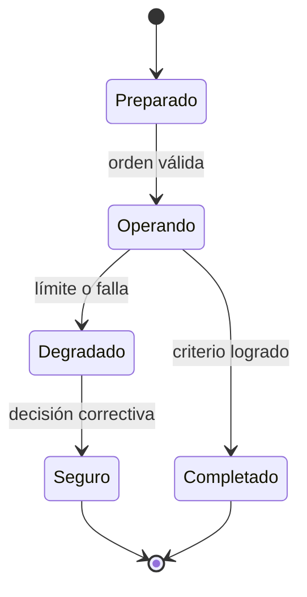

<!-- clase-meta
tipo_documento: clase
clase: 9
codigo: TANQUES-09
curso: tanques
titulo: "Diseño de simulación del tanque (marco público)"
modalidad: "laboratorio de diseño"
duracion_minutos: 90
nivel: introductorio
prerrequisito: TANQUES-08
competencia: "modelado_de_simulacion"
resultados_aprendizaje:
  - "Explicar objetivo, variables, estados, ciclo y escenarios de simulación con vocabulario propio de Tanques."
  - "Aplicar esos conceptos a una decisión segura o a un escenario de simulación de Tanques."
evidencia: "Ficha de escenario y diagrama de estados."
criterio_aprobacion: "El modelo es específico de la máquina, medible, seguro y trazable a clases anteriores."
fuentes: manuales/fuentes.md
ultima_revision: 2026-09-10
-->

# 🎮 Diseño de simulación del tanque (marco público)

[🏠 Inicio](../../../README.md) · [🪖 Curso: Tanques](../README.md) · 🎮 Simulación

Simulación **solo de movilidad**, sin contenido sensible, en línea con
[`docs/04-seguridad-y-limites.md`](../../../docs/04-seguridad-y-limites.md).

```mermaid
stateDiagram-v2
    [*] --> Apagado
    Apagado --> Preparado: encender
    Preparado --> EnMovimiento: meter marcha + acelerar
    EnMovimiento --> Preparado: detener
    EnMovimiento --> Obstaculo: pendiente o zanja
    Obstaculo --> EnMovimiento: superar y continuar
    Preparado --> Apagado: apagar
    Apagado --> [*]
```

## Objetivo de la simulación

Que el usuario aprenda a mover un vehículo de orugas: avanzar, frenar, girar por
dirección diferencial, elegir la marcha y superar obstáculos, de forma segura y
progresiva. No se representan sistemas de combate.

## Nivel de realismo

- Nivel elegido: se ofrece del 1 al 3 (ver `docs/03-niveles-de-realismo.md`).
- Justificación: el vehículo de orugas enseña movilidad todo terreno y dirección
  diferencial, distintas de un vehículo de ruedas.

## Variables principales

| Variable | Tipo | Rango | Afecta a | Comentarios |
| --- | --- | --- | --- | --- |
| Velocidad | numérica | 0-70 km/h | Movimiento | Central para todo. |
| Marcha | discreta | N,1..n | Fuerza y velocidad | Según transmisión. |
| Diferencia entre orugas | numérica | -1..1 | Radio de giro | Base de la dirección. |
| Adherencia | numérica | 0-1 | Tracción y giro | Baja en barro o hielo. |
| Presión sobre el suelo | numérica | derivada | Hundimiento | Depende de peso y superficie. |
| Pendiente | numérica | grados | Fuerza necesaria | Sube la demanda de par. |
| Combustible | numérica | 0-100% | Autonomía | Consumo por esfuerzo. |
| Temperatura del motor | numérica | grados | Fiabilidad | Sube con carga. |

## Ciclo básico

1. Leer entrada del usuario (acelerador, freno, giro, marcha).
2. Actualizar estado del motor y la transmisión.
3. Calcular fuerzas: propulsión, resistencia del terreno y adherencia.
4. Aplicar restricciones del entorno (superficie, pendiente, obstáculo).
5. Actualizar velocidad, posición y presión sobre el suelo.
6. Refrescar instrumentos y retroalimentación (sonido, vibración, testigos).

## Modos de juego futuros

- Tutorial guiado de conducción y dirección diferencial.
- Práctica libre en terreno mixto.
- Circuito de obstáculos (pendientes, zanjas, barro).
- Desafíos de movilidad y control fino.
- Escenarios de clima adverso, sin contenido sensible.

## Elementos fuera de alcance

- Cualquier sistema de armas, táctica o procedimiento operativo.
- Blindaje ofensivo más allá de la masa que influye en la movilidad.
- Datos técnicos sensibles o no públicos.

## Pendientes

- [ ] Definir valores por defecto de movilidad por tipo de terreno.
- [ ] Prototipar la dirección diferencial en un motor simple.
- [ ] Ajustar el modelo de presión sobre el suelo.
- [ ] Agregar fuentes públicas a [`manuales/fuentes.md`](../../../manuales/fuentes.md).

## 🧭 Guía de estudio aplicada

### Pregunta guía

¿Cómo ayuda **Objetivo de la simulación, Nivel de realismo, Variables principales y Ciclo básico** a **modelar cruce simulado de suelo blando con cambio de pendiente como estados, variables y decisiones observables**?

### Explicación razonada

Una simulación de Tanques es educativa si representa decisiones y consecuencias. Como mínimo debe modelar el estado de motor, la respuesta de transmisión, la transición en ruedas tractoras y el resultado en orugas. El escenario «cruce simulado de suelo blando con cambio de pendiente» es valioso porque obliga a observar, formular una hipótesis, actuar y comprobar.

```mermaid
stateDiagram-v2
    [*] --> Preparado
    Preparado --> Operando: orden válida
    Operando --> Degradado: límite o falla
    Degradado --> Seguro: decisión correctiva
    Operando --> Completado: criterio logrado
    Seguro --> [*]
    Completado --> [*]
```

Esta clase se conecta con el resto del curso mediante **tracción y presión sobre el terreno condicionadas por masa, reparto y resistencia al avance**. El hilo de
seguridad consiste en reconocer a tiempo **atasco, pérdida de movilidad o exposición por elegir una ruta incompatible** y poder justificar la decisión
**reconocer capacidad del terreno y escoger ruta, velocidad y orientación del casco**; en clases posteriores cambiará el ángulo de análisis, no esa relación causal.
La lectura funcional común sigue **motor → transmisión → ruedas tractoras → orugas**, de modo que cada concepto pueda
ubicarse dentro del funcionamiento completo y no quede como un dato aislado.

**Apoyo documental:** [Tank Collection](https://tankmuseum.org/tank-nuts/tank-collection) aporta historia pública de vehículos blindados;
[Vehicle Safety](https://www.nhtsa.gov/vehicle-safety) se usa para seguridad de vehículos terrestres. Estas fuentes
se contrastan con el alcance de la clase y no sustituyen un manual de equipo concreto.

### Caso resuelto: de la observación a la decisión

1. **Estado inicial:** representa cruce simulado de suelo blando con cambio de pendiente con valores observables para **motor**, **transmisión**, **ruedas tractoras** y **orugas**.
2. **Decisión del estudiante:** ofrece una elección que cambie el estado, no una animación automática.
3. **Consecuencia:** modela la tendencia hacia **atasco, pérdida de movilidad o exposición por elegir una ruta incompatible** y una señal previa que permita corregir.
4. **Cierre:** evalúa la explicación de la decisión, además de si el estudiante “ganó” el escenario.

### Comprueba tu comprensión

1. ¿Qué cuatro estados mínimos necesita el escenario «cruce simulado de suelo blando con cambio de pendiente»?
2. ¿Qué variable anticipa **atasco, pérdida de movilidad o exposición por elegir una ruta incompatible** antes de llegar al estado de falla?
3. ¿Cómo evaluarías la explicación del estudiante y no solo el resultado final?

Orientación para revisar tus respuestas

- La primera respuesta debe relacionar el eslabón elegido con un efecto posterior, no solo nombrarlo.
- La segunda debe proponer una señal medible u observable y explicar qué tendencia sería preocupante.
- La tercera debe cambiar al menos una variable de capacidad, mando, entorno o margen de seguridad.

## 🎓 Cierre de clase

- **Actividad:** Diseña un escenario educativo de Tanques basado en objetivo, variables, estados, ciclo y escenarios de simulación, con entradas, estados, variables y criterio de cierre.
- **Evidencia:** Ficha de escenario y diagrama de estados.
- **Criterio de aprobación:** El modelo es específico de la máquina, medible, seguro y trazable a clases anteriores.
- **Transferencia:** explica qué cambiaría al pasar a otra variante de esta máquina.

### Fuentes de esta clase

- [TANK-MUSEUM](https://tankmuseum.org/tank-nuts/tank-collection): Tank Collection, The Tank Museum. Uso: historia pública de vehículos blindados.
- [US-NHTSA](https://www.nhtsa.gov/vehicle-safety): Vehicle Safety, NHTSA. Uso: seguridad de vehículos terrestres.
- [NASA-FLIGHT](https://www1.grc.nasa.gov/beginners-guide-to-aeronautics/): Beginner's Guide to Aeronautics, NASA. Uso: contraste con física y vuelo reales.

> Las fuentes sostienen el marco conceptual y normativo; esta clase no reemplaza el manual
> del fabricante, la formación certificada ni la habilitación exigida para operar equipos reales.

---

[⬅️ Anterior: Reglamentos](../reglamentos/reglamentos-tanque.md) · [➡️ Siguiente: Recursos](../recursos/recursos-tanque.md)
