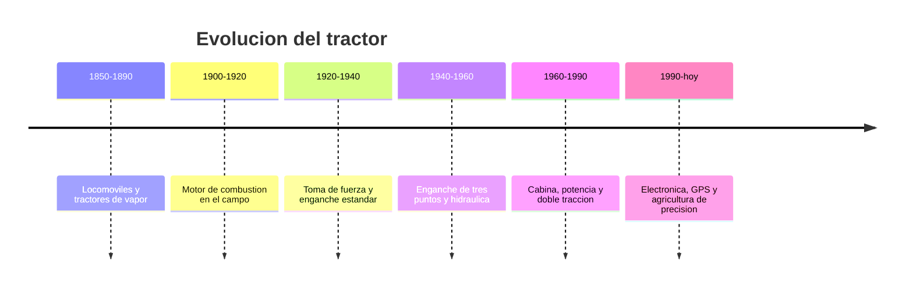

# 📜 Historia del tractor

[🏠 Inicio](../../../README.md) · [🚜 Curso: Tractores](../README.md) · 📜 Historia

## Origen

El tractor nace para reemplazar la fuerza animal en las labores del campo. Los
primeros ingenios fueron locomoviles de vapor, pesados y difíciles de maniobrar.
El motor de combustión, más ligero, los hizo prácticos a comienzos del siglo XX.
El gran salto llegó con el **enganche de tres puntos** y la hidráulica, que
convirtieron al tractor en una plataforma capaz de accionar y transportar
múltiples aperos.

## Línea de tiempo

| Periodo | Hito | Importancia |
| --- | --- | --- |
| 1850-1890 | Locomoviles y tractores de vapor | Primer intento de mecanizar el campo. |
| 1900-1920 | Motor de combustión en el campo | Máquina más ligera y manejable. |
| 1920-1940 | Toma de fuerza y enganche estandar | El tractor acciona aperos, no solo tira. |
| 1940-1960 | Enganche de tres puntos y hidráulica | Control de aperos y transferencia de peso. |
| 1960-1990 | Cabina, potencia y doble tracción | Confort, seguridad y más agarre. |
| 1990-presente | Electrónica, GPS y precisión | Guiado automático y dosis exactas. |

## Evolución tecnológica

- **Fuerza**: del vapor al diesel de alto par y baja velocidad de giro.
- **Enganche**: del arrastre simple al enganche de tres puntos con control hidráulico.
- **Toma de fuerza**: aparición del eje PTO normalizado para accionar aperos.
- **Tracción**: de una sola rueda motriz a la doble tracción y las orugas de goma.
- **Cabina**: aparición de la estructura antivuelco (ROPS) y la cabina cerrada.
- **Precisión**: guiado por GPS, control de dosis y telemetría de la máquina.

## Tipos representativos

| Tipo | Uso típico | Característica destacada |
| --- | --- | --- |
| Tractor utilitario | Tareas generales de campo | Versátil, potencia media. |
| Tractor de alta potencia | Labranza pesada | Doble tracción, gran par. |
| Tractor fruticola / viña | Hileras estrechas | Chasis angosto y bajo. |
| Tractor de orugas | Suelos blandos o en pendiente | Reparte el peso, mucho agarre. |
| Tractor articulado | Grandes extensiones | Se pliega en el centro para girar. |

## Impacto en la agricultura

El tractor es la máquina que mecanizó la agricultura y multiplicó la superficie
que una persona puede trabajar. Al accionar aperos por la toma de fuerza y
manejarlos con la hidráulica, se convirtió en la plataforma central de la faena
agrícola. Su evolución actual apunta a la precisión: hacer más con menos insumos
y con menor impacto sobre el suelo.

## Fuentes

- Registrar aquí las fuentes públicas consultadas.
- Enlazar cada fuente también en [`manuales/fuentes.md`](../../../manuales/fuentes.md).

---

[🎓 Portada del curso](../README.md) · [➡️ Siguiente: Características](../operacion/caracteristicas-tractor.md)
