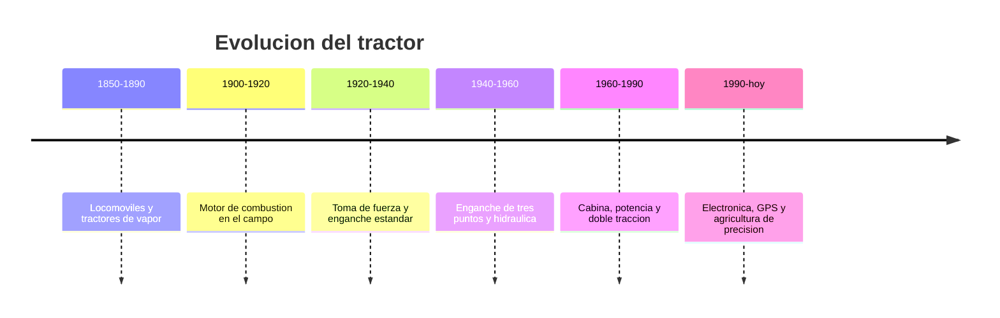

<!-- clase-meta
tipo_documento: clase
clase: 1
codigo: TRACTORES-01
curso: tractores
titulo: "Historia del tractor"
modalidad: "teórica dialogada"
duracion_minutos: 45
nivel: introductorio
prerrequisito: ninguno
competencia: "contexto_historico"
resultados_aprendizaje:
  - "Explicar origen, evolución tecnológica, variantes representativas e impacto con vocabulario propio de Tractores."
  - "Aplicar esos conceptos a una decisión segura o a un escenario de simulación de Tractores."
evidencia: "Línea de tiempo comentada con cuatro hitos o más."
criterio_aprobacion: "Los hitos están ordenados, son pertinentes y dos relaciones de causa y efecto quedan justificadas."
fuentes: manuales/fuentes.md
ultima_revision: 2026-09-10
-->

# 📜 Historia del tractor

[🏠 Inicio](../../../README.md) · [🚜 Curso: Tractores](../README.md) · 📜 Historia

```mermaid
timeline
    title Evolucion del tractor
    1850-1890 : Locomoviles y tractores de vapor
    1900-1920 : Motor de combustion en el campo
    1920-1940 : Toma de fuerza y enganche estandar
    1940-1960 : Enganche de tres puntos y hidraulica
    1960-1990 : Cabina, potencia y doble traccion
    1990-hoy : Electronica, GPS y agricultura de precision
```

## Origen

El tractor nace para reemplazar la fuerza animal en las labores del campo. Los
primeros ingenios fueron locomoviles de vapor, pesados y difíciles de maniobrar.
El motor de combustión, más ligero, los hizo prácticos a comienzos del siglo XX.
El gran salto llegó con el **enganche de tres puntos** y la hidráulica, que
convirtieron al tractor en una plataforma capaz de accionar y transportar
múltiples aperos.

## Línea de tiempo

| Periodo | Hito | Importancia |
| --- | --- | --- |
| 1850-1890 | Locomoviles y tractores de vapor | Primer intento de mecanizar el campo. |
| 1900-1920 | Motor de combustión en el campo | Máquina más ligera y manejable. |
| 1920-1940 | Toma de fuerza y enganche estandar | El tractor acciona aperos, no solo tira. |
| 1940-1960 | Enganche de tres puntos y hidráulica | Control de aperos y transferencia de peso. |
| 1960-1990 | Cabina, potencia y doble tracción | Confort, seguridad y más agarre. |
| 1990-presente | Electrónica, GPS y precisión | Guiado automático y dosis exactas. |

## Evolución tecnológica

- **Fuerza**: del vapor al diesel de alto par y baja velocidad de giro.
- **Enganche**: del arrastre simple al enganche de tres puntos con control hidráulico.
- **Toma de fuerza**: aparición del eje PTO normalizado para accionar aperos.
- **Tracción**: de una sola rueda motriz a la doble tracción y las orugas de goma.
- **Cabina**: aparición de la estructura antivuelco (ROPS) y la cabina cerrada.
- **Precisión**: guiado por GPS, control de dosis y telemetría de la máquina.

## Tipos representativos

| Tipo | Uso típico | Característica destacada |
| --- | --- | --- |
| Tractor utilitario | Tareas generales de campo | Versátil, potencia media. |
| Tractor de alta potencia | Labranza pesada | Doble tracción, gran par. |
| Tractor fruticola / viña | Hileras estrechas | Chasis angosto y bajo. |
| Tractor de orugas | Suelos blandos o en pendiente | Reparte el peso, mucho agarre. |
| Tractor articulado | Grandes extensiones | Se pliega en el centro para girar. |

## Impacto en la agricultura

El tractor es la máquina que mecanizó la agricultura y multiplicó la superficie
que una persona puede trabajar. Al accionar aperos por la toma de fuerza y
manejarlos con la hidráulica, se convirtió en la plataforma central de la faena
agrícola. Su evolución actual apunta a la precisión: hacer más con menos insumos
y con menor impacto sobre el suelo.

## 🧭 Guía de estudio aplicada

### Pregunta guía

¿Cómo ayuda **Origen, Línea de tiempo, Evolución tecnológica y Tipos representativos** a **explicar cómo la evolución hizo posibles alternativas como tractor agrícola convencional frente a articulado**?

### Explicación razonada

La evolución de Tractores se comprende mejor como una sucesión de respuestas a problemas, no como una lista de fechas. Los cambios en motor, transmisión, toma de fuerza y apero alteraron qué podía hacer la máquina, quién podía usarla y qué riesgos debían controlarse. El contraste «tractor agrícola convencional frente a articulado» permite observar qué decisiones de diseño permanecieron y cuáles cambiaron con la tecnología y el propósito.

Esta clase se conecta con el resto del curso mediante **tracción a baja velocidad, transferencia de peso y estabilidad frente al vuelco**. El hilo de
seguridad consiste en reconocer a tiempo **vuelco lateral, atrapamiento en la toma de fuerza o pérdida de dirección** y poder justificar la decisión
**bajar el implemento, reducir velocidad y escoger una trayectoria compatible**; en clases posteriores cambiará el ángulo de análisis, no esa relación causal.
La lectura funcional común sigue **motor → transmisión → toma de fuerza → apero**, de modo que cada concepto pueda
ubicarse dentro del funcionamiento completo y no quede como un dato aislado.

**Apoyo documental:** [Agricultural Operations: Hazards and Controls](https://www.osha.gov/agricultural-operations/hazards) aporta tractores, aperos y riesgos agrícolas;
[Ley de Tránsito 18.290](https://www.bcn.cl/leychile/navegar?idNorma=29708) se usa para marco legal chileno. Estas fuentes
se contrastan con el alcance de la clase y no sustituyen un manual de equipo concreto.

### Caso resuelto: de la observación a la decisión

1. **Situar:** ordena los hitos que explican cómo se llegó a **tractor agrícola convencional frente a articulado** y describe la necesidad que impulsó cada cambio.
2. **Relacionar:** explica qué se modificó en **motor**, **transmisión**, **toma de fuerza** o **apero**; una fecha sin mecanismo no basta.
3. **Interpretar:** vincula el cambio con una capacidad nueva y también con el riesgo **vuelco lateral, atrapamiento en la toma de fuerza o pérdida de dirección**.
4. **Transferir:** usa la evolución para justificar por qué hoy conviene **bajar el implemento, reducir velocidad y escoger una trayectoria compatible**.

### Comprueba tu comprensión

1. ¿Qué necesidad histórica impulsó un cambio en **motor** o **transmisión**?
2. ¿Qué hito modificó la relación entre capacidad y **vuelco lateral, atrapamiento en la toma de fuerza o pérdida de dirección**?
3. ¿Por qué **tractor agrícola convencional frente a articulado** no puede explicarse como una simple diferencia estética?

Orientación para revisar tus respuestas

- La primera respuesta debe relacionar el eslabón elegido con un efecto posterior, no solo nombrarlo.
- La segunda debe proponer una señal medible u observable y explicar qué tendencia sería preocupante.
- La tercera debe cambiar al menos una variable de capacidad, mando, entorno o margen de seguridad.

## 🎓 Cierre de clase

- **Actividad:** Construye una línea de tiempo de Tractores y explica cómo dos cambios históricos transformaron su función o su puesto de mando.
- **Evidencia:** Línea de tiempo comentada con cuatro hitos o más.
- **Criterio de aprobación:** Los hitos están ordenados, son pertinentes y dos relaciones de causa y efecto quedan justificadas.
- **Transferencia:** explica qué cambiaría al pasar a otra variante de esta máquina.

### Fuentes de esta clase

- [OSHA-AGRI](https://www.osha.gov/agricultural-operations/hazards): Agricultural Operations: Hazards and Controls, OSHA. Uso: tractores, aperos y riesgos agrícolas.
- [CL-LEY-18290](https://www.bcn.cl/leychile/navegar?idNorma=29708): Ley de Tránsito 18.290, BCN Chile. Uso: marco legal chileno.

> Las fuentes sostienen el marco conceptual y normativo; esta clase no reemplaza el manual
> del fabricante, la formación certificada ni la habilitación exigida para operar equipos reales.

---

[🎓 Portada del curso](../README.md) · [➡️ Siguiente: Características](../operacion/caracteristicas-tractor.md)
