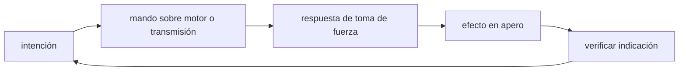

<!-- clase-meta
tipo_documento: clase
clase: 5
codigo: TRACTORES-05
curso: tractores
titulo: "Mandos e instrumentos del tractor"
modalidad: "taller de simulación"
duracion_minutos: 60
nivel: introductorio
prerrequisito: TRACTORES-04
competencia: "lectura_y_mando"
resultados_aprendizaje:
  - "Explicar controles, instrumentos, entradas y estados del sistema con vocabulario propio de Tractores."
  - "Aplicar esos conceptos a una decisión segura o a un escenario de simulación de Tractores."
evidencia: "Mapa de mandos y resolución de dos estados del tablero."
criterio_aprobacion: "Reconoce los controles críticos y responde a los estados sin introducir acciones inseguras."
fuentes: manuales/fuentes.md
ultima_revision: 2026-09-10
-->

# 🎛️ Mandos e instrumentos del tractor

[🏠 Inicio](../../../README.md) · [🚜 Curso: Tractores](../README.md) · 🎛️ Mandos

## Vista general

El puesto de mando del tractor combina los controles de conducción con los de
trabajo. Además del volante y los pedales, el operador dispone de mandos para la
toma de fuerza, la hidráulica del enganche de tres puntos y las salidas
hidráulicas externas. La cabina moderna incluye estructura antivuelco (ROPS) y
cinturón, elementos de seguridad centrales.

## Mapa de controles

| Zona | Control | Tipo | Función | Prioridad | Comentarios |
| --- | --- | --- | --- | --- | --- |
| Volante | Dirección | Volante asistido | Orientar el eje delantero | Alta | Radio de giro corto para maniobrar. |
| Pie derecho | Acelerador | Pedal | Regular el par del motor | Alta | Suele haber también acelerador de mano. |
| Pie | Frenos independientes | Dos pedales | Frenar cada rueda trasera | Alta | Se unen para frenar en carretera. |
| Pie izquierdo | Embrague | Pedal | Desacoplar motor y caja | Alta | Para cambiar y para arrancar. |
| Palanca | Cambio de marchas y gamas | Palancas | Elegir relación y superreductora | Alta | Muchas relaciones de trabajo. |
| Palanca | Mando de la PTO | Palanca o botón | Conectar la toma de fuerza | Alta | Elegir 540 o 1000 rpm. |
| Palanca | Enganche de tres puntos | Palanca de posición | Subir y bajar el apero | Alta | Control de posición o de esfuerzo. |
| Consola | Salidas hidráulicas | Palancas | Alimentar aperos externos | Media | Para cilindros del apero. |
| Tablero | Bloqueo de diferencial | Pedal o botón | Igualar giro de ruedas | Media | Para barro o patinaje. |
| Tablero | Doble tracción | Botón | Traccionar el eje delantero | Media | Más agarre cuando se necesita. |

## Instrumentos principales

| Instrumento | Mide o muestra | Unidad | Importancia | Notas |
| --- | --- | --- | --- | --- |
| Tacómetro | Régimen del motor | rpm | Alta | Marca el régimen de PTO (540/1000). |
| Cuentahoras | Horas de trabajo | horas | Alta | Base del mantenimiento, no del odómetro. |
| Temperatura del motor | Calor del refrigerante | grados | Alta | Vigila esfuerzo continuo. |
| Presión de aceite | Lubricación | testigo/bar | Alta | Crítica en trabajo prolongado. |
| Nivel de combustible | Diesel restante | fracción | Alta | Autonomía de la jornada. |
| Testigos | Estado de sistemas | luz | Alta | Freno de mano, carga, filtros. |

## Entradas de simulación

| Acción | Teclado | Controlador | Pantalla táctil | Comentarios |
| --- | --- | --- | --- | --- |
| Acelerar | Flecha arriba | Gatillo derecho | Zona derecha | Con opción de acelerador de mano. |
| Frenar | Flecha abajo | Gatillo izquierdo | Botón freno | Frenos unidos en carretera. |
| Embragar | Shift | Botón lateral | Botón embrague | Para cambiar de marcha. |
| Cambiar marcha | E / Q | Cruceta | Botones más/menos | Con gamas y superreductora. |
| Conectar PTO | Tecla T | Botón dedicado | Botón PTO | Elegir régimen normalizado. |
| Subir/bajar apero | R / F | Cruceta arriba/abajo | Palanca en pantalla | Control de posición o esfuerzo. |
| Doble tracción | Tecla 4 | Botón | Botón 4x4 | Activa el eje delantero. |
| Girar | Flechas izq/der | Stick izquierdo | Volante en pantalla | Radio de giro corto. |

## Estados del sistema

| Estado | Descripción | Indicadores | Acciones disponibles |
| --- | --- | --- | --- |
| Apagado | Motor detenido | Tablero off | Encender, revisar aperos. |
| Preparado | Motor en marcha, detenido | Testigos en verde | Meter marcha, conectar PTO. |
| Traslado | Circulando sin trabajar | Marcha de transporte | Conducir, girar, frenar. |
| Trabajando | Apero en acción | PTO o hidráulica activas | Regular profundidad y avance. |
| Emergencia | Riesgo o falla | Testigos de alerta | Desconectar PTO, frenar, detener. |

## Observaciones ergonomicas

- El tacómetro con marcas de PTO debe verse siempre para mantener el régimen.
- El mando de la PTO debe ser inconfundible y fácil de desconectar.
- El asiento con suspensión y el cinturón dentro del ROPS son claves de seguridad.
- La interfaz de simulación debería advertir el vuelco al girar en pendiente y
  bloquear el trabajo con la PTO si alguien está en la zona de riesgo.

## 🧭 Guía de estudio aplicada

### Pregunta guía

¿Cómo ayuda **Vista general, Mapa de controles, Instrumentos principales y Entradas de simulación** a **interpretar mandos e indicaciones durante trabajo transversal en pendiente con un implemento elevado**?

### Explicación razonada

Un mando no se aprende memorizando su nombre, sino recorriendo el ciclo intención → acción → indicación → verificación. En Tractores, el operador actúa sobre motor o transmisión, observa la respuesta en toma de fuerza y confirma el efecto en apero. Una indicación inesperada exige detener la secuencia mental, identificar el modo activo y evitar una segunda orden que agrave el estado.

Esta clase se conecta con el resto del curso mediante **tracción a baja velocidad, transferencia de peso y estabilidad frente al vuelco**. El hilo de
seguridad consiste en reconocer a tiempo **vuelco lateral, atrapamiento en la toma de fuerza o pérdida de dirección** y poder justificar la decisión
**bajar el implemento, reducir velocidad y escoger una trayectoria compatible**; en clases posteriores cambiará el ángulo de análisis, no esa relación causal.
La lectura funcional común sigue **motor → transmisión → toma de fuerza → apero**, de modo que cada concepto pueda
ubicarse dentro del funcionamiento completo y no quede como un dato aislado.

**Apoyo documental:** [Agricultural Operations: Hazards and Controls](https://www.osha.gov/agricultural-operations/hazards) aporta tractores, aperos y riesgos agrícolas;
[Ley de Tránsito 18.290](https://www.bcn.cl/leychile/navegar?idNorma=29708) se usa para marco legal chileno. Estas fuentes
se contrastan con el alcance de la clase y no sustituyen un manual de equipo concreto.

### Caso resuelto: de la observación a la decisión

1. **Intención:** formula qué cambio se necesita durante **trabajo transversal en pendiente con un implemento elevado**.
2. **Mando:** identifica el control que actúa sobre **motor** o **transmisión** y el modo que debe estar activo.
3. **Lectura:** localiza la indicación que confirma la respuesta de **toma de fuerza** y el efecto en **apero**.
4. **Verificación:** si la lectura no coincide, no acumules órdenes; estabiliza e investiga el estado.

### Comprueba tu comprensión

1. ¿Qué mando inicia la respuesta y qué instrumento confirma que el modo correcto está activo?
2. ¿Qué indicación temprana advertiría **vuelco lateral, atrapamiento en la toma de fuerza o pérdida de dirección**?
3. ¿Qué secuencia usarías si la respuesta de **apero** no coincide con la orden?

Orientación para revisar tus respuestas

- La primera respuesta debe relacionar el eslabón elegido con un efecto posterior, no solo nombrarlo.
- La segunda debe proponer una señal medible u observable y explicar qué tendencia sería preocupante.
- La tercera debe cambiar al menos una variable de capacidad, mando, entorno o margen de seguridad.

## 🎓 Cierre de clase

- **Actividad:** Recorre el puesto de mando simulado de Tractores: localiza los controles de controles, instrumentos, entradas y estados del sistema y asocia cada indicación con una decisión.
- **Evidencia:** Mapa de mandos y resolución de dos estados del tablero.
- **Criterio de aprobación:** Reconoce los controles críticos y responde a los estados sin introducir acciones inseguras.
- **Transferencia:** explica qué cambiaría al pasar a otra variante de esta máquina.

### Fuentes de esta clase

- [OSHA-AGRI](https://www.osha.gov/agricultural-operations/hazards): Agricultural Operations: Hazards and Controls, OSHA. Uso: tractores, aperos y riesgos agrícolas.
- [CL-LEY-18290](https://www.bcn.cl/leychile/navegar?idNorma=29708): Ley de Tránsito 18.290, BCN Chile. Uso: marco legal chileno.

> Las fuentes sostienen el marco conceptual y normativo; esta clase no reemplaza el manual
> del fabricante, la formación certificada ni la habilitación exigida para operar equipos reales.

---

[⬅️ Anterior: Sistemas mecánicos](../operacion/sistemas-mecanicos-tractor.md) · [➡️ Siguiente: Principios y operación](../operacion/principios-tractor.md)
