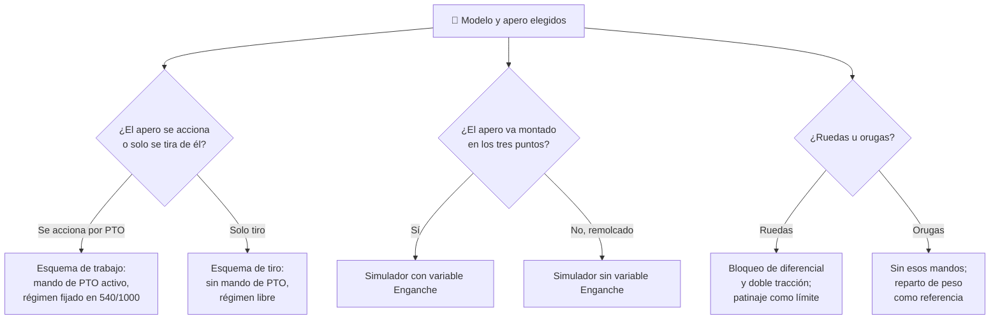

# 🧩 Modelos y variantes del tractor

[🏠 Inicio](../../../README.md) · [🚜 Curso: Tractores](../README.md) · 🧩 Modelos

El [Módulo 2](../operacion/caracteristicas-tractor.md) ya dijo qué tipos de
tractor existen y para qué sirve cada uno. Este módulo responde a lo siguiente:
**no todos se manejan igual**, y esa diferencia no es de matiz. Cambia qué
mandos tiene la máquina y, por tanto, qué debe modelar el simulador.

> 🎯 **La idea que sostiene el módulo.** "Un tractor" no es una sola máquina
> desde el punto de vista del mando. El tractor no se define por cómo circula,
> sino por lo que acciona: cambia el apero y cambian los mandos disponibles. Un
> tractor con remolque no tiene nada que subir con el enganche de tres puntos y
> nada que conectar con la toma de fuerza: no es que esos mandos sean más
> fáciles, es que **no tienen destinatario**. Un simulador que presente un solo
> esquema de control está representando un tractor concreto con un apero
> concreto, aunque diga representarlos todos.

---

## 🧭 Por qué el modelo decide el simulador

El [Módulo 5](../mandos/manual-mandos-tractor.md) describe un puesto de mando con
una **palanca de mando de la PTO** ("conectar la toma de fuerza", eligiendo 540 o
1000 rpm) y una **palanca de posición del enganche de tres puntos** ("subir y
bajar el apero"). Sus entradas de simulación las recogen como `Conectar PTO`
(tecla T) y `Subir/bajar apero` (R / F). El
[Módulo 9](../simulacion/diseno-simulador-tractor.md) expone la variable
`Enganche` con rango `subido..bajado` y define el `Régimen del motor` como lo que
"marca 540 o 1000 rpm de la PTO". Los tres describen un tractor **con apero
montado y accionado**.

En un tractor con remolque, esa palanca de posición no controla nada: el remolque
recibe la fuerza "por tiro desde la barra", según el
[Módulo 4](../operacion/sistemas-mecanicos-tractor.md), y los tres puntos van
vacíos. La variable `Enganche` sencillamente no tiene valores útiles que tomar, y
el `Régimen del motor` deja de leerse contra las marcas de PTO del tacómetro para
pasar a ser solo par de tiro. Si el simulador se construye sobre el esquema de
labranza con PTO y luego se le "añade" el traslado con remolque, el resultado es
un remolque enganchado a los tres puntos y accionado por la toma de fuerza, que
no existe.

---

## 🗂️ Qué cambia en el manejo

| Modelo | Qué cambia al conducirlo |
| --- | --- |
| Utilitario | La referencia del curso: potencia media, versátil, doble tracción conectable. |
| Alta potencia | Gran par y doble tracción para labranza pesada: el tiro del apero domina el comportamiento y el patinaje se gestiona con lastre. |
| Frutícola / viña | Chasis angosto y bajo: pasa entre hileras, pero la vía estrecha reduce el margen de estabilidad lateral. |
| Articulado | Se pliega por el centro para girar: el giro no viene de orientar el eje delantero, sino de quebrar la máquina en dos. |
| De orugas | Reparte el peso sobre el suelo y agarra mucho: el patinaje deja de ser el límite principal en suelo blando o en pendiente. |
| Con apero accionado por PTO | La velocidad de avance y el régimen del motor se desacoplan: hay que mantener el régimen de PTO constante aunque el avance sea lento. |
| Con apero de tiro puro | Toda la potencia va a la tracción: el trabajo se regula con la marcha y la profundidad, no con el régimen normalizado. |
| Con pala cargadora frontal | El peso y la carga viven delante y cambian durante la jornada: la misma máquina se comporta distinto con la pala llena o vacía. |

---

## 🎛️ Qué cambia en el mando

| Modelo | Qué mando aparece o desaparece | Consecuencia |
| --- | --- | --- |
| Utilitario, Alta potencia, Frutícola / viña | Ninguno: el mapa de controles del Módulo 5 aplica tal cual. | Cambian los rangos y las prioridades, no los controles. |
| Articulado | El volante **deja de orientar el eje delantero** y pasa a mandar el pliegue central del chasis. | El mismo control físico gobierna otra geometría de giro. |
| De orugas | El **bloqueo de diferencial** y la **doble tracción** pierden su función: no hay ruedas cuyo giro igualar ni eje delantero que traccionar. | Dos botones del tablero se quedan sin sistema al que mandar. |
| Con apero accionado por PTO | Están todos: **mando de la PTO** y **palanca del enganche** operan a la vez. | Es el caso completo del Módulo 5. |
| Con apero de tiro puro (arado, rastra) | **Desaparece** el mando de la PTO: no hay cardán que conectar. Queda la palanca del enganche. | El tacómetro deja de leerse contra las marcas de 540/1000 rpm. |
| Con remolque | **Desaparecen** el mando de la PTO y la palanca del enganche: el tiro sale de la barra baja. | El operador conduce, pero no manda ningún apero; los frenos se unen para carretera. |
| Con pala cargadora frontal | **Aparecen** las salidas hidráulicas como mando principal de trabajo, delante. **Desaparece** el enganche trasero como control activo. | El trabajo se manda con la hidráulica, no con los tres puntos ni con la PTO. |

---

## 🎮 Qué cambia en el simulador

Contrastado con las variables del
[Módulo 9](../simulacion/diseno-simulador-tractor.md):

| Modelo | Variables que cambian | Esquema de control |
| --- | --- | --- |
| Utilitario | Ninguna: es el caso base. | El del Módulo 5. |
| Alta potencia | `Patinaje` y `Lastre` pesan más en el cálculo; `Marcha` usa sobre todo las relaciones cortas de trabajo. | El mismo, con más par disponible. |
| Frutícola / viña | `Inclinación lateral` **reduce** su margen útil: la vía estrecha vuelca antes dentro del mismo rango. | El mismo. |
| Articulado | `Velocidad` e `Inclinación lateral` se calculan sobre un chasis que se quiebra: el giro deja de depender del eje delantero. | El mismo volante, otra geometría. |
| De orugas | `Patinaje` deja de ser el límite dominante y `Pendiente` amplía su margen útil de trabajo. | Sin entrada de bloqueo de diferencial ni de doble tracción. |
| Con apero accionado por PTO | `Régimen del motor` queda **fijado** en las marcas de 540 o 1000 rpm y se desacopla de `Velocidad`. | El completo: PTO más enganche. |
| Con apero de tiro puro | `Régimen del motor` **se libera** de las marcas de PTO y pasa a depender solo del acelerador y de la carga de tiro. | Sin entrada de PTO. |
| Con remolque | `Enganche` **se elimina**: no hay apero montado cuya profundidad regular. `Régimen del motor` se libera de la PTO. | Sin entrada de PTO ni de enganche: solo conducción. |
| Con pala cargadora frontal | `Lastre` deja de ser fijo y pasa a variar durante la partida: la carga de la pala cambia el reparto de peso y la estabilidad. | El enganche trasero se sustituye por las salidas hidráulicas. |

---

## 🗺️ Del modelo al esquema de control

---

## ⚠️ Qué modelos no comparten simulador

Tres configuraciones no se resuelven con un ajuste de parámetros, porque su
esquema de control es otro:

- **El tractor con remolque** frente al tractor con apero montado: faltan dos
  entradas (PTO y enganche) y una variable, `Enganche`, se queda sin valores. Es
  un modo de control distinto, no una dificultad distinta.
- **El tractor de orugas** frente al de ruedas: dos mandos del tablero, el
  bloqueo de diferencial y la doble tracción, se quedan sin sistema al que
  mandar, y `Patinaje` deja de ser el límite que ordena el trabajo.
- **La pala cargadora frontal** frente a la labranza: obliga a que el lastre sea
  una variable viva durante la partida, no una constante que se fija al empezar,
  y traslada el mando de trabajo del enganche trasero a las salidas hidráulicas.

El resto de modelos sí caben en un mismo simulador ajustando rangos, tal como
plantean los [niveles de realismo](../../../docs/03-niveles-de-realismo.md): en
el nivel 1 casi todos se comportan igual, y las diferencias emergen a medida que
el nivel sube, justo cuando entran el régimen de PTO, el control de esfuerzo y
los límites de vuelco.

> ⚖️ **El principio detrás de todo esto.** Cuánto pesa la carga y dónde va no cambia
> solo los números: cambia qué puede hacer el operador. La física común a todas las
> máquinas del catálogo —sostener, girar, equilibrar y la masa que cambia en
> marcha— está en [⚖️ carga y manejo](../../../docs/09-carga-y-manejo.md).

---

[⬅️ Anterior: Características](../operacion/caracteristicas-tractor.md) · [➡️ Siguiente: Sistemas mecánicos](../operacion/sistemas-mecanicos-tractor.md)
