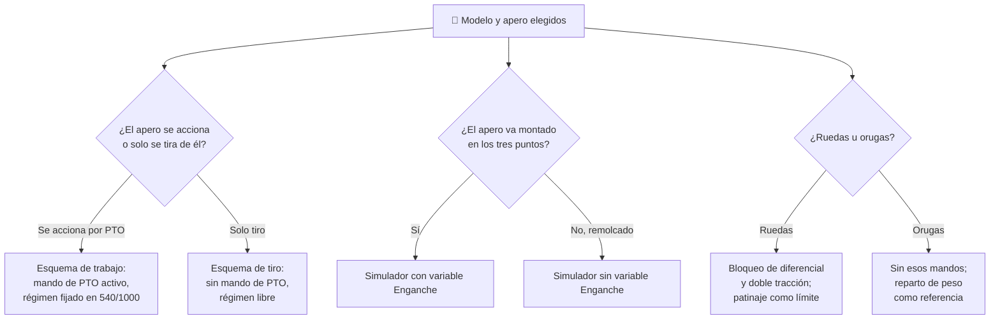

<!-- clase-meta
tipo_documento: clase
clase: 3
codigo: TRACTORES-03
curso: tractores
titulo: "Modelos y variantes del tractor"
modalidad: "comparativa guiada"
duracion_minutos: 60
nivel: introductorio
prerrequisito: TRACTORES-02
competencia: "seleccion_de_configuracion"
resultados_aprendizaje:
  - "Explicar manejo, arquitectura de mandos y variables de simulación con vocabulario propio de Tractores."
  - "Aplicar esos conceptos a una decisión segura o a un escenario de simulación de Tractores."
evidencia: "Matriz comparativa y decisión justificada."
criterio_aprobacion: "La elección considera función, límites, mando y efecto en la simulación; no se apoya solo en preferencias."
fuentes: manuales/fuentes.md
ultima_revision: 2026-09-10
-->

# 🧩 Modelos y variantes del tractor

[🏠 Inicio](../../../README.md) · [🚜 Curso: Tractores](../README.md) · 🧩 Modelos

El [Clase 2](../operacion/caracteristicas-tractor.md) ya dijo qué tipos de
tractor existen y para qué sirve cada uno. Esta clase responde a lo siguiente:
**no todos se manejan igual**, y esa diferencia no es de matiz. Cambia qué
mandos tiene la máquina y, por tanto, qué debe modelar el simulador.

> 🎯 **La idea que sostiene el módulo.** "Un tractor" no es una sola máquina
> desde el punto de vista del mando. El tractor no se define por cómo circula,
> sino por lo que acciona: cambia el apero y cambian los mandos disponibles. Un
> tractor con remolque no tiene nada que subir con el enganche de tres puntos y
> nada que conectar con la toma de fuerza: no es que esos mandos sean más
> fáciles, es que **no tienen destinatario**. Un simulador que presente un solo
> esquema de control está representando un tractor concreto con un apero
> concreto, aunque diga representarlos todos.

---

## 🧭 Por qué el modelo decide el simulador

El [Clase 5](../mandos/manual-mandos-tractor.md) describe un puesto de mando con
una **palanca de mando de la PTO** ("conectar la toma de fuerza", eligiendo 540 o
1000 rpm) y una **palanca de posición del enganche de tres puntos** ("subir y
bajar el apero"). Sus entradas de simulación las recogen como `Conectar PTO`
(tecla T) y `Subir/bajar apero` (R / F). El
[Clase 9](../simulacion/diseno-simulador-tractor.md) expone la variable
`Enganche` con rango `subido..bajado` y define el `Régimen del motor` como lo que
"marca 540 o 1000 rpm de la PTO". Los tres describen un tractor **con apero
montado y accionado**.

En un tractor con remolque, esa palanca de posición no controla nada: el remolque
recibe la fuerza "por tiro desde la barra", según el
[Clase 4](../operacion/sistemas-mecanicos-tractor.md), y los tres puntos van
vacíos. La variable `Enganche` sencillamente no tiene valores útiles que tomar, y
el `Régimen del motor` deja de leerse contra las marcas de PTO del tacómetro para
pasar a ser solo par de tiro. Si el simulador se construye sobre el esquema de
labranza con PTO y luego se le "añade" el traslado con remolque, el resultado es
un remolque enganchado a los tres puntos y accionado por la toma de fuerza, que
no existe.

---

## 🗂️ Qué cambia en el manejo

| Modelo | Qué cambia al conducirlo |
| --- | --- |
| Utilitario | La referencia del curso: potencia media, versátil, doble tracción conectable. |
| Alta potencia | Gran par y doble tracción para labranza pesada: el tiro del apero domina el comportamiento y el patinaje se gestiona con lastre. |
| Frutícola / viña | Chasis angosto y bajo: pasa entre hileras, pero la vía estrecha reduce el margen de estabilidad lateral. |
| Articulado | Se pliega por el centro para girar: el giro no viene de orientar el eje delantero, sino de quebrar la máquina en dos. |
| De orugas | Reparte el peso sobre el suelo y agarra mucho: el patinaje deja de ser el límite principal en suelo blando o en pendiente. |
| Con apero accionado por PTO | La velocidad de avance y el régimen del motor se desacoplan: hay que mantener el régimen de PTO constante aunque el avance sea lento. |
| Con apero de tiro puro | Toda la potencia va a la tracción: el trabajo se regula con la marcha y la profundidad, no con el régimen normalizado. |
| Con pala cargadora frontal | El peso y la carga viven delante y cambian durante la jornada: la misma máquina se comporta distinto con la pala llena o vacía. |

---

## 🎛️ Qué cambia en el mando

| Modelo | Qué mando aparece o desaparece | Consecuencia |
| --- | --- | --- |
| Utilitario, Alta potencia, Frutícola / viña | Ninguno: el mapa de controles del Clase 5 aplica tal cual. | Cambian los rangos y las prioridades, no los controles. |
| Articulado | El volante **deja de orientar el eje delantero** y pasa a mandar el pliegue central del chasis. | El mismo control físico gobierna otra geometría de giro. |
| De orugas | El **bloqueo de diferencial** y la **doble tracción** pierden su función: no hay ruedas cuyo giro igualar ni eje delantero que traccionar. | Dos botones del tablero se quedan sin sistema al que mandar. |
| Con apero accionado por PTO | Están todos: **mando de la PTO** y **palanca del enganche** operan a la vez. | Es el caso completo del Clase 5. |
| Con apero de tiro puro (arado, rastra) | **Desaparece** el mando de la PTO: no hay cardán que conectar. Queda la palanca del enganche. | El tacómetro deja de leerse contra las marcas de 540/1000 rpm. |
| Con remolque | **Desaparecen** el mando de la PTO y la palanca del enganche: el tiro sale de la barra baja. | El operador conduce, pero no manda ningún apero; los frenos se unen para carretera. |
| Con pala cargadora frontal | **Aparecen** las salidas hidráulicas como mando principal de trabajo, delante. **Desaparece** el enganche trasero como control activo. | El trabajo se manda con la hidráulica, no con los tres puntos ni con la PTO. |

---

## 🎮 Qué cambia en el simulador

Contrastado con las variables del
[Clase 9](../simulacion/diseno-simulador-tractor.md):

| Modelo | Variables que cambian | Esquema de control |
| --- | --- | --- |
| Utilitario | Ninguna: es el caso base. | El del Clase 5. |
| Alta potencia | `Patinaje` y `Lastre` pesan más en el cálculo; `Marcha` usa sobre todo las relaciones cortas de trabajo. | El mismo, con más par disponible. |
| Frutícola / viña | `Inclinación lateral` **reduce** su margen útil: la vía estrecha vuelca antes dentro del mismo rango. | El mismo. |
| Articulado | `Velocidad` e `Inclinación lateral` se calculan sobre un chasis que se quiebra: el giro deja de depender del eje delantero. | El mismo volante, otra geometría. |
| De orugas | `Patinaje` deja de ser el límite dominante y `Pendiente` amplía su margen útil de trabajo. | Sin entrada de bloqueo de diferencial ni de doble tracción. |
| Con apero accionado por PTO | `Régimen del motor` queda **fijado** en las marcas de 540 o 1000 rpm y se desacopla de `Velocidad`. | El completo: PTO más enganche. |
| Con apero de tiro puro | `Régimen del motor` **se libera** de las marcas de PTO y pasa a depender solo del acelerador y de la carga de tiro. | Sin entrada de PTO. |
| Con remolque | `Enganche` **se elimina**: no hay apero montado cuya profundidad regular. `Régimen del motor` se libera de la PTO. | Sin entrada de PTO ni de enganche: solo conducción. |
| Con pala cargadora frontal | `Lastre` deja de ser fijo y pasa a variar durante la partida: la carga de la pala cambia el reparto de peso y la estabilidad. | El enganche trasero se sustituye por las salidas hidráulicas. |

---

## 🗺️ Del modelo al esquema de control

```mermaid
flowchart TD
    Modelo[🧩 Modelo y apero elegidos] --> Acc{¿El apero se acciona<br/>o solo se tira de él?}
    Acc -- Se acciona por PTO --> ConPTO[Esquema de trabajo:<br/>mando de PTO activo,<br/>régimen fijado en 540/1000]
    Acc -- Solo tiro --> SinPTO[Esquema de tiro:<br/>sin mando de PTO,<br/>régimen libre]
    Modelo --> Mont{¿El apero va montado<br/>en los tres puntos?}
    Mont -- Sí --> ConEng[Simulador con variable Enganche]
    Mont -- No, remolcado --> SinEng[Simulador sin variable Enganche]
    Modelo --> Rod{¿Ruedas u orugas?}
    Rod -- Ruedas --> Rueda[Bloqueo de diferencial<br/>y doble tracción;<br/>patinaje como límite]
    Rod -- Orugas --> Oruga[Sin esos mandos;<br/>reparto de peso<br/>como referencia]
```

---

## ⚠️ Qué modelos no comparten simulador

Tres configuraciones no se resuelven con un ajuste de parámetros, porque su
esquema de control es otro:

- **El tractor con remolque** frente al tractor con apero montado: faltan dos
  entradas (PTO y enganche) y una variable, `Enganche`, se queda sin valores. Es
  un modo de control distinto, no una dificultad distinta.
- **El tractor de orugas** frente al de ruedas: dos mandos del tablero, el
  bloqueo de diferencial y la doble tracción, se quedan sin sistema al que
  mandar, y `Patinaje` deja de ser el límite que ordena el trabajo.
- **La pala cargadora frontal** frente a la labranza: obliga a que el lastre sea
  una variable viva durante la partida, no una constante que se fija al empezar,
  y traslada el mando de trabajo del enganche trasero a las salidas hidráulicas.

El resto de modelos sí caben en un mismo simulador ajustando rangos, tal como
plantean los [niveles de realismo](../../../docs/03-niveles-de-realismo.md): en
el nivel 1 casi todos se comportan igual, y las diferencias emergen a medida que
el nivel sube, justo cuando entran el régimen de PTO, el control de esfuerzo y
los límites de vuelco.

> ⚖️ **El principio detrás de todo esto.** Cuánto pesa la carga y dónde va no cambia
> solo los números: cambia qué puede hacer el operador. La física común a todas las
> máquinas del catálogo —sostener, girar, equilibrar y la masa que cambia en
> marcha— está en [⚖️ carga y manejo](../../../docs/09-carga-y-manejo.md).

## 🧭 Guía de estudio aplicada

### Pregunta guía

¿Cómo ayuda **Por qué el modelo decide el simulador, Qué cambia en el manejo, Qué cambia en el mando y Qué cambia en el simulador** a **comparar tractor agrícola convencional frente a articulado frente al mismo encargo**?

### Explicación razonada

Las variantes «tractor agrícola convencional frente a articulado» resuelven prioridades distintas. Una comparación profesional sigue la cadena motor → transmisión → toma de fuerza → apero: cada cambio de arquitectura modifica mandos, respuesta, mantenimiento y variables que una simulación debe representar. Elegir un modelo significa justificar qué compromiso sirve mejor al caso, no declarar un favorito.

Esta clase se conecta con el resto del curso mediante **tracción a baja velocidad, transferencia de peso y estabilidad frente al vuelco**. El hilo de
seguridad consiste en reconocer a tiempo **vuelco lateral, atrapamiento en la toma de fuerza o pérdida de dirección** y poder justificar la decisión
**bajar el implemento, reducir velocidad y escoger una trayectoria compatible**; en clases posteriores cambiará el ángulo de análisis, no esa relación causal.
La lectura funcional común sigue **motor → transmisión → toma de fuerza → apero**, de modo que cada concepto pueda
ubicarse dentro del funcionamiento completo y no quede como un dato aislado.

**Apoyo documental:** [Agricultural Operations: Hazards and Controls](https://www.osha.gov/agricultural-operations/hazards) aporta tractores, aperos y riesgos agrícolas;
[Ley de Tránsito 18.290](https://www.bcn.cl/leychile/navegar?idNorma=29708) se usa para marco legal chileno. Estas fuentes
se contrastan con el alcance de la clase y no sustituyen un manual de equipo concreto.

### Caso resuelto: de la observación a la decisión

1. **Mantener el encargo constante:** ambas variantes deben evaluarse ante **trabajo transversal en pendiente con un implemento elevado**.
2. **Trazar consecuencias:** para cada variante sigue el efecto desde **motor** hasta **apero**.
3. **Comparar el puesto de mando:** determina qué debe percibir y controlar el operador en cada arquitectura.
4. **Justificar:** elige una variante y explica qué sacrifica; toda selección técnica contiene un compromiso.

### Comprueba tu comprensión

1. ¿Qué cambia en la cadena **motor → transmisión → toma de fuerza → apero** entre las dos variantes?
2. ¿Qué indicación o mando adicional necesitaría una de ellas?
3. ¿Cuál elegirías para «trabajo transversal en pendiente con un implemento elevado» y qué desventaja aceptarías?

Orientación para revisar tus respuestas

- La primera respuesta debe relacionar el eslabón elegido con un efecto posterior, no solo nombrarlo.
- La segunda debe proponer una señal medible u observable y explicar qué tendencia sería preocupante.
- La tercera debe cambiar al menos una variable de capacidad, mando, entorno o margen de seguridad.

## 🎓 Cierre de clase

- **Actividad:** Compara variantes de Tractores mediante los ejes «manejo, arquitectura de mandos y variables de simulación» y elige una para un caso de uso razonado.
- **Evidencia:** Matriz comparativa y decisión justificada.
- **Criterio de aprobación:** La elección considera función, límites, mando y efecto en la simulación; no se apoya solo en preferencias.
- **Transferencia:** explica qué cambiaría al pasar a otra variante de esta máquina.

### Fuentes de esta clase

- [OSHA-AGRI](https://www.osha.gov/agricultural-operations/hazards): Agricultural Operations: Hazards and Controls, OSHA. Uso: tractores, aperos y riesgos agrícolas.
- [CL-LEY-18290](https://www.bcn.cl/leychile/navegar?idNorma=29708): Ley de Tránsito 18.290, BCN Chile. Uso: marco legal chileno.

> Las fuentes sostienen el marco conceptual y normativo; esta clase no reemplaza el manual
> del fabricante, la formación certificada ni la habilitación exigida para operar equipos reales.

---

[⬅️ Anterior: Características](../operacion/caracteristicas-tractor.md) · [➡️ Siguiente: Sistemas mecánicos](../operacion/sistemas-mecanicos-tractor.md)
