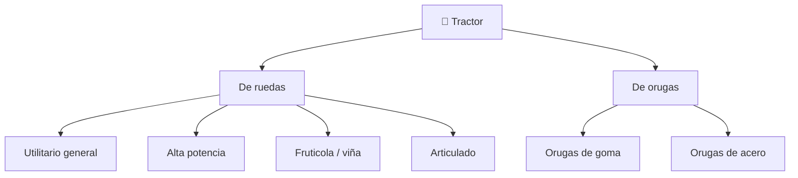

# 📋 Características funcionales del tractor

[🏠 Inicio](../../../README.md) · [🚜 Curso: Tractores](../README.md) · 📋 Características

Que es un tractor, que tipos existen y para que sirve cada uno. Este módulo da el
contexto antes de abrir la mecánica (Módulo 4).

---

## 🧭 Definición

Un tractor es una máquina automotriz disenada para entregar fuerza de tracción y
para accionar aperos en el campo. No busca velocidad, sino **par**: mucha fuerza
a bajas vueltas para tirar de arados, arrastrar remolques y mover implementos a
través de la toma de fuerza. Se distingue por sus grandes ruedas traseras, su
enganche de tres puntos y su capacidad de recibir lastre para mejorar el agarre.

---

## 🧬 Características clave

| Característica | Descripción |
| --- | --- |
| Par elevado | Entrega mucha fuerza a bajas vueltas para tirar y accionar. |
| Toma de fuerza | Un eje transmite la potencia del motor a los aperos. |
| Enganche de tres puntos | Sujeta y controla la altura de aperos montados. |
| Hidráulica de trabajo | Levanta aperos y alimenta accesorios externos. |
| Lastre y contrapeso | Peso agregado que mejora el agarre y equilibra el apero. |
| Estabilidad sensible | Centro de gravedad alto; riesgo de vuelco en pendiente. |

---

## 🗂️ Tipos de tractor

| Tipo | Uso típico | Rasgo destacado |
| --- | --- | --- |
| Utilitario | Tareas generales | Versátil, potencia media. |
| Alta potencia | Labranza pesada | Doble tracción, gran par. |
| Fruticola / viña | Hileras estrechas | Chasis angosto y bajo. |
| Articulado | Grandes extensiones | Se pliega en el centro para girar. |
| De orugas | Suelos blandos o en pendiente | Reparte el peso, mucho agarre. |

---

## 🎯 Para qué se usa

- Labranza: arar, rastrear y preparar el suelo.
- Siembra y aplicación de insumos con aperos accionados por la PTO.
- Cosecha y transporte de productos con remolque.
- Trabajo con implementos: pala cargadora frontal, retro, cortadora.
- Tareas fuera de la agricultura: mantenimiento de caminos, jardinería pesada.

## 🎓 Cierre de clase

- **Actividad:** Compara variantes de Tractores mediante los ejes «definición, rasgos funcionales, tipos y usos» y elige una para un caso de uso razonado.
- **Evidencia:** Matriz comparativa y decisión justificada.
- **Criterio de aprobación:** La elección considera función, límites, mando y efecto en la simulación; no se apoya solo en preferencias.
- **Transferencia:** explica qué cambiaría al pasar a otra variante de esta máquina.

### Fuentes de esta clase

- [OSHA-AGRI](https://www.osha.gov/agricultural-operations/hazards): Agricultural Operations: Hazards and Controls, OSHA. Uso: tractores, aperos y riesgos agrícolas.
- [CL-LEY-18290](https://www.bcn.cl/leychile/navegar?idNorma=29708): Ley de Tránsito 18.290, BCN Chile. Uso: marco legal chileno.

> Las fuentes sostienen el marco conceptual y normativo; esta clase no reemplaza el manual
> del fabricante, la formación certificada ni la habilitación exigida para operar equipos reales.

---

[⬅️ Anterior: Historia](../historia/historia-tractor.md) · [➡️ Siguiente: Modelos y variantes](../modelos/modelos-tractor.md)
