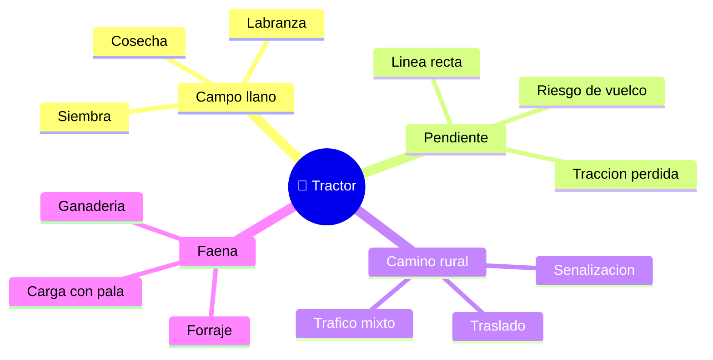

# 🌍 Entornos de trabajo del tractor

[🏠 Inicio](../../../README.md) · [🚜 Curso: Tractores](../README.md) · 🌍 Entornos

Dónde opera un tractor y cómo cambia la conducción según el entorno. Cada entorno
implica reglas, riesgos y ajustes distintos, y en simulación se traduce en
escenarios diferentes.

---

## 🗺️ Entornos principales

| Entorno | Características | Riesgos típicos | Ajuste de conducción |
| --- | --- | --- | --- |
| Campo llano | Labranza, siembra, cosecha. | Polvo, obstáculos ocultos. | Régimen de PTO estable, avance parejo. |
| Pendiente | Terreno inclinado. | Vuelco lateral o hacia atrás. | Subir en línea recta, baja velocidad. |
| Suelo blando / barro | Poca firmeza, patinaje. | Empantanamiento, pérdida de tracción. | Doble tracción, lastre, bloqueo de diferencial. |
| Camino rural | Traslado entre predios. | Tráfico mixto, baja visibilidad. | Frenos unidos, luces, apero trabado. |
| Faena ganadera / forraje | Carga y transporte. | Atrapamiento con la PTO. | Protector de PTO, área despejada. |

---

## 🌦️ Factores del entorno

- **Pendiente**: es el factor de riesgo principal por el vuelco del tractor.
- **Humedad del suelo**: define el agarre; el barro exige lastre y doble tracción.
- **Tipo de labor**: labranza pide fuerza; transporte pide velocidad moderada.
- **Tráfico**: al circular por camino público convive con otros vehículos.
- **Clima**: lluvia y polvo afectan visibilidad, agarre y confort.

---

## 🎮 Traducción a simulación

Cada entorno es un escenario con su pendiente, tipo de suelo, labor y clima. Ver
como se modela en el
[Módulo 8: Diseño de simulación](../simulacion/diseno-simulador-tractor.md).

---

[⬅️ Anterior: Principios y operación](principios-tractor.md) · [➡️ Siguiente: Reglamentos](../reglamentos/reglamentos-tractor.md)
