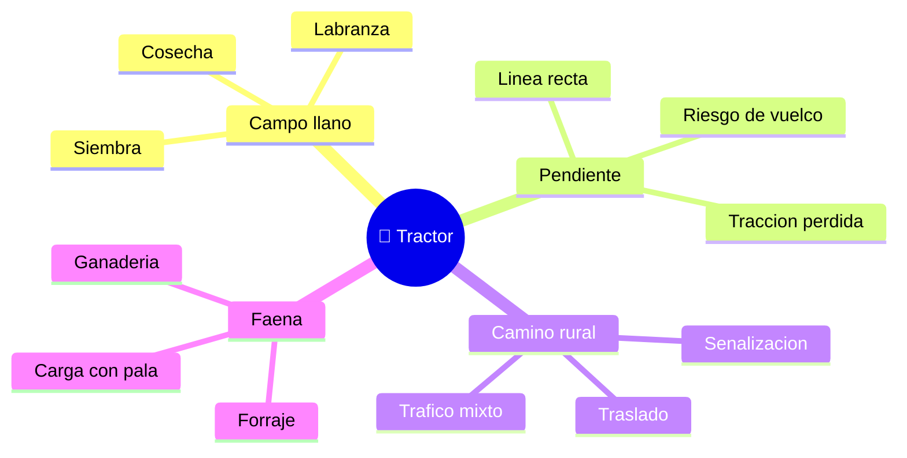

<!-- clase-meta
tipo_documento: clase
clase: 7
codigo: TRACTORES-07
curso: tractores
titulo: "Entornos de trabajo del tractor"
modalidad: "análisis de escenarios"
duracion_minutos: 60
nivel: introductorio
prerrequisito: TRACTORES-06
competencia: "adaptacion_al_entorno"
resultados_aprendizaje:
  - "Explicar entornos, factores ambientales, riesgos y respuesta de simulación con vocabulario propio de Tractores."
  - "Aplicar esos conceptos a una decisión segura o a un escenario de simulación de Tractores."
evidencia: "Matriz entorno–cambio–riesgo–respuesta."
criterio_aprobacion: "Cada respuesta se adapta al entorno y distingue riesgos que no son intercambiables entre escenarios."
fuentes: manuales/fuentes.md
ultima_revision: 2026-09-10
-->

# 🌍 Entornos de trabajo del tractor

[🏠 Inicio](../../../README.md) · [🚜 Curso: Tractores](../README.md) · 🌍 Entornos

Dónde opera un tractor y cómo cambia la conducción según el entorno. Cada entorno
implica reglas, riesgos y ajustes distintos, y en simulación se traduce en
escenarios diferentes.

---

## 🗺️ Entornos principales

```mermaid
mindmap
  root((🚜 Tractor))
    Campo llano
      Labranza
      Siembra
      Cosecha
    Pendiente
      Riesgo de vuelco
      Traccion perdida
      Linea recta
    Camino rural
      Traslado
      Trafico mixto
      Senalizacion
    Faena
      Ganaderia
      Forraje
      Carga con pala
```

| Entorno | Características | Riesgos típicos | Ajuste de conducción |
| --- | --- | --- | --- |
| Campo llano | Labranza, siembra, cosecha. | Polvo, obstáculos ocultos. | Régimen de PTO estable, avance parejo. |
| Pendiente | Terreno inclinado. | Vuelco lateral o hacia atrás. | Subir en línea recta, baja velocidad. |
| Suelo blando / barro | Poca firmeza, patinaje. | Empantanamiento, pérdida de tracción. | Doble tracción, lastre, bloqueo de diferencial. |
| Camino rural | Traslado entre predios. | Tráfico mixto, baja visibilidad. | Frenos unidos, luces, apero trabado. |
| Faena ganadera / forraje | Carga y transporte. | Atrapamiento con la PTO. | Protector de PTO, área despejada. |

---

## 🌦️ Factores del entorno

- **Pendiente**: es el factor de riesgo principal por el vuelco del tractor.
- **Humedad del suelo**: define el agarre; el barro exige lastre y doble tracción.
- **Tipo de labor**: labranza pide fuerza; transporte pide velocidad moderada.
- **Tráfico**: al circular por camino público convive con otros vehículos.
- **Clima**: lluvia y polvo afectan visibilidad, agarre y confort.

---

## 🎮 Traducción a simulación

Cada entorno es un escenario con su pendiente, tipo de suelo, labor y clima. Ver
como se modela en el
[Clase 9: Diseño de simulación](../simulacion/diseno-simulador-tractor.md).

## 🧭 Guía de estudio aplicada

### Pregunta guía

¿Cómo ayuda **Entornos principales, Factores del entorno, Traducción a simulación y Guía de estudio aplicada** a **adaptar trabajo transversal en pendiente con un implemento elevado a tres condiciones ambientales distintas**?

### Explicación razonada

El entorno no es decoración: modifica las fuerzas, la percepción y el tiempo disponible. En el caso «trabajo transversal en pendiente con un implemento elevado», cambia el comportamiento de apero y aumenta la probabilidad de vuelco lateral, atrapamiento en la toma de fuerza o pérdida de dirección. La respuesta correcta empieza por reconocer qué variable cambió y después adaptar límites, ruta o misión.

Esta clase se conecta con el resto del curso mediante **tracción a baja velocidad, transferencia de peso y estabilidad frente al vuelco**. El hilo de
seguridad consiste en reconocer a tiempo **vuelco lateral, atrapamiento en la toma de fuerza o pérdida de dirección** y poder justificar la decisión
**bajar el implemento, reducir velocidad y escoger una trayectoria compatible**; en clases posteriores cambiará el ángulo de análisis, no esa relación causal.
La lectura funcional común sigue **motor → transmisión → toma de fuerza → apero**, de modo que cada concepto pueda
ubicarse dentro del funcionamiento completo y no quede como un dato aislado.

**Apoyo documental:** [Agricultural Operations: Hazards and Controls](https://www.osha.gov/agricultural-operations/hazards) aporta tractores, aperos y riesgos agrícolas;
[Ley de Tránsito 18.290](https://www.bcn.cl/leychile/navegar?idNorma=29708) se usa para marco legal chileno. Estas fuentes
se contrastan con el alcance de la clase y no sustituyen un manual de equipo concreto.

### Caso resuelto: de la observación a la decisión

1. **Escenario base:** conserva la misión «trabajo transversal en pendiente con un implemento elevado» para poder comparar.
2. **Cambiar una condición:** modifica sucesivamente superficie o medio, visibilidad y perturbación externa.
3. **Recalcular margen:** explica cómo cada cambio afecta **apero** y acerca o aleja **vuelco lateral, atrapamiento en la toma de fuerza o pérdida de dirección**.
4. **Adaptar:** cambia límite, ruta, configuración o incluso cancela; no mantengas la misma respuesta por hábito.

### Comprueba tu comprensión

1. ¿Cómo cambiaría **apero** si empeora la perturbación externa?
2. ¿Qué condición ambiental acerca más el escenario a **vuelco lateral, atrapamiento en la toma de fuerza o pérdida de dirección**?
3. ¿Cuándo adaptarías la maniobra y cuándo la cancelarías?

Orientación para revisar tus respuestas

- La primera respuesta debe relacionar el eslabón elegido con un efecto posterior, no solo nombrarlo.
- La segunda debe proponer una señal medible u observable y explicar qué tendencia sería preocupante.
- La tercera debe cambiar al menos una variable de capacidad, mando, entorno o margen de seguridad.

## 🎓 Cierre de clase

- **Actividad:** Contrasta tres entornos de Tractores a partir de entornos, factores ambientales, riesgos y respuesta de simulación y determina cómo cambian variables, percepción, riesgos y respuesta.
- **Evidencia:** Matriz entorno–cambio–riesgo–respuesta.
- **Criterio de aprobación:** Cada respuesta se adapta al entorno y distingue riesgos que no son intercambiables entre escenarios.
- **Transferencia:** explica qué cambiaría al pasar a otra variante de esta máquina.

### Fuentes de esta clase

- [OSHA-AGRI](https://www.osha.gov/agricultural-operations/hazards): Agricultural Operations: Hazards and Controls, OSHA. Uso: tractores, aperos y riesgos agrícolas.
- [CL-LEY-18290](https://www.bcn.cl/leychile/navegar?idNorma=29708): Ley de Tránsito 18.290, BCN Chile. Uso: marco legal chileno.

> Las fuentes sostienen el marco conceptual y normativo; esta clase no reemplaza el manual
> del fabricante, la formación certificada ni la habilitación exigida para operar equipos reales.

---

[⬅️ Anterior: Principios y operación](principios-tractor.md) · [➡️ Siguiente: Reglamentos](../reglamentos/reglamentos-tractor.md)
