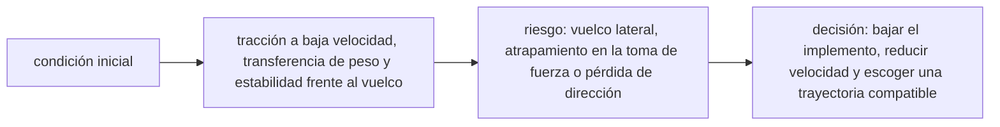

<!-- clase-meta
tipo_documento: clase
clase: 6
codigo: TRACTORES-06
curso: tractores
titulo: "Principios y operación del tractor"
modalidad: "resolución de problemas"
duracion_minutos: 90
nivel: introductorio
prerrequisito: TRACTORES-05
competencia: "razonamiento_operacional"
resultados_aprendizaje:
  - "Explicar principios físicos, fases de operación, decisiones y errores frecuentes con vocabulario propio de Tractores."
  - "Aplicar esos conceptos a una decisión segura o a un escenario de simulación de Tractores."
evidencia: "Resolución argumentada de un escenario operacional."
criterio_aprobacion: "Aplica los principios correctos, anticipa consecuencias y respeta los límites del curso."
fuentes: manuales/fuentes.md
ultima_revision: 2026-09-10
-->

# 🧪 Principios y operación del tractor

[🏠 Inicio](../../../README.md) · [🚜 Curso: Tractores](../README.md) · 🧪 Principios

Documento general y educativo. No sustituye la capacitación agrícola certificada
ni el manual del fabricante. Describe cómo se opera un tractor en simulación y
que principios físicos conviene representar.

## Principios de funcionamiento

- **Tracción**: el motor diesel entrega par a las ruedas; el agarre depende del
  peso sobre ellas y del tipo de suelo. Sin peso suficiente, la rueda patina.
- **Transferencia de peso**: al tirar de un apero o levantarlo con el enganche,
  parte del peso se traslada al eje trasero y aumenta el agarre.
- **Toma de fuerza**: el motor entrega potencia a régimen constante para accionar
  aperos, independiente de la velocidad de avance.
- **Estabilidad**: el centro de gravedad alto y la vía estrecha hacen al tractor
  sensible al vuelco lateral en pendiente y al vuelco hacia atrás si el tiro es alto.
- **Patinaje**: un poco de patinaje es inevitable; el exceso desperdicia potencia
  y dana el suelo, y se corrige con lastre o doble tracción.

## Fases de operación

| Fase | Que ocurre | Puntos clave |
| --- | --- | --- |
| Inspección previa | Revisión de la máquina y el apero | Aceite, filtros, enganche, protector de PTO. |
| Enganche del apero | Conectar el implemento | Tres puntos firmes, cardan de PTO seguro. |
| Arranque | Iniciar movimiento | Marcha corta, soltar embrague suave. |
| Traslado | Ir al lugar de trabajo | Frenos unidos, apero levantado y trabado. |
| Trabajo | Ejecutar la labor | Régimen de PTO, profundidad y velocidad constantes. |
| Giro en cabecera | Cambiar de surco | Levantar apero, desconectar PTO si procede. |
| Cierre | Dejar la máquina segura | Apero apoyado, PTO desconectada, freno de mano. |

## Estabilidad: idea general

1. Subir y bajar pendientes **en línea recta**, nunca en diagonal.
2. Reducir la velocidad antes de un giro, sobre todo en pendiente.
3. Enganchar siempre el tiro desde la **barra de tiro baja**, no en alto.
4. Usar lastre para equilibrar aperos pesados y mejorar el agarre.
5. Llevar puesto el cinturón dentro de la estructura antivuelco.

## Errores comunes que la simulación puede enseñar a evitar

- Girar en pendiente a velocidad alta y provocar vuelco lateral.
- Enganchar una carga por encima del eje y provocar vuelco hacia atrás.
- Acercarse a la PTO en marcha o trabajar sin su protector.
- Forzar el motor sin usar el control de esfuerzo del enganche.
- Circular por carretera con los pedales de freno sin unir.
- Ignorar el lastre y trabajar con exceso de patinaje.

## Relación con los niveles de realismo

- **Nivel 1 (educativo)**: conducir, enganchar un apero y subir/bajar el enganche.
- **Nivel 2 (simplificado)**: agregar tracción, patinaje básico y estabilidad en
  pendiente.
- **Nivel 3 (técnico)**: sumar régimen de PTO, control de esfuerzo, transferencia
  de peso, lastre y límites de vuelco.

Ver [`docs/03-niveles-de-realismo.md`](../../../docs/03-niveles-de-realismo.md)
para el detalle de cada nivel.

## 🧭 Guía de estudio aplicada

### Pregunta guía

¿Cómo ayuda **Principios de funcionamiento, Fases de operación, Estabilidad: idea general y Errores comunes que la simulación puede enseñar a evitar** a **resolver trabajo transversal en pendiente con un implemento elevado sin agotar el margen operacional**?

### Explicación razonada

El principio rector puede resumirse así: tracción a baja velocidad, transferencia de peso y estabilidad frente al vuelco. Esto explica por qué una misma orden produce resultados distintos cuando cambian velocidad, carga, configuración o entorno. Operar bien consiste en leer la tendencia antes de agotar el margen y tomar esta decisión: bajar el implemento, reducir velocidad y escoger una trayectoria compatible.

Esta clase se conecta con el resto del curso mediante **tracción a baja velocidad, transferencia de peso y estabilidad frente al vuelco**. El hilo de
seguridad consiste en reconocer a tiempo **vuelco lateral, atrapamiento en la toma de fuerza o pérdida de dirección** y poder justificar la decisión
**bajar el implemento, reducir velocidad y escoger una trayectoria compatible**; en clases posteriores cambiará el ángulo de análisis, no esa relación causal.
La lectura funcional común sigue **motor → transmisión → toma de fuerza → apero**, de modo que cada concepto pueda
ubicarse dentro del funcionamiento completo y no quede como un dato aislado.

**Apoyo documental:** [Agricultural Operations: Hazards and Controls](https://www.osha.gov/agricultural-operations/hazards) aporta tractores, aperos y riesgos agrícolas;
[Ley de Tránsito 18.290](https://www.bcn.cl/leychile/navegar?idNorma=29708) se usa para marco legal chileno. Estas fuentes
se contrastan con el alcance de la clase y no sustituyen un manual de equipo concreto.

### Caso resuelto: de la observación a la decisión

1. **Datos:** reconoce condiciones, configuración y margen disponibles en **trabajo transversal en pendiente con un implemento elevado**.
2. **Modelo:** aplica **tracción a baja velocidad, transferencia de peso y estabilidad frente al vuelco** para predecir una tendencia antes de actuar.
3. **Riesgo:** explica mediante qué cadena de causas podría ocurrir **vuelco lateral, atrapamiento en la toma de fuerza o pérdida de dirección**.
4. **Decisión:** ejecuta mentalmente **bajar el implemento, reducir velocidad y escoger una trayectoria compatible** y define qué observación confirmaría que funcionó.

### Comprueba tu comprensión

1. ¿Qué variable del principio «tracción a baja velocidad, transferencia de peso y estabilidad frente al vuelco» cambia primero en el caso?
2. ¿Cómo se propaga ese cambio hasta **apero**?
3. ¿Qué evidencia confirmaría que **bajar el implemento, reducir velocidad y escoger una trayectoria compatible** conservó margen operacional?

Orientación para revisar tus respuestas

- La primera respuesta debe relacionar el eslabón elegido con un efecto posterior, no solo nombrarlo.
- La segunda debe proponer una señal medible u observable y explicar qué tendencia sería preocupante.
- La tercera debe cambiar al menos una variable de capacidad, mando, entorno o margen de seguridad.

## 🎓 Cierre de clase

- **Actividad:** Resuelve un escenario de Tractores explicando, paso a paso, cómo intervienen principios físicos, fases de operación, decisiones y errores frecuentes.
- **Evidencia:** Resolución argumentada de un escenario operacional.
- **Criterio de aprobación:** Aplica los principios correctos, anticipa consecuencias y respeta los límites del curso.
- **Transferencia:** explica qué cambiaría al pasar a otra variante de esta máquina.

### Fuentes de esta clase

- [OSHA-AGRI](https://www.osha.gov/agricultural-operations/hazards): Agricultural Operations: Hazards and Controls, OSHA. Uso: tractores, aperos y riesgos agrícolas.
- [CL-LEY-18290](https://www.bcn.cl/leychile/navegar?idNorma=29708): Ley de Tránsito 18.290, BCN Chile. Uso: marco legal chileno.

> Las fuentes sostienen el marco conceptual y normativo; esta clase no reemplaza el manual
> del fabricante, la formación certificada ni la habilitación exigida para operar equipos reales.

---

[⬅️ Anterior: Mandos](../mandos/manual-mandos-tractor.md) · [➡️ Siguiente: Entornos de trabajo](entornos-tractor.md)
