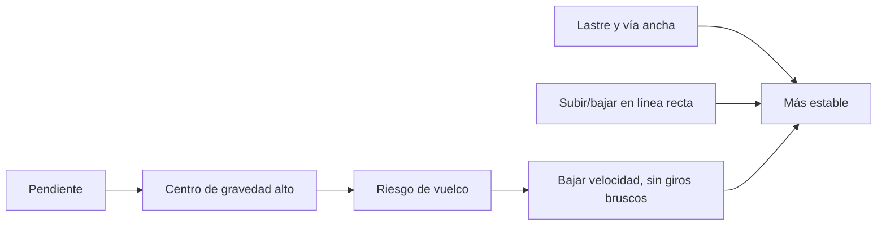

# 🧰 Recursos del tractor

[🏠 Inicio](../../../README.md) · [🚜 Curso: Tractores](../README.md) · 🧰 Recursos

Glosario específico, enlaces y diagramas de apoyo del curso de tractores. Amplia
el [glosario general](../../../docs/05-glosario-general.md).

---

## 📖 Glosario específico

| Término | Definición |
| --- | --- |
| Toma de fuerza (PTO) | Eje que transmite la potencia del motor a un apero. |
| Enganche de tres puntos | Triángulo de brazos que sujeta y controla un apero montado. |
| Tercer punto | Brazo superior que fija el ángulo del apero. |
| Control de esfuerzo | Regulación que sube el apero cuando aumenta la resistencia. |
| Barra de tiro | Punto bajo de enganche para arrastrar cargas con seguridad. |
| Lastre | Peso agregado que mejora el agarre y equilibra el apero. |
| Patinaje | Diferencia entre el giro de la rueda y el avance real. |
| Doble tracción | Sistema que tracciona también el eje delantero. |
| ROPS | Estructura antivuelco que protege al operador. |
| Bloqueo de diferencial | Mando que iguala el giro de ambas ruedas motrices. |

---

## 🗺️ Diagrama de estabilidad en pendiente

---

## 🔗 Enlaces y fuentes

- Marco legal: [⚖️ docs/07-marco-legal-chile.md](../../../docs/07-marco-legal-chile.md)
- Registro de fuentes: [📚 manuales/fuentes.md](../../../manuales/fuentes.md)
- Manuales oficiales del conductor (CONASET): ver el registro de fuentes.

Registrar cada recurso nuevo con su origen y licencia, siguiendo
[`recursos/README.md`](../../../recursos/README.md).

---

[🎓 Portada del curso](../README.md) · [⬅️ Anterior: Diseño de simulación](../simulacion/diseno-simulador-tractor.md)
