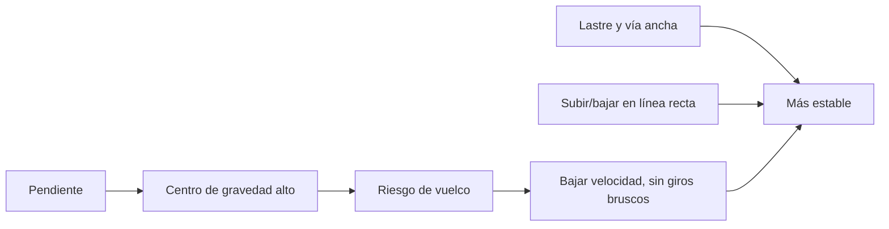

<!-- clase-meta
tipo_documento: clase
clase: 10
codigo: TRACTORES-10
curso: tractores
titulo: "Recursos del tractor"
modalidad: "taller documental"
duracion_minutos: 45
nivel: introductorio
prerrequisito: TRACTORES-09
competencia: "alfabetizacion_tecnica"
resultados_aprendizaje:
  - "Explicar glosario, esquemas y trazabilidad de fuentes con vocabulario propio de Tractores."
  - "Aplicar esos conceptos a una decisión segura o a un escenario de simulación de Tractores."
evidencia: "Glosario aplicado y ficha breve de trazabilidad."
criterio_aprobacion: "Los términos permiten interpretar el curso y las fuentes se distinguen por autoridad, alcance y vigencia."
fuentes: manuales/fuentes.md
ultima_revision: 2026-09-10
-->

# 🧰 Recursos del tractor

[🏠 Inicio](../../../README.md) · [🚜 Curso: Tractores](../README.md) · 🧰 Recursos

Glosario específico, enlaces y diagramas de apoyo del curso de tractores. Amplia
el [glosario general](../../../docs/05-glosario-general.md).

---

## 📖 Glosario específico

| Término | Definición |
| --- | --- |
| Toma de fuerza (PTO) | Eje que transmite la potencia del motor a un apero. |
| Enganche de tres puntos | Triángulo de brazos que sujeta y controla un apero montado. |
| Tercer punto | Brazo superior que fija el ángulo del apero. |
| Control de esfuerzo | Regulación que sube el apero cuando aumenta la resistencia. |
| Barra de tiro | Punto bajo de enganche para arrastrar cargas con seguridad. |
| Lastre | Peso agregado que mejora el agarre y equilibra el apero. |
| Patinaje | Diferencia entre el giro de la rueda y el avance real. |
| Doble tracción | Sistema que tracciona también el eje delantero. |
| ROPS | Estructura antivuelco que protege al operador. |
| Bloqueo de diferencial | Mando que iguala el giro de ambas ruedas motrices. |

---

## 🗺️ Diagrama de estabilidad en pendiente

```mermaid
flowchart LR
    Pendiente[Pendiente] --> CG[Centro de gravedad alto]
    CG --> Riesgo[Riesgo de vuelco]
    Lastre[Lastre y vía ancha] --> Estable[Más estable]
    Recta[Subir/bajar en línea recta] --> Estable
    Riesgo --> Prudencia[Bajar velocidad, sin giros bruscos]
    Prudencia --> Estable
```

---

## 🔗 Enlaces y fuentes

- Marco legal: [⚖️ docs/07-marco-legal-chile.md](../../../docs/07-marco-legal-chile.md)
- Registro de fuentes: [📚 manuales/fuentes.md](../../../manuales/fuentes.md)
- Manuales oficiales del conductor (CONASET): ver el registro de fuentes.

Registrar cada recurso nuevo con su origen y licencia, siguiendo
[`recursos/README.md`](../../../recursos/README.md).

## 🧭 Guía de estudio aplicada

### Pregunta guía

¿Cómo ayuda **Glosario específico, Diagrama de estabilidad en pendiente, Enlaces y fuentes y Guía de estudio aplicada** a **explicar con fuentes los términos motor, transmisión, toma de fuerza y apero**?

### Explicación razonada

El vocabulario técnico organiza relaciones: motor, transmisión, toma de fuerza y apero nombran partes distintas de una misma cadena funcional. Una fuente se usa para sostener una afirmación concreta —principio, límite, procedimiento o contexto— y debe distinguirse del manual particular de un fabricante o de una regla narrativa.

Esta clase se conecta con el resto del curso mediante **tracción a baja velocidad, transferencia de peso y estabilidad frente al vuelco**. El hilo de
seguridad consiste en reconocer a tiempo **vuelco lateral, atrapamiento en la toma de fuerza o pérdida de dirección** y poder justificar la decisión
**bajar el implemento, reducir velocidad y escoger una trayectoria compatible**; en clases posteriores cambiará el ángulo de análisis, no esa relación causal.
La lectura funcional común sigue **motor → transmisión → toma de fuerza → apero**, de modo que cada concepto pueda
ubicarse dentro del funcionamiento completo y no quede como un dato aislado.

**Apoyo documental:** [Agricultural Operations: Hazards and Controls](https://www.osha.gov/agricultural-operations/hazards) aporta tractores, aperos y riesgos agrícolas;
[Ley de Tránsito 18.290](https://www.bcn.cl/leychile/navegar?idNorma=29708) se usa para marco legal chileno. Estas fuentes
se contrastan con el alcance de la clase y no sustituyen un manual de equipo concreto.

### Caso resuelto: de la observación a la decisión

1. **Definir en contexto:** explica **motor**, **transmisión**, **toma de fuerza** y **apero** por su función y relación.
2. **Respaldar:** enlaza cada afirmación importante con una fuente identificable y declara su alcance.
3. **Contrastar:** separa principios generales, requisitos locales, manual de fabricante y —si aplica— canon ficticio.
4. **Reformular:** convierte una definición copiada en una explicación propia con un ejemplo de **Tractores**.

### Comprueba tu comprensión

1. Explica la diferencia funcional entre **transmisión** y **toma de fuerza** sin copiar una definición.
2. ¿Qué fuente respalda el principio «tracción a baja velocidad, transferencia de peso y estabilidad frente al vuelco» y cuál es su alcance?
3. ¿Qué dato exigiría un manual de fabricante en vez de una fuente general?

Orientación para revisar tus respuestas

- La primera respuesta debe relacionar el eslabón elegido con un efecto posterior, no solo nombrarlo.
- La segunda debe proponer una señal medible u observable y explicar qué tendencia sería preocupante.
- La tercera debe cambiar al menos una variable de capacidad, mando, entorno o margen de seguridad.

## 🎓 Cierre de clase

- **Actividad:** Selecciona términos de glosario, esquemas y trazabilidad de fuentes, explícalos en contexto de Tractores y verifica la procedencia de las fuentes utilizadas.
- **Evidencia:** Glosario aplicado y ficha breve de trazabilidad.
- **Criterio de aprobación:** Los términos permiten interpretar el curso y las fuentes se distinguen por autoridad, alcance y vigencia.
- **Transferencia:** explica qué cambiaría al pasar a otra variante de esta máquina.

### Fuentes de esta clase

- [OSHA-AGRI](https://www.osha.gov/agricultural-operations/hazards): Agricultural Operations: Hazards and Controls, OSHA. Uso: tractores, aperos y riesgos agrícolas.
- [CL-LEY-18290](https://www.bcn.cl/leychile/navegar?idNorma=29708): Ley de Tránsito 18.290, BCN Chile. Uso: marco legal chileno.

> Las fuentes sostienen el marco conceptual y normativo; esta clase no reemplaza el manual
> del fabricante, la formación certificada ni la habilitación exigida para operar equipos reales.

---

[🎓 Portada del curso](../README.md) · [⬅️ Anterior: Diseño de simulación](../simulacion/diseno-simulador-tractor.md) · [➡️ Siguiente: Ejercicios](../ejercicios/ejercicios-tractor.md)
