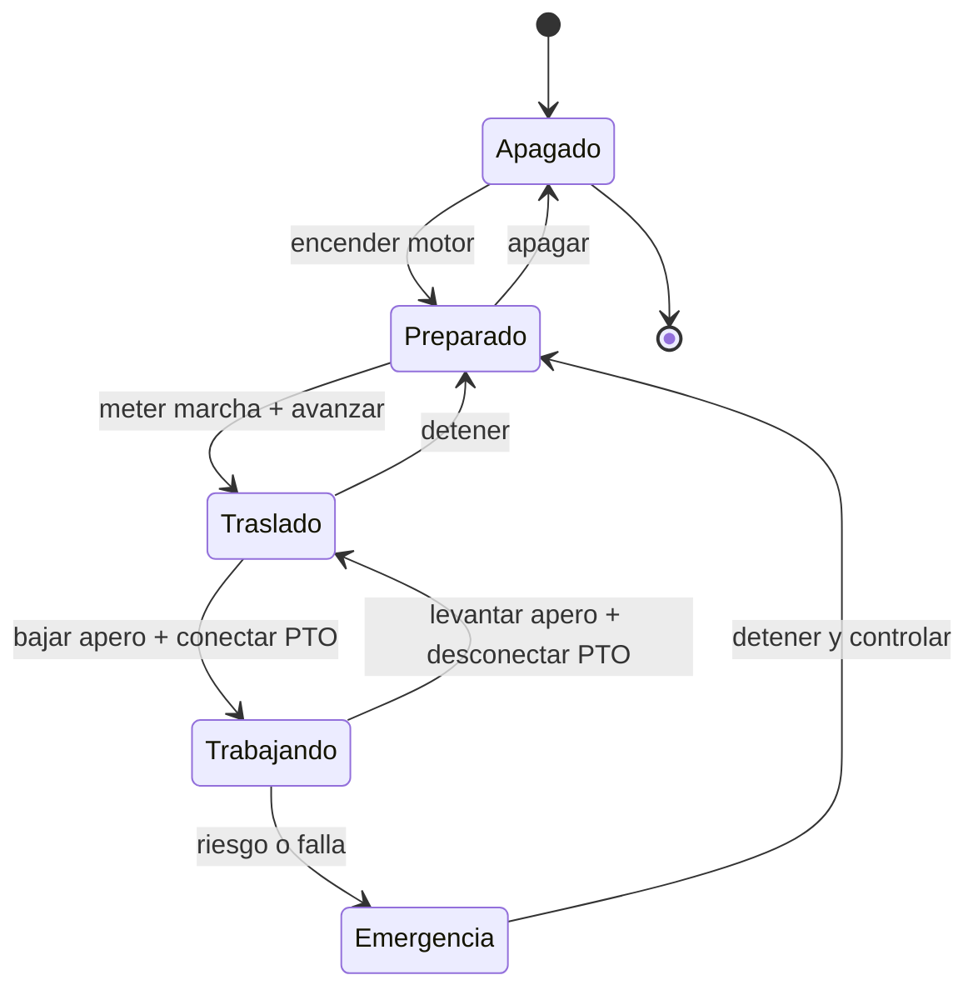

# 🎮 Diseño de simulación del tractor

[🏠 Inicio](../../../README.md) · [🚜 Curso: Tractores](../README.md) · 🎮 Simulación

## Objetivo de la simulación

Que el usuario aprenda a operar un tractor con seguridad: enganchar un apero,
usar la toma de fuerza y la hidráulica del enganche de tres puntos, mantener la
tracción sin patinar en exceso y, sobre todo, conservar la estabilidad en
pendiente evitando el vuelco.

## Nivel de realismo

- Nivel elegido: se ofrece del 1 al 3 (ver `docs/03-niveles-de-realismo.md`).
- Justificación: el tractor introduce la máquina de trabajo con toma de fuerza y
  enganche, y una física de estabilidad delicada, sin la complejidad del izaje de
  una grúa.

## Variables principales

| Variable | Tipo | Rango | Afecta a | Comentarios |
| --- | --- | --- | --- | --- |
| Velocidad | numérica | 0-40 km/h | Avance y trabajo | Baja en labranza, media en traslado. |
| Régimen del motor | numérica | 0-2500 rpm | Par y régimen de PTO | Marca 540 o 1000 rpm de la PTO. |
| Marcha | discreta | superreductora..transporte | Fuerza y velocidad | Muchas relaciones de trabajo. |
| Patinaje | numérica | 0-100% | Tracción útil | Sube en suelo blando sin lastre. |
| Enganche | numérica | subido..bajado | Profundidad del apero | Control de posición o esfuerzo. |
| Lastre | numérica | 0-100% | Agarre y estabilidad | Equilibra el apero trasero. |
| Pendiente | numérica | -30..30 grados | Riesgo de vuelco | Factor de estabilidad central. |
| Inclinación lateral | numérica | -30..30 grados | Vuelco lateral | Crítica en ladera. |

## Ciclo básico

1. Leer entrada del usuario (acelerador, frenos, marcha, PTO, enganche, dirección).
2. Actualizar estado del motor, la transmisión y la PTO.
3. Calcular fuerzas: tracción, patinaje, tiro del apero, gravedad en pendiente.
4. Aplicar restricciones del entorno (suelo, pendiente, clima, lastre).
5. Actualizar velocidad, posición, profundidad del apero y estabilidad.
6. Refrescar instrumentos y retroalimentación (sonido, testigos, avisos de vuelco).

## Modos de juego futuros

- Tutorial guiado de enganche de aperos y uso de la PTO.
- Práctica de labranza manteniendo profundidad y régimen constantes.
- Desafíos de estabilidad en pendiente sin volcar.
- Misiones de traslado por camino rural respetando la señalización.
- Carga y movimiento de material con pala frontal.

## Elementos fuera de alcance

- Presentar la conducción en pendiente sin ROPS como algo aceptable.
- Trabajar con la PTO sin protector como opción valida.
- Datos que permitan alterar sistemas reales de la máquina.

## Pendientes

- [ ] Definir valores por defecto de cada variable por tipo de tractor.
- [ ] Prototipar el modelo de tracción y patinaje.
- [ ] Ajustar el modelo de estabilidad y vuelco en pendiente.
- [ ] Agregar fuentes técnicas públicas a
      [`manuales/fuentes.md`](../../../manuales/fuentes.md).

---

[⬅️ Anterior: Reglamentos](../reglamentos/reglamentos-tractor.md) · [➡️ Siguiente: Recursos](../recursos/recursos-tractor.md)
