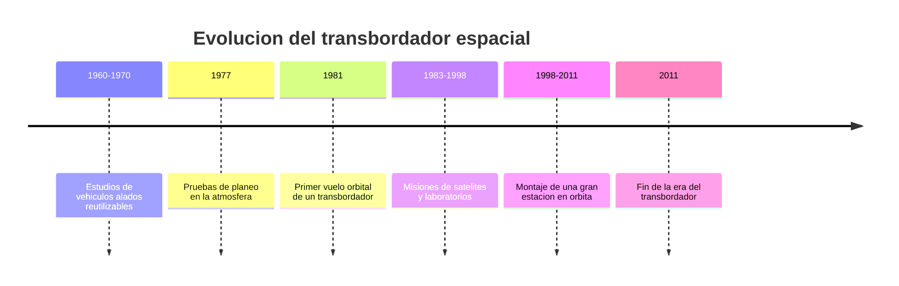

# 📜 Historia del transbordador

[🏠 Inicio](../../../README.md) · [🛬 Curso: Transbordadores](../README.md) · 📜 Historia

## Origen

El transbordador nace de una idea ambiciosa: un vehículo espacial que despegue
como cohete, trabaje en órbita y regrese planeando para aterrizar en una pista,
listo para volar otra vez. La meta era reutilizar la nave para bajar el costo de
cada misión. Antes de volar al espacio, se probo el **planeo** dejandolo caer
desde un avión para validar el aterrizaje sin motor. Esta es historia de
**ciencia real**.

## Línea de tiempo

| Periodo | Hito | Importancia |
| --- | --- | --- |
| 1960-1970 | Estudios de vehículos alados | Se disena el concepto reutilizable. |
| 1977 | Pruebas de planeo atmosférico | Se valida el aterrizaje sin motor. |
| 1981 | Primer vuelo orbital | El transbordador llega al espacio y vuelve. |
| 1983-1998 | Misiones de satélites y ciencia | Se usa como laboratorio y taller orbital. |
| 1998-2011 | Montaje de una estación orbital | Lleva y ensambla grandes módulos. |
| 2011 | Fin de la era del transbordador | Cierra un capítulo de la reutilización. |

## Evolución tecnológica

- **Reutilización**: primer intento serio de reusar un vehículo espacial completo.
- **Escudo térmico**: miles de piezas para soportar el calor de la reentrada.
- **Reentrada alada**: alas y timones para planear y aterrizar en pista.
- **Brazo robotico**: para desplegar y capturar cargas en órbita.
- **Propulsores recuperables**: los cohetes laterales se recuperaban del mar.
- **Lecciones de seguridad**: cada misión mejoró la comprensión del riesgo.

## Partes representativas

| Parte | Función | Característica destacada |
| --- | --- | --- |
| Orbitador | Nave alada con tripulación y carga | Regresa planeando a una pista. |
| Propulsores laterales | Empuje extra en el despegue | Recuperables tras separarse. |
| Tanque externo | Alimenta los motores del orbitador | Se desechaba en cada vuelo. |
| Escudo térmico | Protege en la reentrada | Miles de losetas resistentes al calor. |
| Bahía de carga | Lleva satélites y módulos | Puertas que se abren en órbita. |

## Impacto social y económico

El transbordador demostro que un vehículo espacial podía reutilizarse y regresar
planeando, y permitió construir en órbita una gran estación internacional. Aunque
resultó más caro y complejo de lo esperado, dejó lecciones clave sobre
reutilización, escudos térmicos y seguridad que hoy guian a los cohetes modernos.

## Fuentes

- Registrar aquí las fuentes públicas consultadas.
- Enlazar cada fuente también en [`manuales/fuentes.md`](../../../manuales/fuentes.md).

---

[🎓 Portada del curso](../README.md) · [➡️ Siguiente: Características](../operacion/caracteristicas-transbordador.md)
