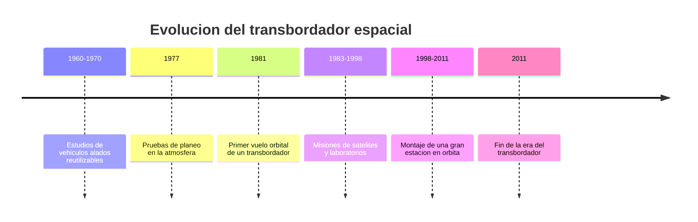

# 📜 Historia del transbordador

[🏠 Inicio](../../../README.md) · [🛬 Curso: Transbordadores](../README.md) · 📜 Historia

## Origen

El transbordador nace de una idea ambiciosa: un vehiculo espacial que despegue
como cohete, trabaje en orbita y regrese planeando para aterrizar en una pista,
listo para volar otra vez. La meta era reutilizar la nave para bajar el costo de
cada mision. Antes de volar al espacio, se probo el **planeo** dejandolo caer
desde un avion para validar el aterrizaje sin motor. Esta es historia de
**ciencia real**.

## Linea de tiempo

| Periodo | Hito | Importancia |
| --- | --- | --- |
| 1960-1970 | Estudios de vehiculos alados | Se disena el concepto reutilizable. |
| 1977 | Pruebas de planeo atmosferico | Se valida el aterrizaje sin motor. |
| 1981 | Primer vuelo orbital | El transbordador llega al espacio y vuelve. |
| 1983-1998 | Misiones de satelites y ciencia | Se usa como laboratorio y taller orbital. |
| 1998-2011 | Montaje de una estacion orbital | Lleva y ensambla grandes modulos. |
| 2011 | Fin de la era del transbordador | Cierra un capitulo de la reutilizacion. |

## Evolucion tecnologica

- **Reutilizacion**: primer intento serio de reusar un vehiculo espacial completo.
- **Escudo termico**: miles de piezas para soportar el calor de la reentrada.
- **Reentrada alada**: alas y timones para planear y aterrizar en pista.
- **Brazo robotico**: para desplegar y capturar cargas en orbita.
- **Propulsores recuperables**: los cohetes laterales se recuperaban del mar.
- **Lecciones de seguridad**: cada mision mejoro la comprension del riesgo.

## Partes representativas

| Parte | Funcion | Caracteristica destacada |
| --- | --- | --- |
| Orbitador | Nave alada con tripulacion y carga | Regresa planeando a una pista. |
| Propulsores laterales | Empuje extra en el despegue | Recuperables tras separarse. |
| Tanque externo | Alimenta los motores del orbitador | Se desechaba en cada vuelo. |
| Escudo termico | Protege en la reentrada | Miles de losetas resistentes al calor. |
| Bahia de carga | Lleva satelites y modulos | Puertas que se abren en orbita. |

## Impacto social y economico

El transbordador demostro que un vehiculo espacial podia reutilizarse y regresar
planeando, y permitio construir en orbita una gran estacion internacional. Aunque
resulto mas caro y complejo de lo esperado, dejo lecciones clave sobre
reutilizacion, escudos termicos y seguridad que hoy guian a los cohetes modernos.

## Fuentes

- Registrar aqui las fuentes publicas consultadas.
- Enlazar cada fuente tambien en [`manuales/fuentes.md`](../../../manuales/fuentes.md).

---

[🎓 Portada del curso](../README.md) · [➡️ Siguiente: Caracteristicas](../operacion/caracteristicas-transbordador.md)
