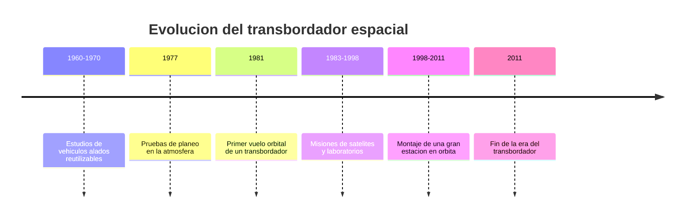

<!-- clase-meta
tipo_documento: clase
clase: 1
codigo: TRANSBORDADO-01
curso: transbordadores
titulo: "Historia del transbordador"
modalidad: "teórica dialogada"
duracion_minutos: 45
nivel: introductorio
prerrequisito: ninguno
competencia: "contexto_historico"
resultados_aprendizaje:
  - "Explicar origen, evolución tecnológica, variantes representativas e impacto con vocabulario propio de Transbordadores."
  - "Aplicar esos conceptos a una decisión segura o a un escenario de simulación de Transbordadores."
evidencia: "Línea de tiempo comentada con cuatro hitos o más."
criterio_aprobacion: "Los hitos están ordenados, son pertinentes y dos relaciones de causa y efecto quedan justificadas."
fuentes: manuales/fuentes.md
ultima_revision: 2026-09-10
-->

# 📜 Historia del transbordador

[🏠 Inicio](../../../README.md) · [🛬 Curso: Transbordadores](../README.md) · 📜 Historia

```mermaid
timeline
    title Evolucion del transbordador espacial
    1960-1970 : Estudios de vehiculos alados reutilizables
    1977 : Pruebas de planeo en la atmosfera
    1981 : Primer vuelo orbital de un transbordador
    1983-1998 : Misiones de satelites y laboratorios
    1998-2011 : Montaje de una gran estacion en orbita
    2011 : Fin de la era del transbordador
```

## Origen

El transbordador nace de una idea ambiciosa: un vehículo espacial que despegue
como cohete, trabaje en órbita y regrese planeando para aterrizar en una pista,
listo para volar otra vez. La meta era reutilizar la nave para bajar el costo de
cada misión. Antes de volar al espacio, se probo el **planeo** dejandolo caer
desde un avión para validar el aterrizaje sin motor. Esta es historia de
**ciencia real**.

## Línea de tiempo

| Periodo | Hito | Importancia |
| --- | --- | --- |
| 1960-1970 | Estudios de vehículos alados | Se disena el concepto reutilizable. |
| 1977 | Pruebas de planeo atmosférico | Se valida el aterrizaje sin motor. |
| 1981 | Primer vuelo orbital | El transbordador llega al espacio y vuelve. |
| 1983-1998 | Misiones de satélites y ciencia | Se usa como laboratorio y taller orbital. |
| 1998-2011 | Montaje de una estación orbital | Lleva y ensambla grandes módulos. |
| 2011 | Fin de la era del transbordador | Cierra un capítulo de la reutilización. |

## Evolución tecnológica

- **Reutilización**: primer intento serio de reusar un vehículo espacial completo.
- **Escudo térmico**: miles de piezas para soportar el calor de la reentrada.
- **Reentrada alada**: alas y timones para planear y aterrizar en pista.
- **Brazo robotico**: para desplegar y capturar cargas en órbita.
- **Propulsores recuperables**: los cohetes laterales se recuperaban del mar.
- **Lecciones de seguridad**: cada misión mejoró la comprensión del riesgo.

## Partes representativas

| Parte | Función | Característica destacada |
| --- | --- | --- |
| Orbitador | Nave alada con tripulación y carga | Regresa planeando a una pista. |
| Propulsores laterales | Empuje extra en el despegue | Recuperables tras separarse. |
| Tanque externo | Alimenta los motores del orbitador | Se desechaba en cada vuelo. |
| Escudo térmico | Protege en la reentrada | Miles de losetas resistentes al calor. |
| Bahía de carga | Lleva satélites y módulos | Puertas que se abren en órbita. |

## Impacto social y económico

El transbordador demostro que un vehículo espacial podía reutilizarse y regresar
planeando, y permitió construir en órbita una gran estación internacional. Aunque
resultó más caro y complejo de lo esperado, dejó lecciones clave sobre
reutilización, escudos térmicos y seguridad que hoy guian a los cohetes modernos.

## 🧭 Guía de estudio aplicada

### Pregunta guía

¿Cómo ayuda **Origen, Línea de tiempo, Evolución tecnológica y Partes representativas** a **explicar cómo la evolución hizo posibles alternativas como configuración de lanzamiento frente a orbitador en planeo**?

### Explicación razonada

La evolución de Transbordadores se comprende mejor como una sucesión de respuestas a problemas, no como una lista de fechas. Los cambios en motores principales, propulsores sólidos, vehículo orbital y superficies de reentrada alteraron qué podía hacer la máquina, quién podía usarla y qué riesgos debían controlarse. El contraste «configuración de lanzamiento frente a orbitador en planeo» permite observar qué decisiones de diseño permanecieron y cuáles cambiaron con la tecnología y el propósito.

Esta clase se conecta con el resto del curso mediante **una misión combina regímenes irreversibles: ascenso propulsado, órbita y planeo sin motor**. El hilo de
seguridad consiste en reconocer a tiempo **disipar mal la energía o salir del corredor térmico y geométrico** y poder justificar la decisión
**administrar energía y puntos de no retorno antes de cada fase**; en clases posteriores cambiará el ángulo de análisis, no esa relación causal.
La lectura funcional común sigue **motores principales → propulsores sólidos → vehículo orbital → superficies de reentrada**, de modo que cada concepto pueda
ubicarse dentro del funcionamiento completo y no quede como un dato aislado.

**Apoyo documental:** [The Space Shuttle](https://www.nasa.gov/reference/the-space-shuttle/) aporta arquitectura y operación del transbordador;
[Aviation Handbooks and Manuals](https://www.faa.gov/regulations_policies/handbooks_manuals) se usa para aerodinámica, sistemas y operación. Estas fuentes
se contrastan con el alcance de la clase y no sustituyen un manual de equipo concreto.

### Caso resuelto: de la observación a la decisión

1. **Situar:** ordena los hitos que explican cómo se llegó a **configuración de lanzamiento frente a orbitador en planeo** y describe la necesidad que impulsó cada cambio.
2. **Relacionar:** explica qué se modificó en **motores principales**, **propulsores sólidos**, **vehículo orbital** o **superficies de reentrada**; una fecha sin mecanismo no basta.
3. **Interpretar:** vincula el cambio con una capacidad nueva y también con el riesgo **disipar mal la energía o salir del corredor térmico y geométrico**.
4. **Transferir:** usa la evolución para justificar por qué hoy conviene **administrar energía y puntos de no retorno antes de cada fase**.

### Comprueba tu comprensión

1. ¿Qué necesidad histórica impulsó un cambio en **motores principales** o **propulsores sólidos**?
2. ¿Qué hito modificó la relación entre capacidad y **disipar mal la energía o salir del corredor térmico y geométrico**?
3. ¿Por qué **configuración de lanzamiento frente a orbitador en planeo** no puede explicarse como una simple diferencia estética?

Orientación para revisar tus respuestas

- La primera respuesta debe relacionar el eslabón elegido con un efecto posterior, no solo nombrarlo.
- La segunda debe proponer una señal medible u observable y explicar qué tendencia sería preocupante.
- La tercera debe cambiar al menos una variable de capacidad, mando, entorno o margen de seguridad.

## 🎓 Cierre de clase

- **Actividad:** Construye una línea de tiempo de Transbordadores y explica cómo dos cambios históricos transformaron su función o su puesto de mando.
- **Evidencia:** Línea de tiempo comentada con cuatro hitos o más.
- **Criterio de aprobación:** Los hitos están ordenados, son pertinentes y dos relaciones de causa y efecto quedan justificadas.
- **Transferencia:** explica qué cambiaría al pasar a otra variante de esta máquina.

### Fuentes de esta clase

- [NASA-SHUTTLE](https://www.nasa.gov/reference/the-space-shuttle/): The Space Shuttle, NASA. Uso: arquitectura y operación del transbordador.
- [US-FAA-HANDBOOKS](https://www.faa.gov/regulations_policies/handbooks_manuals): Aviation Handbooks and Manuals, FAA. Uso: aerodinámica, sistemas y operación.
- [UNOOSA-TREATIES](https://www.unoosa.org/oosa/SpaceLaw/treaties.html): Space Law Treaties and Principles, UNOOSA. Uso: derecho espacial internacional.

> Las fuentes sostienen el marco conceptual y normativo; esta clase no reemplaza el manual
> del fabricante, la formación certificada ni la habilitación exigida para operar equipos reales.

---

[🎓 Portada del curso](../README.md) · [➡️ Siguiente: Características](../operacion/caracteristicas-transbordador.md)
