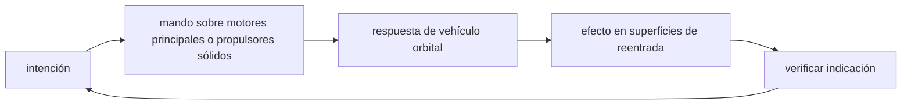

<!-- clase-meta
tipo_documento: clase
clase: 5
codigo: TRANSBORDADO-05
curso: transbordadores
titulo: "Mandos e instrumentos del transbordador"
modalidad: "taller de simulación"
duracion_minutos: 60
nivel: introductorio
prerrequisito: TRANSBORDADO-04
competencia: "lectura_y_mando"
resultados_aprendizaje:
  - "Explicar controles, instrumentos, entradas y estados del sistema con vocabulario propio de Transbordadores."
  - "Aplicar esos conceptos a una decisión segura o a un escenario de simulación de Transbordadores."
evidencia: "Mapa de mandos y resolución de dos estados del tablero."
criterio_aprobacion: "Reconoce los controles críticos y responde a los estados sin introducir acciones inseguras."
fuentes: manuales/fuentes.md
ultima_revision: 2026-09-10
-->

# 🎛️ Mandos e instrumentos del transbordador

[🏠 Inicio](../../../README.md) · [🛬 Curso: Transbordadores](../README.md) · 🎛️ Mandos

## Vista general

La cabina del orbitador combina lo mejor de una nave espacial y de un avión.
Durante el ascenso y la órbita, la tripulación controla el empuje, la actitud y
los sistemas como en una nave; en la reentrada y el aterrizaje, usa palanca y
timones como en un planeador. Los paneles muestran la órbita, los recursos y,
sobre todo, el estado del escudo térmico y la trayectoria de descenso.

## Mapa de controles

| Zona | Control | Tipo | Función | Prioridad | Comentarios |
| --- | --- | --- | --- | --- | --- |
| Consola | Control de actitud | Palanca | Orientar la nave en órbita | Alta | Acciona propulsores RCS. |
| Consola | Control de empuje | Palanca | Motores de maniobra | Alta | Para cambiar de órbita y desorbitar. |
| Cabina | Palanca de vuelo | Bastón | Controlar el planeo | Alta | Se usa en la reentrada y el aterrizaje. |
| Cabina | Pedales de timón | Pedales | Dirección y frenado en pista | Alta | Como en un avión. |
| Panel | Bahía de carga | Interruptores | Abrir puertas y mover brazo | Media | Solo en órbita. |
| Panel | Energía y soporte vital | Mandos | Gestionar aire, agua, potencia | Alta | Vital durante la misión. |
| Panel | Tren de aterrizaje | Palanca | Desplegar el tren | Alta | Antes de tocar la pista. |
| Panel | Alarmas | Luces y sonido | Avisar fallas | Alta | Presión, escudo, energía. |

## Instrumentos de vuelo

| Instrumento | Mide o muestra | Unidad | Importancia | Notas |
| --- | --- | --- | --- | --- |
| Indicador de órbita | Forma y altura de la órbita | km | Alta | Apogeo y perigeo. |
| Actitud | Orientación de la nave | grados | Alta | Clave para apuntar el escudo. |
| Velocidad | Rapidez de la nave | m/s o km/h | Alta | Muy alta en órbita, baja al aterrizar. |
| Ángulo de reentrada | Inclinación de descenso | grados | Alta | Ni muy plano ni muy vertical. |
| Temperatura del escudo | Calor en la panza y bordes | grados | Alta | Crítica en la reentrada. |
| Senda de planeo | Trayectoria hacia la pista | gráfico | Alta | Guía el descenso sin motor. |

## Entradas de simulación

| Acción | Teclado | Controlador | Panel táctil | Comentarios |
| --- | --- | --- | --- | --- |
| Orientar en órbita | Teclas WASDQE | Stick derecho | Zona de actitud | Cabecear, guiñar, rolar. |
| Empuje de maniobra | Shift y Ctrl | Gatillos | Barra de empuje | Cambiar órbita o desorbitar. |
| Apuntar el escudo | Tecla B | Botón | Modo reentrada | Escudo por delante. |
| Controlar el planeo | Flechas | Stick de vuelo | Palanca virtual | Cabeceo y alabeo sin motor. |
| Timón y frenos | Teclas Z y X | Gatillos | Pedales | Dirección y frenado en pista. |
| Desplegar tren | Tecla G | Botón | Botón de tren | Antes del toque. |
| Abrir bahía | Tecla O | Botón | Panel de carga | Solo en órbita. |

## Estados del sistema

| Estado | Descripción | Indicadores | Acciones disponibles |
| --- | --- | --- | --- |
| En plataforma | Antes del despegue | Checklist en pantalla | Revisar sistemas, iniciar cuenta. |
| Ascenso | Subiendo con propulsores | Empuje y velocidad activos | Guiar, separar propulsores y tanque. |
| En órbita | Vuelo orbital estable | Indicador de órbita activo | Maniobrar, abrir bahía, operar carga. |
| Desorbitación | Frenado para volver | Delta-v en uso | Encender motor, apuntar escudo. |
| Reentrada | Regreso con calor | Temperatura del escudo | Mantener ángulo, orientar el escudo. |
| Planeo y aterrizaje | Descenso sin motor | Senda de planeo | Controlar palanca, timón, tren, frenos. |

## Observaciones ergonomicas

- La temperatura del escudo y el ángulo de reentrada deben verse siempre.
- El paso de "nave" a "planeador" debe quedar claro en la interfaz.
- La senda de planeo debe guiar al usuario en el aterrizaje sin motor.
- Las alarmas del escudo y de la energía deben ser inconfundibles.
- Debe recordarse que en el descenso final no hay motor para corregir.

## 🧭 Guía de estudio aplicada

### Pregunta guía

¿Cómo ayuda **Vista general, Mapa de controles, Instrumentos de vuelo y Entradas de simulación** a **interpretar mandos e indicaciones durante reentrada simulada con energía suficiente pero opciones de pista limitadas**?

### Explicación razonada

Un mando no se aprende memorizando su nombre, sino recorriendo el ciclo intención → acción → indicación → verificación. En Transbordadores, el operador actúa sobre motores principales o propulsores sólidos, observa la respuesta en vehículo orbital y confirma el efecto en superficies de reentrada. Una indicación inesperada exige detener la secuencia mental, identificar el modo activo y evitar una segunda orden que agrave el estado.

Esta clase se conecta con el resto del curso mediante **una misión combina regímenes irreversibles: ascenso propulsado, órbita y planeo sin motor**. El hilo de
seguridad consiste en reconocer a tiempo **disipar mal la energía o salir del corredor térmico y geométrico** y poder justificar la decisión
**administrar energía y puntos de no retorno antes de cada fase**; en clases posteriores cambiará el ángulo de análisis, no esa relación causal.
La lectura funcional común sigue **motores principales → propulsores sólidos → vehículo orbital → superficies de reentrada**, de modo que cada concepto pueda
ubicarse dentro del funcionamiento completo y no quede como un dato aislado.

**Apoyo documental:** [The Space Shuttle](https://www.nasa.gov/reference/the-space-shuttle/) aporta arquitectura y operación del transbordador;
[Aviation Handbooks and Manuals](https://www.faa.gov/regulations_policies/handbooks_manuals) se usa para aerodinámica, sistemas y operación. Estas fuentes
se contrastan con el alcance de la clase y no sustituyen un manual de equipo concreto.

### Caso resuelto: de la observación a la decisión

1. **Intención:** formula qué cambio se necesita durante **reentrada simulada con energía suficiente pero opciones de pista limitadas**.
2. **Mando:** identifica el control que actúa sobre **motores principales** o **propulsores sólidos** y el modo que debe estar activo.
3. **Lectura:** localiza la indicación que confirma la respuesta de **vehículo orbital** y el efecto en **superficies de reentrada**.
4. **Verificación:** si la lectura no coincide, no acumules órdenes; estabiliza e investiga el estado.

### Comprueba tu comprensión

1. ¿Qué mando inicia la respuesta y qué instrumento confirma que el modo correcto está activo?
2. ¿Qué indicación temprana advertiría **disipar mal la energía o salir del corredor térmico y geométrico**?
3. ¿Qué secuencia usarías si la respuesta de **superficies de reentrada** no coincide con la orden?

Orientación para revisar tus respuestas

- La primera respuesta debe relacionar el eslabón elegido con un efecto posterior, no solo nombrarlo.
- La segunda debe proponer una señal medible u observable y explicar qué tendencia sería preocupante.
- La tercera debe cambiar al menos una variable de capacidad, mando, entorno o margen de seguridad.

## 🎓 Cierre de clase

- **Actividad:** Recorre el puesto de mando simulado de Transbordadores: localiza los controles de controles, instrumentos, entradas y estados del sistema y asocia cada indicación con una decisión.
- **Evidencia:** Mapa de mandos y resolución de dos estados del tablero.
- **Criterio de aprobación:** Reconoce los controles críticos y responde a los estados sin introducir acciones inseguras.
- **Transferencia:** explica qué cambiaría al pasar a otra variante de esta máquina.

### Fuentes de esta clase

- [NASA-SHUTTLE](https://www.nasa.gov/reference/the-space-shuttle/): The Space Shuttle, NASA. Uso: arquitectura y operación del transbordador.
- [US-FAA-HANDBOOKS](https://www.faa.gov/regulations_policies/handbooks_manuals): Aviation Handbooks and Manuals, FAA. Uso: aerodinámica, sistemas y operación.
- [UNOOSA-TREATIES](https://www.unoosa.org/oosa/SpaceLaw/treaties.html): Space Law Treaties and Principles, UNOOSA. Uso: derecho espacial internacional.

> Las fuentes sostienen el marco conceptual y normativo; esta clase no reemplaza el manual
> del fabricante, la formación certificada ni la habilitación exigida para operar equipos reales.

---

[⬅️ Anterior: Sistemas mecánicos](../operacion/sistemas-mecanicos-transbordador.md) · [➡️ Siguiente: Principios y operación](../operacion/principios-transbordador.md)
