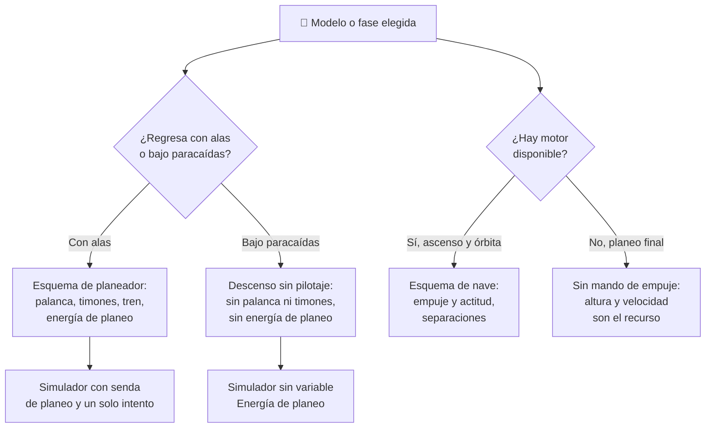

# 🧩 Modelos y variantes del transbordador

[🏠 Inicio](../../../README.md) · [🛬 Curso: Transbordadores](../README.md) · 🧩 Modelos

El [Módulo 2](../operacion/caracteristicas-transbordador.md) ya dijo qué es un
transbordador, cuáles son sus partes y para qué sirve cada una. Este módulo
responde a lo siguiente: **no todas las configuraciones se pilotan igual**, y esa
diferencia no es de matiz. Cambia qué mandos tiene la máquina y, por tanto, qué
debe modelar el simulador.

> 🎯 **La idea que sostiene el módulo.** "Un transbordador" no es una sola
> máquina desde el punto de vista del mando. El Módulo 2 lo define como cohete,
> nave y planeador a la vez: eso significa que el mismo vehículo cambia de
> esquema de control **durante un único vuelo**. Y frente a un vehículo de
> reentrada tipo cápsula, que regresa cayendo bajo paracaídas, el orbitador alado
> no tiene mandos "más difíciles": tiene **otros mandos**. Un simulador que
> presente un solo esquema de control está representando una fase concreta aunque
> diga representar la misión completa.

---

## 🧭 Por qué el modelo decide el simulador

El [Módulo 5](../mandos/manual-mandos-transbordador.md) describe un puesto de
mando con `Control de actitud`, `Control de empuje`, `Palanca de vuelo` y
`Pedales de timón`. El [Módulo 9](../simulacion/diseno-simulador-transbordador.md)
expone variables como `Orientación del escudo`, `Temperatura del escudo` y
`Energía de planeo`. Ambos describen el **orbitador alado completo, en misión
completa**: despegue de cohete, trabajo en órbita, reentrada con escudo y planeo
sin motor hasta la pista.

Ninguna de las dos listas se usa entera a la vez. En el ascenso, la palanca de
vuelo y los pedales de timón no mandan sobre nada: el aire todavía no sostiene
las alas y el vehículo se guía con empuje y actitud. En el planeo final ocurre lo
contrario, y de forma más radical: el `Control de empuje` **no existe** como
recurso, porque no hay motor que encender. El [Módulo 6](../operacion/principios-transbordador.md)
lo dice sin rodeos al listar los errores comunes: pensar que se puede "acelerar"
en el descenso final.

Si el simulador se construye sobre un único esquema y luego se le "añaden" las
demás fases o variantes, el resultado es un planeo con acelerador, que no existe.

---

## 🗂️ Qué cambia en el manejo

El curso describe un solo vehículo, así que sus variantes no son marcas
distintas: son **configuraciones del mismo transbordador** más el contraste con
la alternativa que el Módulo 2 descarta al elegir la reentrada alada.

| Modelo | Qué cambia en su operación |
| --- | --- |
| Pila de lanzamiento completa (orbitador, propulsores y tanque externo) | La referencia del curso al despegar: empuje mayor que el peso y dos separaciones que hay que soltar en el momento justo. |
| Orbitador solo, en órbita | Deja de ser cohete y pasa a ser nave: se orienta con RCS y se maniobra con los motores de maniobra, en microgravedad. |
| Orbitador en reentrada | El pilotaje se reduce a sostener el escudo por delante y un ángulo ni muy plano ni muy pronunciado; el error se paga en temperatura. |
| Orbitador en planeo y aterrizaje | Deja de ser nave y pasa a ser planeador: altura y velocidad son el único "combustible" y el aterrizaje es de un solo intento. |
| Vehículo de prueba de planeo atmosférico ([Módulo 1](../historia/historia-transbordador.md), 1977) | Se suelta desde un avión: no hay despegue, ni órbita, ni calor. Solo la parte de planeador, aislada para validarla. |
| Misión con operación de carga | Añade una jornada de trabajo en órbita: puertas de la bahía y brazo robotico, con la nave estabilizada. |
| Vehículo de reentrada tipo cápsula ([curso de cohetes](../../cohetes/README.md)) | El regreso deja de pilotarse: la cápsula cae y frena bajo paracaídas, y el punto de contacto se elige antes de reingresar, no durante el descenso. |

---

## 🎛️ Qué cambia en el mando

| Modelo | Qué mando aparece o desaparece | Consecuencia |
| --- | --- | --- |
| Pila de lanzamiento completa | **Aparece** `Empuje de maniobra` en su uso de ascenso, junto con las separaciones de propulsores y tanque. La `Palanca de vuelo` y los `Pedales de timón` no mandan aún sobre nada. | El puesto se opera como nave: empuje y actitud. Media cabina está inactiva. |
| Orbitador solo, en órbita | **Aparecen** los mandos de la `Bahía de carga`; el `Control de actitud` pasa a ser el mando principal. | Es la única fase en la que la carga se opera; el Módulo 5 la marca como "solo en órbita". |
| Orbitador en reentrada | **Aparece** `Apuntar el escudo` como mando propio. El `Control de empuje` se agota con la desorbitación. | La orientación deja de ser una preferencia y pasa a ser condición de supervivencia. |
| Orbitador en planeo y aterrizaje | **Desaparece** el `Control de empuje`. **Aparecen** la `Palanca de vuelo`, los `Pedales de timón` y el `Tren de aterrizaje`. | El mismo puesto cambia de esquema completo a mitad de vuelo: se pilota como avión, sin la corrección que da el motor. |
| Vehículo de prueba de planeo atmosférico | **Desaparecen** `Control de empuje`, `Control de actitud`, `Apuntar el escudo` y los mandos de bahía. **Queda** el bloque de planeo. | Es el esquema del Módulo 5 recortado a su última fase: una lección de aterrizaje sin misión alrededor. |
| Misión con operación de carga | **Aparecen** los interruptores de puertas y el brazo robotico. | No cambia el vuelo, pero añade un puesto de trabajo con su propio ritmo y sus propias alarmas. |
| Vehículo de reentrada tipo cápsula | **Desaparecen** de golpe `Palanca de vuelo`, `Pedales de timón` y `Tren de aterrizaje`, y con ellos la senda de planeo. | El descenso deja de tener piloto: no es un aterrizaje más fácil, es un aterrizaje que no se manda. |

---

## 🎮 Qué cambia en el simulador

Contrastado con las variables del
[Módulo 9](../simulacion/diseno-simulador-transbordador.md):

| Modelo | Variables que cambian | Esquema de control |
| --- | --- | --- |
| Pila de lanzamiento completa | Ninguna: es el caso base del ascenso. `Estado de separaciones` es la variable viva de la fase; `Altitud` y `Velocidad` crecen. | El del Módulo 5, en modo nave: empuje y actitud. |
| Orbitador solo, en órbita | `Estado de separaciones` queda en hecha y deja de decidir. `Altitud` y `Velocidad` se estabilizan. | Actitud como mando principal, más los mandos de bahía. |
| Orbitador en reentrada | `Ángulo de reentrada`, `Orientación del escudo` y `Temperatura del escudo` **se activan** y dominan el resultado. | Sostener escudo y ángulo; sin margen para corregir con empuje. |
| Orbitador en planeo y aterrizaje | `Energía de planeo` **pasa a ser el recurso central** y solo decrece. `Tren de aterrizaje` **entra en juego**. `Temperatura del escudo` deja de mandar. | Esquema de planeador: palanca, timón, tren y frenos. |
| Vehículo de prueba de planeo atmosférico | `Ángulo de reentrada`, `Orientación del escudo`, `Temperatura del escudo` y `Estado de separaciones` **se eliminan**. `Altitud` reduce su rango a la altura de suelta. | Solo el bloque de planeo, desde el primer segundo de la partida. |
| Misión con operación de carga | Ninguna de vuelo: añade el estado de las puertas y del brazo sobre la fase de órbita. | El de órbita, con un panel más. |
| Vehículo de reentrada tipo cápsula | `Energía de planeo` **se elimina**: no hay alcance que administrar. `Tren de aterrizaje` **se elimina**. `Velocidad` final deja de depender del piloto. | Sin entradas de planeo; el descenso se observa, no se pilota. |

---

## 🗺️ Del modelo al esquema de control

---

## ⚠️ Qué modelos no comparten simulador

Dos casos no se resuelven con un ajuste de parámetros, porque su esquema de
control es otro:

- **El regreso alado frente al regreso bajo paracaídas.** No falta un mando:
  falta el bloque entero. Sin palanca, sin timones, sin tren y sin `Energía de
  planeo`, el descenso deja de ser una tarea de pilotaje. Es un modo de control
  distinto, no una dificultad distinta.
- **El ascenso frente al planeo final del mismo orbitador.** El `Control de
  empuje` está o no está, y de ello depende que el error sea corregible. Un
  simulador que mantenga viva la entrada de empuje en el descenso enseña algo
  falso justo donde el Módulo 6 pide lo contrario.

El vehículo de prueba de planeo y las configuraciones de misión sí caben en el
mismo simulador: el primero es el esquema de planeo aislado, y las segundas
añaden paneles sin tocar el vuelo. Encajan en los
[niveles de realismo](../../../docs/03-niveles-de-realismo.md) tal como los
plantea el Módulo 6: en el nivel 1 la misión se recorre guiada, y las
separaciones, la gestión de energía y el aterrizaje de un solo intento solo
aparecen en el nivel 3.

Conviene además el tono del [Módulo 1](../historia/historia-transbordador.md) al
hablar de las lecciones de seguridad: la reentrada y el planeo no admiten
reintento, y un simulador que insinúe lo contrario deja de ser educativo.

---

[⬅️ Anterior: Características](../operacion/caracteristicas-transbordador.md) · [➡️ Siguiente: Sistemas mecánicos](../operacion/sistemas-mecanicos-transbordador.md)
