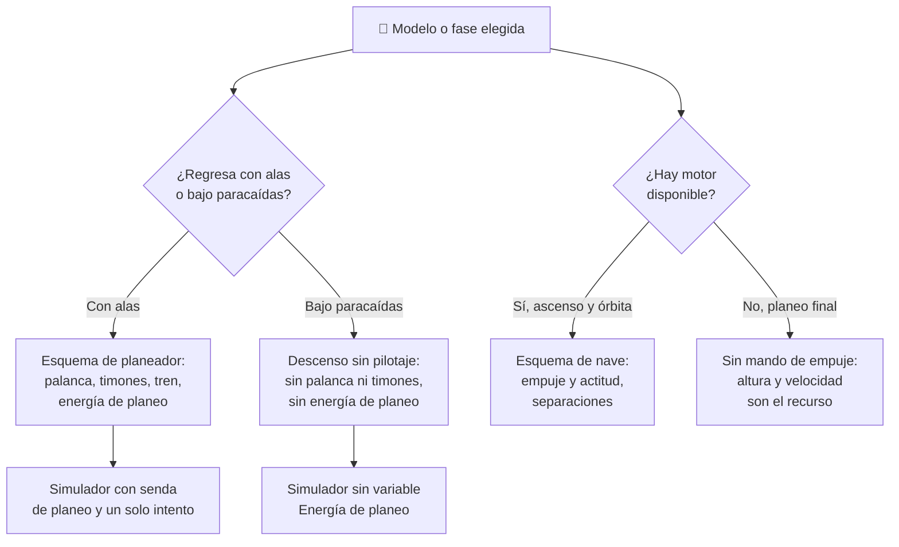

<!-- clase-meta
tipo_documento: clase
clase: 3
codigo: TRANSBORDADO-03
curso: transbordadores
titulo: "Modelos y variantes del transbordador"
modalidad: "comparativa guiada"
duracion_minutos: 60
nivel: introductorio
prerrequisito: TRANSBORDADO-02
competencia: "seleccion_de_configuracion"
resultados_aprendizaje:
  - "Explicar manejo, arquitectura de mandos y variables de simulación con vocabulario propio de Transbordadores."
  - "Aplicar esos conceptos a una decisión segura o a un escenario de simulación de Transbordadores."
evidencia: "Matriz comparativa y decisión justificada."
criterio_aprobacion: "La elección considera función, límites, mando y efecto en la simulación; no se apoya solo en preferencias."
fuentes: manuales/fuentes.md
ultima_revision: 2026-09-10
-->

# 🧩 Modelos y variantes del transbordador

[🏠 Inicio](../../../README.md) · [🛬 Curso: Transbordadores](../README.md) · 🧩 Modelos

El [Clase 2](../operacion/caracteristicas-transbordador.md) ya dijo qué es un
transbordador, cuáles son sus partes y para qué sirve cada una. Esta clase
responde a lo siguiente: **no todas las configuraciones se pilotan igual**, y esa
diferencia no es de matiz. Cambia qué mandos tiene la máquina y, por tanto, qué
debe modelar el simulador.

> 🎯 **La idea que sostiene el módulo.** "Un transbordador" no es una sola
> máquina desde el punto de vista del mando. El Clase 2 lo define como cohete,
> nave y planeador a la vez: eso significa que el mismo vehículo cambia de
> esquema de control **durante un único vuelo**. Y frente a un vehículo de
> reentrada tipo cápsula, que regresa cayendo bajo paracaídas, el orbitador alado
> no tiene mandos "más difíciles": tiene **otros mandos**. Un simulador que
> presente un solo esquema de control está representando una fase concreta aunque
> diga representar la misión completa.

---

## 🧭 Por qué el modelo decide el simulador

El [Clase 5](../mandos/manual-mandos-transbordador.md) describe un puesto de
mando con `Control de actitud`, `Control de empuje`, `Palanca de vuelo` y
`Pedales de timón`. El [Clase 9](../simulacion/diseno-simulador-transbordador.md)
expone variables como `Orientación del escudo`, `Temperatura del escudo` y
`Energía de planeo`. Ambos describen el **orbitador alado completo, en misión
completa**: despegue de cohete, trabajo en órbita, reentrada con escudo y planeo
sin motor hasta la pista.

Ninguna de las dos listas se usa entera a la vez. En el ascenso, la palanca de
vuelo y los pedales de timón no mandan sobre nada: el aire todavía no sostiene
las alas y el vehículo se guía con empuje y actitud. En el planeo final ocurre lo
contrario, y de forma más radical: el `Control de empuje` **no existe** como
recurso, porque no hay motor que encender. El [Clase 6](../operacion/principios-transbordador.md)
lo dice sin rodeos al listar los errores comunes: pensar que se puede "acelerar"
en el descenso final.

Si el simulador se construye sobre un único esquema y luego se le "añaden" las
demás fases o variantes, el resultado es un planeo con acelerador, que no existe.

---

## 🗂️ Qué cambia en el manejo

El curso describe un solo vehículo, así que sus variantes no son marcas
distintas: son **configuraciones del mismo transbordador** más el contraste con
la alternativa que el Clase 2 descarta al elegir la reentrada alada.

| Modelo | Qué cambia en su operación |
| --- | --- |
| Pila de lanzamiento completa (orbitador, propulsores y tanque externo) | La referencia del curso al despegar: empuje mayor que el peso y dos separaciones que hay que soltar en el momento justo. |
| Orbitador solo, en órbita | Deja de ser cohete y pasa a ser nave: se orienta con RCS y se maniobra con los motores de maniobra, en microgravedad. |
| Orbitador en reentrada | El pilotaje se reduce a sostener el escudo por delante y un ángulo ni muy plano ni muy pronunciado; el error se paga en temperatura. |
| Orbitador en planeo y aterrizaje | Deja de ser nave y pasa a ser planeador: altura y velocidad son el único "combustible" y el aterrizaje es de un solo intento. |
| Vehículo de prueba de planeo atmosférico ([Clase 1](../historia/historia-transbordador.md), 1977) | Se suelta desde un avión: no hay despegue, ni órbita, ni calor. Solo la parte de planeador, aislada para validarla. |
| Misión con operación de carga | Añade una jornada de trabajo en órbita: puertas de la bahía y brazo robotico, con la nave estabilizada. |
| Vehículo de reentrada tipo cápsula ([curso de cohetes](../../cohetes/README.md)) | El regreso deja de pilotarse: la cápsula cae y frena bajo paracaídas, y el punto de contacto se elige antes de reingresar, no durante el descenso. |

---

## 🎛️ Qué cambia en el mando

| Modelo | Qué mando aparece o desaparece | Consecuencia |
| --- | --- | --- |
| Pila de lanzamiento completa | **Aparece** `Empuje de maniobra` en su uso de ascenso, junto con las separaciones de propulsores y tanque. La `Palanca de vuelo` y los `Pedales de timón` no mandan aún sobre nada. | El puesto se opera como nave: empuje y actitud. Media cabina está inactiva. |
| Orbitador solo, en órbita | **Aparecen** los mandos de la `Bahía de carga`; el `Control de actitud` pasa a ser el mando principal. | Es la única fase en la que la carga se opera; el Clase 5 la marca como "solo en órbita". |
| Orbitador en reentrada | **Aparece** `Apuntar el escudo` como mando propio. El `Control de empuje` se agota con la desorbitación. | La orientación deja de ser una preferencia y pasa a ser condición de supervivencia. |
| Orbitador en planeo y aterrizaje | **Desaparece** el `Control de empuje`. **Aparecen** la `Palanca de vuelo`, los `Pedales de timón` y el `Tren de aterrizaje`. | El mismo puesto cambia de esquema completo a mitad de vuelo: se pilota como avión, sin la corrección que da el motor. |
| Vehículo de prueba de planeo atmosférico | **Desaparecen** `Control de empuje`, `Control de actitud`, `Apuntar el escudo` y los mandos de bahía. **Queda** el bloque de planeo. | Es el esquema del Clase 5 recortado a su última fase: una lección de aterrizaje sin misión alrededor. |
| Misión con operación de carga | **Aparecen** los interruptores de puertas y el brazo robotico. | No cambia el vuelo, pero añade un puesto de trabajo con su propio ritmo y sus propias alarmas. |
| Vehículo de reentrada tipo cápsula | **Desaparecen** de golpe `Palanca de vuelo`, `Pedales de timón` y `Tren de aterrizaje`, y con ellos la senda de planeo. | El descenso deja de tener piloto: no es un aterrizaje más fácil, es un aterrizaje que no se manda. |

---

## 🎮 Qué cambia en el simulador

Contrastado con las variables del
[Clase 9](../simulacion/diseno-simulador-transbordador.md):

| Modelo | Variables que cambian | Esquema de control |
| --- | --- | --- |
| Pila de lanzamiento completa | Ninguna: es el caso base del ascenso. `Estado de separaciones` es la variable viva de la fase; `Altitud` y `Velocidad` crecen. | El del Clase 5, en modo nave: empuje y actitud. |
| Orbitador solo, en órbita | `Estado de separaciones` queda en hecha y deja de decidir. `Altitud` y `Velocidad` se estabilizan. | Actitud como mando principal, más los mandos de bahía. |
| Orbitador en reentrada | `Ángulo de reentrada`, `Orientación del escudo` y `Temperatura del escudo` **se activan** y dominan el resultado. | Sostener escudo y ángulo; sin margen para corregir con empuje. |
| Orbitador en planeo y aterrizaje | `Energía de planeo` **pasa a ser el recurso central** y solo decrece. `Tren de aterrizaje` **entra en juego**. `Temperatura del escudo` deja de mandar. | Esquema de planeador: palanca, timón, tren y frenos. |
| Vehículo de prueba de planeo atmosférico | `Ángulo de reentrada`, `Orientación del escudo`, `Temperatura del escudo` y `Estado de separaciones` **se eliminan**. `Altitud` reduce su rango a la altura de suelta. | Solo el bloque de planeo, desde el primer segundo de la partida. |
| Misión con operación de carga | Ninguna de vuelo: añade el estado de las puertas y del brazo sobre la fase de órbita. | El de órbita, con un panel más. |
| Vehículo de reentrada tipo cápsula | `Energía de planeo` **se elimina**: no hay alcance que administrar. `Tren de aterrizaje` **se elimina**. `Velocidad` final deja de depender del piloto. | Sin entradas de planeo; el descenso se observa, no se pilota. |

---

## 🗺️ Del modelo al esquema de control

```mermaid
flowchart TD
    Modelo[🧩 Modelo o fase elegida] --> Alas{¿Regresa con alas<br/>o bajo paracaídas?}
    Alas -- Con alas --> Planeador[Esquema de planeador:<br/>palanca, timones, tren,<br/>energía de planeo]
    Alas -- Bajo paracaídas --> Caida[Descenso sin pilotaje:<br/>sin palanca ni timones,<br/>sin energía de planeo]
    Planeador --> Var1[Simulador con senda<br/>de planeo y un solo intento]
    Caida --> Var2[Simulador sin variable<br/>Energía de planeo]
    Modelo --> Fase{¿Hay motor<br/>disponible?}
    Fase -- Sí, ascenso y órbita --> Nave[Esquema de nave:<br/>empuje y actitud,<br/>separaciones]
    Fase -- No, planeo final --> Sin[Sin mando de empuje:<br/>altura y velocidad<br/>son el recurso]
```

---

## ⚠️ Qué modelos no comparten simulador

Dos casos no se resuelven con un ajuste de parámetros, porque su esquema de
control es otro:

- **El regreso alado frente al regreso bajo paracaídas.** No falta un mando:
  falta el bloque entero. Sin palanca, sin timones, sin tren y sin `Energía de
  planeo`, el descenso deja de ser una tarea de pilotaje. Es un modo de control
  distinto, no una dificultad distinta.
- **El ascenso frente al planeo final del mismo orbitador.** El `Control de
  empuje` está o no está, y de ello depende que el error sea corregible. Un
  simulador que mantenga viva la entrada de empuje en el descenso enseña algo
  falso justo donde el Clase 6 pide lo contrario.

El vehículo de prueba de planeo y las configuraciones de misión sí caben en el
mismo simulador: el primero es el esquema de planeo aislado, y las segundas
añaden paneles sin tocar el vuelo. Encajan en los
[niveles de realismo](../../../docs/03-niveles-de-realismo.md) tal como los
plantea el Clase 6: en el nivel 1 la misión se recorre guiada, y las
separaciones, la gestión de energía y el aterrizaje de un solo intento solo
aparecen en el nivel 3.

Conviene además el tono del [Clase 1](../historia/historia-transbordador.md) al
hablar de las lecciones de seguridad: la reentrada y el planeo no admiten
reintento, y un simulador que insinúe lo contrario deja de ser educativo.

> ⚖️ **El principio detrás de todo esto.** Cuánto pesa la carga y dónde va no cambia
> solo los números: cambia qué puede hacer el operador. La física común a todas las
> máquinas del catálogo —sostener, girar, equilibrar y la masa que cambia en
> marcha— está en [⚖️ carga y manejo](../../../docs/09-carga-y-manejo.md).

## 🧭 Guía de estudio aplicada

### Pregunta guía

¿Cómo ayuda **Por qué el modelo decide el simulador, Qué cambia en el manejo, Qué cambia en el mando y Qué cambia en el simulador** a **comparar configuración de lanzamiento frente a orbitador en planeo frente al mismo encargo**?

### Explicación razonada

Las variantes «configuración de lanzamiento frente a orbitador en planeo» resuelven prioridades distintas. Una comparación profesional sigue la cadena motores principales → propulsores sólidos → vehículo orbital → superficies de reentrada: cada cambio de arquitectura modifica mandos, respuesta, mantenimiento y variables que una simulación debe representar. Elegir un modelo significa justificar qué compromiso sirve mejor al caso, no declarar un favorito.

Esta clase se conecta con el resto del curso mediante **una misión combina regímenes irreversibles: ascenso propulsado, órbita y planeo sin motor**. El hilo de
seguridad consiste en reconocer a tiempo **disipar mal la energía o salir del corredor térmico y geométrico** y poder justificar la decisión
**administrar energía y puntos de no retorno antes de cada fase**; en clases posteriores cambiará el ángulo de análisis, no esa relación causal.
La lectura funcional común sigue **motores principales → propulsores sólidos → vehículo orbital → superficies de reentrada**, de modo que cada concepto pueda
ubicarse dentro del funcionamiento completo y no quede como un dato aislado.

**Apoyo documental:** [The Space Shuttle](https://www.nasa.gov/reference/the-space-shuttle/) aporta arquitectura y operación del transbordador;
[Aviation Handbooks and Manuals](https://www.faa.gov/regulations_policies/handbooks_manuals) se usa para aerodinámica, sistemas y operación. Estas fuentes
se contrastan con el alcance de la clase y no sustituyen un manual de equipo concreto.

### Caso resuelto: de la observación a la decisión

1. **Mantener el encargo constante:** ambas variantes deben evaluarse ante **reentrada simulada con energía suficiente pero opciones de pista limitadas**.
2. **Trazar consecuencias:** para cada variante sigue el efecto desde **motores principales** hasta **superficies de reentrada**.
3. **Comparar el puesto de mando:** determina qué debe percibir y controlar el operador en cada arquitectura.
4. **Justificar:** elige una variante y explica qué sacrifica; toda selección técnica contiene un compromiso.

### Comprueba tu comprensión

1. ¿Qué cambia en la cadena **motores principales → propulsores sólidos → vehículo orbital → superficies de reentrada** entre las dos variantes?
2. ¿Qué indicación o mando adicional necesitaría una de ellas?
3. ¿Cuál elegirías para «reentrada simulada con energía suficiente pero opciones de pista limitadas» y qué desventaja aceptarías?

Orientación para revisar tus respuestas

- La primera respuesta debe relacionar el eslabón elegido con un efecto posterior, no solo nombrarlo.
- La segunda debe proponer una señal medible u observable y explicar qué tendencia sería preocupante.
- La tercera debe cambiar al menos una variable de capacidad, mando, entorno o margen de seguridad.

## 🎓 Cierre de clase

- **Actividad:** Compara variantes de Transbordadores mediante los ejes «manejo, arquitectura de mandos y variables de simulación» y elige una para un caso de uso razonado.
- **Evidencia:** Matriz comparativa y decisión justificada.
- **Criterio de aprobación:** La elección considera función, límites, mando y efecto en la simulación; no se apoya solo en preferencias.
- **Transferencia:** explica qué cambiaría al pasar a otra variante de esta máquina.

### Fuentes de esta clase

- [NASA-SHUTTLE](https://www.nasa.gov/reference/the-space-shuttle/): The Space Shuttle, NASA. Uso: arquitectura y operación del transbordador.
- [US-FAA-HANDBOOKS](https://www.faa.gov/regulations_policies/handbooks_manuals): Aviation Handbooks and Manuals, FAA. Uso: aerodinámica, sistemas y operación.
- [UNOOSA-TREATIES](https://www.unoosa.org/oosa/SpaceLaw/treaties.html): Space Law Treaties and Principles, UNOOSA. Uso: derecho espacial internacional.

> Las fuentes sostienen el marco conceptual y normativo; esta clase no reemplaza el manual
> del fabricante, la formación certificada ni la habilitación exigida para operar equipos reales.

---

[⬅️ Anterior: Características](../operacion/caracteristicas-transbordador.md) · [➡️ Siguiente: Sistemas mecánicos](../operacion/sistemas-mecanicos-transbordador.md)
