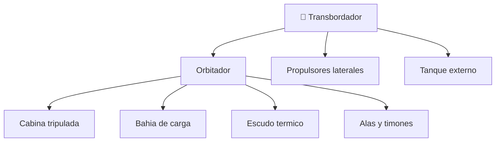

# 📋 Caracteristicas funcionales del transbordador

[🏠 Inicio](../../../README.md) · [🛬 Curso: Transbordadores](../README.md) · 📋 Caracteristicas

Que es un transbordador, cuales son sus partes y para que sirve. Este modulo da el
contexto antes de abrir los sistemas del vehiculo (Modulo 3).

---

## 🧭 Definicion

Un transbordador espacial es un vehiculo reutilizable que despega ayudado por
cohetes, trabaja en orbita como una nave tripulada y regresa a la atmosfera para
**planear sin motor** hasta aterrizar en una pista, como un avion. Combina tres
mundos: el cohete en el despegue, la nave en la orbita y el planeador en el
regreso.

---

## 🧬 Caracteristicas clave

| Caracteristica | Descripcion |
| --- | --- |
| Reutilizable | El orbitador vuelve y se prepara para otra mision. |
| Despegue vertical | Sube como cohete con propulsores y tanque externo. |
| Reentrada alada | Regresa planeando y aterriza en pista. |
| Planeo sin motor | En el descenso final no usa empuje, solo aerodinamica. |
| Bahia de carga | Transporta satelites y modulos grandes. |
| Escudo termico | Losetas que soportan el calor de la reentrada. |

---

## 🗂️ Partes del transbordador

| Parte | Uso tipico | Rasgo destacado |
| --- | --- | --- |
| Orbitador | Nave alada tripulada | Regresa planeando a la pista. |
| Propulsores laterales | Empuje extra al despegar | Se separan y se recuperan. |
| Tanque externo | Alimenta los motores principales | Se desecha en el ascenso. |
| Bahia de carga | Llevar y desplegar cargas | Puertas que se abren en orbita. |
| Escudo termico | Sobrevivir a la reentrada | Losetas resistentes al calor. |
| Alas y timones | Controlar el planeo | Permiten maniobrar sin motor. |

---

## 🎯 Para que se usa

- Llevar y desplegar satelites en orbita.
- Transportar tripulacion y carga a estaciones espaciales.
- Servir de laboratorio orbital de corta duracion.
- Reparar o recuperar equipos en orbita con el brazo robotico.
- Educacion y simulacion de despegue, orbita y reentrada alada.

---

[⬅️ Anterior: Historia](../historia/historia-transbordador.md) · [➡️ Siguiente: Sistemas mecanicos](sistemas-mecanicos-transbordador.md)
