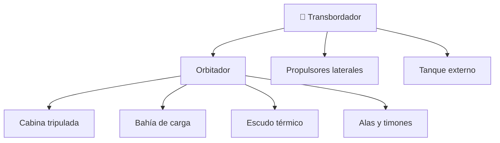

# 📋 Características funcionales del transbordador

[🏠 Inicio](../../../README.md) · [🛬 Curso: Transbordadores](../README.md) · 📋 Características

Que es un transbordador, cuales son sus partes y para que sirve. Este módulo da el
contexto antes de abrir los sistemas del vehículo (Módulo 3).

---

## 🧭 Definición

Un transbordador espacial es un vehículo reutilizable que despega ayudado por
cohetes, trabaja en órbita como una nave tripulada y regresa a la atmósfera para
**planear sin motor** hasta aterrizar en una pista, como un avión. Combina tres
mundos: el cohete en el despegue, la nave en la órbita y el planeador en el
regreso.

---

## 🧬 Características clave

| Característica | Descripción |
| --- | --- |
| Reutilizable | El orbitador vuelve y se prepara para otra misión. |
| Despegue vertical | Sube como cohete con propulsores y tanque externo. |
| Reentrada alada | Regresa planeando y aterriza en pista. |
| Planeo sin motor | En el descenso final no usa empuje, solo aerodinámica. |
| Bahía de carga | Transporta satélites y módulos grandes. |
| Escudo térmico | Losetas que soportan el calor de la reentrada. |

---

## 🗂️ Partes del transbordador

| Parte | Uso típico | Rasgo destacado |
| --- | --- | --- |
| Orbitador | Nave alada tripulada | Regresa planeando a la pista. |
| Propulsores laterales | Empuje extra al despegar | Se separan y se recuperan. |
| Tanque externo | Alimenta los motores principales | Se desecha en el ascenso. |
| Bahía de carga | Llevar y desplegar cargas | Puertas que se abren en órbita. |
| Escudo térmico | Sobrevivir a la reentrada | Losetas resistentes al calor. |
| Alas y timones | Controlar el planeo | Permiten maniobrar sin motor. |

---

## 🎯 Para qué se usa

- Llevar y desplegar satélites en órbita.
- Transportar tripulación y carga a estaciones espaciales.
- Servir de laboratorio orbital de corta duración.
- Reparar o recuperar equipos en órbita con el brazo robotico.
- Educación y simulación de despegue, órbita y reentrada alada.

---

[⬅️ Anterior: Historia](../historia/historia-transbordador.md) · [➡️ Siguiente: Sistemas mecánicos](sistemas-mecanicos-transbordador.md)
