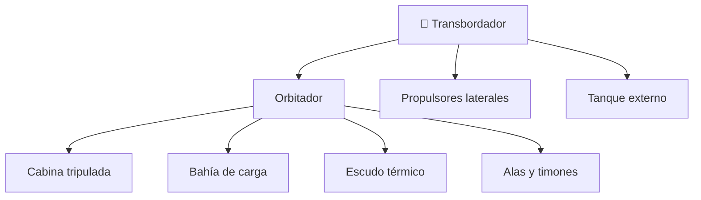

<!-- clase-meta
tipo_documento: clase
clase: 2
codigo: TRANSBORDADO-02
curso: transbordadores
titulo: "Características funcionales del transbordador"
modalidad: "teórica aplicada"
duracion_minutos: 45
nivel: introductorio
prerrequisito: TRANSBORDADO-01
competencia: "identificacion_funcional"
resultados_aprendizaje:
  - "Explicar definición, rasgos funcionales, tipos y usos con vocabulario propio de Transbordadores."
  - "Aplicar esos conceptos a una decisión segura o a un escenario de simulación de Transbordadores."
evidencia: "Matriz comparativa y decisión justificada."
criterio_aprobacion: "La elección considera función, límites, mando y efecto en la simulación; no se apoya solo en preferencias."
fuentes: manuales/fuentes.md
ultima_revision: 2026-09-10
-->

# 📋 Características funcionales del transbordador

[🏠 Inicio](../../../README.md) · [🛬 Curso: Transbordadores](../README.md) · 📋 Características

Que es un transbordador, cuales son sus partes y para que sirve. Esta clase da el
contexto antes de abrir los sistemas del vehículo (Clase 4).

---

## 🧭 Definición

Un transbordador espacial es un vehículo reutilizable que despega ayudado por
cohetes, trabaja en órbita como una nave tripulada y regresa a la atmósfera para
**planear sin motor** hasta aterrizar en una pista, como un avión. Combina tres
mundos: el cohete en el despegue, la nave en la órbita y el planeador en el
regreso.

---

## 🧬 Características clave

| Característica | Descripción |
| --- | --- |
| Reutilizable | El orbitador vuelve y se prepara para otra misión. |
| Despegue vertical | Sube como cohete con propulsores y tanque externo. |
| Reentrada alada | Regresa planeando y aterriza en pista. |
| Planeo sin motor | En el descenso final no usa empuje, solo aerodinámica. |
| Bahía de carga | Transporta satélites y módulos grandes. |
| Escudo térmico | Losetas que soportan el calor de la reentrada. |

---

## 🗂️ Partes del transbordador

```mermaid
flowchart TD
    Sistema[🛬 Transbordador] --> Orbitador[Orbitador]
    Sistema --> Propulsores[Propulsores laterales]
    Sistema --> Tanque[Tanque externo]
    Orbitador --> Cabina[Cabina tripulada]
    Orbitador --> Bahia[Bahía de carga]
    Orbitador --> Escudo[Escudo térmico]
    Orbitador --> Alas[Alas y timones]
```

| Parte | Uso típico | Rasgo destacado |
| --- | --- | --- |
| Orbitador | Nave alada tripulada | Regresa planeando a la pista. |
| Propulsores laterales | Empuje extra al despegar | Se separan y se recuperan. |
| Tanque externo | Alimenta los motores principales | Se desecha en el ascenso. |
| Bahía de carga | Llevar y desplegar cargas | Puertas que se abren en órbita. |
| Escudo térmico | Sobrevivir a la reentrada | Losetas resistentes al calor. |
| Alas y timones | Controlar el planeo | Permiten maniobrar sin motor. |

---

## 🎯 Para qué se usa

- Llevar y desplegar satélites en órbita.
- Transportar tripulación y carga a estaciones espaciales.
- Servir de laboratorio orbital de corta duración.
- Reparar o recuperar equipos en órbita con el brazo robotico.
- Educación y simulación de despegue, órbita y reentrada alada.

## 🧭 Guía de estudio aplicada

### Pregunta guía

¿Cómo ayuda **Definición, Características clave, Partes del transbordador y Para qué se usa** a **elegir una configuración adecuada para reentrada simulada con energía suficiente pero opciones de pista limitadas**?

### Explicación razonada

Una característica solo es útil cuando permite anticipar comportamiento. En Transbordadores, la relación entre motores principales, propulsores sólidos, vehículo orbital y superficies de reentrada determina capacidad, respuesta y límites. Por eso «configuración de lanzamiento frente a orbitador en planeo» no se compara por apariencia: se compara por misión, entorno, carga de trabajo y exposición al riesgo «disipar mal la energía o salir del corredor térmico y geométrico».

Esta clase se conecta con el resto del curso mediante **una misión combina regímenes irreversibles: ascenso propulsado, órbita y planeo sin motor**. El hilo de
seguridad consiste en reconocer a tiempo **disipar mal la energía o salir del corredor térmico y geométrico** y poder justificar la decisión
**administrar energía y puntos de no retorno antes de cada fase**; en clases posteriores cambiará el ángulo de análisis, no esa relación causal.
La lectura funcional común sigue **motores principales → propulsores sólidos → vehículo orbital → superficies de reentrada**, de modo que cada concepto pueda
ubicarse dentro del funcionamiento completo y no quede como un dato aislado.

**Apoyo documental:** [The Space Shuttle](https://www.nasa.gov/reference/the-space-shuttle/) aporta arquitectura y operación del transbordador;
[Aviation Handbooks and Manuals](https://www.faa.gov/regulations_policies/handbooks_manuals) se usa para aerodinámica, sistemas y operación. Estas fuentes
se contrastan con el alcance de la clase y no sustituyen un manual de equipo concreto.

### Caso resuelto: de la observación a la decisión

1. **Definir la necesidad:** convierte «reentrada simulada con energía suficiente pero opciones de pista limitadas» en requisitos de capacidad, entorno y respuesta.
2. **Comparar:** contrasta **configuración de lanzamiento frente a orbitador en planeo** usando esos requisitos y la cadena **motores principales → propulsores sólidos → vehículo orbital → superficies de reentrada**.
3. **Descartar:** elimina la alternativa que deja menos margen frente a **disipar mal la energía o salir del corredor térmico y geométrico**.
4. **Elegir:** declara la variante escogida, la evidencia usada y una limitación que todavía debe respetarse.

### Comprueba tu comprensión

1. ¿Qué característica de **superficies de reentrada** condiciona primero el caso «reentrada simulada con energía suficiente pero opciones de pista limitadas»?
2. ¿Qué requisito descartaría una de las alternativas **configuración de lanzamiento frente a orbitador en planeo**?
3. ¿Qué límite debe declararse junto con la variante elegida?

Orientación para revisar tus respuestas

- La primera respuesta debe relacionar el eslabón elegido con un efecto posterior, no solo nombrarlo.
- La segunda debe proponer una señal medible u observable y explicar qué tendencia sería preocupante.
- La tercera debe cambiar al menos una variable de capacidad, mando, entorno o margen de seguridad.

## 🎓 Cierre de clase

- **Actividad:** Compara variantes de Transbordadores mediante los ejes «definición, rasgos funcionales, tipos y usos» y elige una para un caso de uso razonado.
- **Evidencia:** Matriz comparativa y decisión justificada.
- **Criterio de aprobación:** La elección considera función, límites, mando y efecto en la simulación; no se apoya solo en preferencias.
- **Transferencia:** explica qué cambiaría al pasar a otra variante de esta máquina.

### Fuentes de esta clase

- [NASA-SHUTTLE](https://www.nasa.gov/reference/the-space-shuttle/): The Space Shuttle, NASA. Uso: arquitectura y operación del transbordador.
- [US-FAA-HANDBOOKS](https://www.faa.gov/regulations_policies/handbooks_manuals): Aviation Handbooks and Manuals, FAA. Uso: aerodinámica, sistemas y operación.
- [UNOOSA-TREATIES](https://www.unoosa.org/oosa/SpaceLaw/treaties.html): Space Law Treaties and Principles, UNOOSA. Uso: derecho espacial internacional.

> Las fuentes sostienen el marco conceptual y normativo; esta clase no reemplaza el manual
> del fabricante, la formación certificada ni la habilitación exigida para operar equipos reales.

---

[⬅️ Anterior: Historia](../historia/historia-transbordador.md) · [➡️ Siguiente: Modelos y variantes](../modelos/modelos-transbordador.md)
