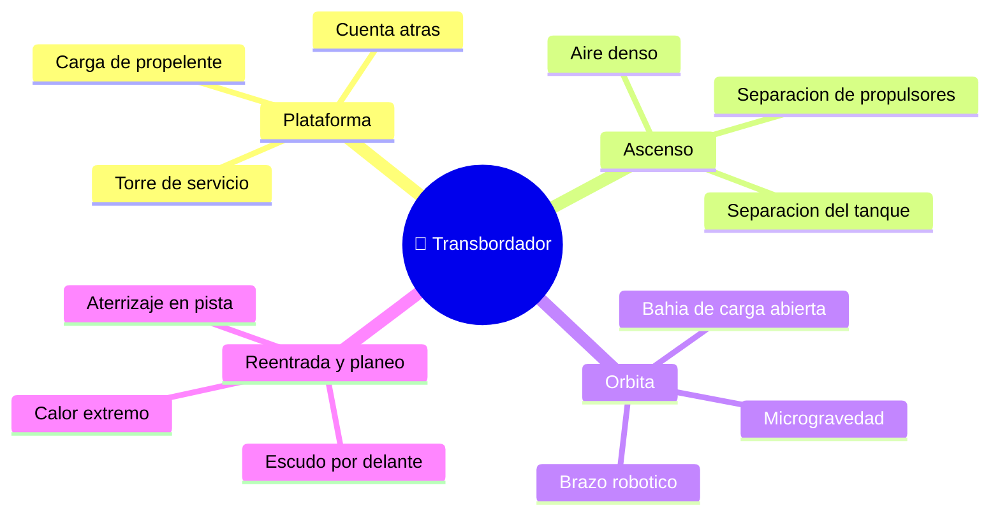

# 🌍 Entornos de trabajo del transbordador

[🏠 Inicio](../../../README.md) · [🛬 Curso: Transbordadores](../README.md) · 🌍 Entornos

Donde opera un transbordador y como cambian las condiciones a lo largo de la
mision. Cada fase implica un entorno distinto, con riesgos y ajustes propios, y en
simulacion se traduce en escenarios diferentes.

---

## 🗺️ Entornos principales

| Entorno | Caracteristicas | Riesgos tipicos | Ajuste de operacion |
| --- | --- | --- | --- |
| Plataforma | Vehiculo cargado y sujeto. | Fuga de propelente, clima. | Checklist, ventana de lanzamiento. |
| Ascenso | Aire denso y gran empuje. | Separaciones a destiempo. | Guiar, separar propulsores y tanque. |
| Orbita | Microgravedad, sin aire. | Colisiones, basura orbital. | Control de actitud, operar la carga. |
| Reentrada | Calor y frenado por el aire. | Mala orientacion del escudo. | Escudo por delante, angulo correcto. |
| Planeo y pista | Descenso sin motor. | Quedar corto o largo, viento. | Administrar energia, un solo intento. |

---

## 🌦️ Factores del entorno

- **Clima**: viento y visibilidad afectan tanto el despegue como el aterrizaje.
- **Ventana de lanzamiento**: momento preciso para alcanzar la orbita objetivo.
- **Calor de reentrada**: depende del angulo y de la velocidad de reingreso.
- **Estado de la pista**: viento cruzado y longitud influyen en el aterrizaje.

---

## 🎮 Traduccion a simulacion

Cada fase es un escenario con su densidad de aire, su gravedad efectiva y su
regimen de vuelo o planeo. Ver como se modela en el
[Modulo 8: Diseno de simulacion](../simulacion/diseno-simulador-transbordador.md).

---

[⬅️ Anterior: Principios y operacion](principios-transbordador.md) · [➡️ Siguiente: Reglamentos](../reglamentos/reglamentos-transbordador.md)
