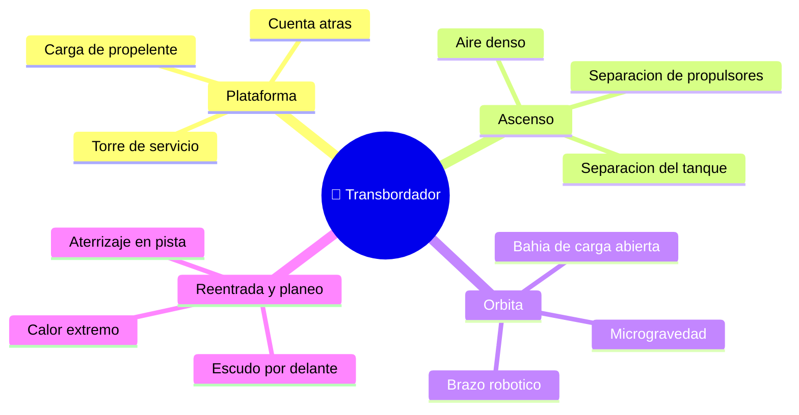

<!-- clase-meta
tipo_documento: clase
clase: 7
codigo: TRANSBORDADO-07
curso: transbordadores
titulo: "Entornos de trabajo del transbordador"
modalidad: "análisis de escenarios"
duracion_minutos: 60
nivel: introductorio
prerrequisito: TRANSBORDADO-06
competencia: "adaptacion_al_entorno"
resultados_aprendizaje:
  - "Explicar entornos, factores ambientales, riesgos y respuesta de simulación con vocabulario propio de Transbordadores."
  - "Aplicar esos conceptos a una decisión segura o a un escenario de simulación de Transbordadores."
evidencia: "Matriz entorno–cambio–riesgo–respuesta."
criterio_aprobacion: "Cada respuesta se adapta al entorno y distingue riesgos que no son intercambiables entre escenarios."
fuentes: manuales/fuentes.md
ultima_revision: 2026-09-10
-->

# 🌍 Entornos de trabajo del transbordador

[🏠 Inicio](../../../README.md) · [🛬 Curso: Transbordadores](../README.md) · 🌍 Entornos

Dónde opera un transbordador y cómo cambian las condiciones a lo largo de la
misión. Cada fase implica un entorno distinto, con riesgos y ajustes propios, y en
simulación se traduce en escenarios diferentes.

---

## 🗺️ Entornos principales

```mermaid
mindmap
  root((🛬 Transbordador))
    Plataforma
      Carga de propelente
      Torre de servicio
      Cuenta atras
    Ascenso
      Aire denso
      Separacion de propulsores
      Separacion del tanque
    Orbita
      Microgravedad
      Bahia de carga abierta
      Brazo robotico
    Reentrada y planeo
      Calor extremo
      Escudo por delante
      Aterrizaje en pista
```

| Entorno | Características | Riesgos típicos | Ajuste de operación |
| --- | --- | --- | --- |
| Plataforma | Vehículo cargado y sujeto. | Fuga de propelente, clima. | Checklist, ventana de lanzamiento. |
| Ascenso | Aire denso y gran empuje. | Separaciones a destiempo. | Guiar, separar propulsores y tanque. |
| Órbita | Microgravedad, sin aire. | Colisiones, basura orbital. | Control de actitud, operar la carga. |
| Reentrada | Calor y frenado por el aire. | Mala orientación del escudo. | Escudo por delante, ángulo correcto. |
| Planeo y pista | Descenso sin motor. | Quedar corto o largo, viento. | Administrar energía, un solo intento. |

---

## 🌦️ Factores del entorno

- **Clima**: viento y visibilidad afectan tanto el despegue como el aterrizaje.
- **Ventana de lanzamiento**: momento preciso para alcanzar la órbita objetivo.
- **Calor de reentrada**: depende del ángulo y de la velocidad de reingreso.
- **Estado de la pista**: viento cruzado y longitud influyen en el aterrizaje.

---

## 🎮 Traducción a simulación

Cada fase es un escenario con su densidad de aire, su gravedad efectiva y su
régimen de vuelo o planeo. Ver cómo se modela en el
[Clase 9: Diseño de simulación](../simulacion/diseno-simulador-transbordador.md).

## 🧭 Guía de estudio aplicada

### Pregunta guía

¿Cómo ayuda **Entornos principales, Factores del entorno, Traducción a simulación y Guía de estudio aplicada** a **adaptar reentrada simulada con energía suficiente pero opciones de pista limitadas a tres condiciones ambientales distintas**?

### Explicación razonada

El entorno no es decoración: modifica las fuerzas, la percepción y el tiempo disponible. En el caso «reentrada simulada con energía suficiente pero opciones de pista limitadas», cambia el comportamiento de superficies de reentrada y aumenta la probabilidad de disipar mal la energía o salir del corredor térmico y geométrico. La respuesta correcta empieza por reconocer qué variable cambió y después adaptar límites, ruta o misión.

Esta clase se conecta con el resto del curso mediante **una misión combina regímenes irreversibles: ascenso propulsado, órbita y planeo sin motor**. El hilo de
seguridad consiste en reconocer a tiempo **disipar mal la energía o salir del corredor térmico y geométrico** y poder justificar la decisión
**administrar energía y puntos de no retorno antes de cada fase**; en clases posteriores cambiará el ángulo de análisis, no esa relación causal.
La lectura funcional común sigue **motores principales → propulsores sólidos → vehículo orbital → superficies de reentrada**, de modo que cada concepto pueda
ubicarse dentro del funcionamiento completo y no quede como un dato aislado.

**Apoyo documental:** [The Space Shuttle](https://www.nasa.gov/reference/the-space-shuttle/) aporta arquitectura y operación del transbordador;
[Aviation Handbooks and Manuals](https://www.faa.gov/regulations_policies/handbooks_manuals) se usa para aerodinámica, sistemas y operación. Estas fuentes
se contrastan con el alcance de la clase y no sustituyen un manual de equipo concreto.

### Caso resuelto: de la observación a la decisión

1. **Escenario base:** conserva la misión «reentrada simulada con energía suficiente pero opciones de pista limitadas» para poder comparar.
2. **Cambiar una condición:** modifica sucesivamente superficie o medio, visibilidad y perturbación externa.
3. **Recalcular margen:** explica cómo cada cambio afecta **superficies de reentrada** y acerca o aleja **disipar mal la energía o salir del corredor térmico y geométrico**.
4. **Adaptar:** cambia límite, ruta, configuración o incluso cancela; no mantengas la misma respuesta por hábito.

### Comprueba tu comprensión

1. ¿Cómo cambiaría **superficies de reentrada** si empeora la perturbación externa?
2. ¿Qué condición ambiental acerca más el escenario a **disipar mal la energía o salir del corredor térmico y geométrico**?
3. ¿Cuándo adaptarías la maniobra y cuándo la cancelarías?

Orientación para revisar tus respuestas

- La primera respuesta debe relacionar el eslabón elegido con un efecto posterior, no solo nombrarlo.
- La segunda debe proponer una señal medible u observable y explicar qué tendencia sería preocupante.
- La tercera debe cambiar al menos una variable de capacidad, mando, entorno o margen de seguridad.

## 🎓 Cierre de clase

- **Actividad:** Contrasta tres entornos de Transbordadores a partir de entornos, factores ambientales, riesgos y respuesta de simulación y determina cómo cambian variables, percepción, riesgos y respuesta.
- **Evidencia:** Matriz entorno–cambio–riesgo–respuesta.
- **Criterio de aprobación:** Cada respuesta se adapta al entorno y distingue riesgos que no son intercambiables entre escenarios.
- **Transferencia:** explica qué cambiaría al pasar a otra variante de esta máquina.

### Fuentes de esta clase

- [NASA-SHUTTLE](https://www.nasa.gov/reference/the-space-shuttle/): The Space Shuttle, NASA. Uso: arquitectura y operación del transbordador.
- [US-FAA-HANDBOOKS](https://www.faa.gov/regulations_policies/handbooks_manuals): Aviation Handbooks and Manuals, FAA. Uso: aerodinámica, sistemas y operación.
- [UNOOSA-TREATIES](https://www.unoosa.org/oosa/SpaceLaw/treaties.html): Space Law Treaties and Principles, UNOOSA. Uso: derecho espacial internacional.

> Las fuentes sostienen el marco conceptual y normativo; esta clase no reemplaza el manual
> del fabricante, la formación certificada ni la habilitación exigida para operar equipos reales.

---

[⬅️ Anterior: Principios y operación](principios-transbordador.md) · [➡️ Siguiente: Reglamentos](../reglamentos/reglamentos-transbordador.md)
