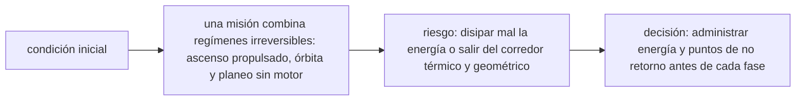

<!-- clase-meta
tipo_documento: clase
clase: 6
codigo: TRANSBORDADO-06
curso: transbordadores
titulo: "Principios y operación del transbordador"
modalidad: "resolución de problemas"
duracion_minutos: 90
nivel: introductorio
prerrequisito: TRANSBORDADO-05
competencia: "razonamiento_operacional"
resultados_aprendizaje:
  - "Explicar principios físicos, fases de operación, decisiones y errores frecuentes con vocabulario propio de Transbordadores."
  - "Aplicar esos conceptos a una decisión segura o a un escenario de simulación de Transbordadores."
evidencia: "Resolución argumentada de un escenario operacional."
criterio_aprobacion: "Aplica los principios correctos, anticipa consecuencias y respeta los límites del curso."
fuentes: manuales/fuentes.md
ultima_revision: 2026-09-10
-->

# 🧪 Principios y operación del transbordador

[🏠 Inicio](../../../README.md) · [🛬 Curso: Transbordadores](../README.md) · 🧪 Principios

Documento general y educativo. Describe cómo se opera un transbordador en
simulación y que principios físicos conviene representar. Todo es **ciencia
real**: la física del ascenso, la órbita y el planeo se modela con rigor.

## Principios de funcionamiento

- **Despegue de cohete**: propulsores y motores dan el empuje para vencer la
  gravedad y ganar velocidad orbital.
- **Vuelo orbital**: en órbita la nave cae de forma continua alrededor de la
  Tierra; la tripulación y los objetos flotan en microgravedad.
- **Reentrada**: al frenar y bajar, el aire genera un calor enorme; el escudo
  térmico protege la estructura y la orientación debe ser exacta.
- **Planeo sin motor**: en el descenso final la nave no tiene empuje, solo la
  aerodinámica de sus alas. Cada aterrizaje es un único intento.
- **Energía del descenso**: la altura y la velocidad son el "combustible" del
  planeo; hay que administrarlas para llegar a la pista.

## La reentrada en una idea

Reingresar no es "caer": la nave llega muy rápido y debe frenar contra el aire de
forma controlada, con el escudo al frente y un ángulo correcto, ni muy plano ni
muy pronunciado.

## Fases de operación

| Fase | Que ocurre | Puntos clave |
| --- | --- | --- |
| Prelanzamiento | Revisión y cuenta atrás | Checklist, propelente, clima. |
| Despegue | Subida con propulsores | Empuje mayor que el peso. |
| Ascenso y separación | Soltar propulsores y tanque | Momento justo de cada separación. |
| Órbita | Cumplir la misión | Desplegar carga, ciencia, acoplar. |
| Desorbitación | Frenar para volver | Encender motor en el punto correcto. |
| Reentrada | Regreso con calor | Escudo por delante, ángulo correcto. |
| Planeo y aterrizaje | Descenso sin motor | Administrar altura y velocidad. |

## Aterrizaje sin motor: idea general

1. La nave llega a la atmósfera con mucha energía de altura y velocidad.
2. Las alas generan sustentación cuando el aire es denso.
3. Se controla el planeo con palanca y timones, sin empuje.
4. Se administra la energía para no quedar corto ni largo de la pista.
5. Se despliega el tren y se frena, con un único intento.

## Errores comunes que la simulación puede enseñar a evitar

- Reingresar con el escudo mal orientado.
- Elegir un ángulo de reentrada muy plano (rebota) o muy pronunciado (calor extremo).
- Gastar la energía del planeo demasiado pronto y no llegar a la pista.
- Olvidar desplegar el tren de aterrizaje a tiempo.
- Pensar que se puede "acelerar" en el descenso final, cuando no hay motor.

## Relación con los niveles de realismo

- **Nivel 1 (educativo)**: despegar, orbitar y aterrizar de forma guiada.
- **Nivel 2 (simplificado)**: agregar órbita, ángulo de reentrada y planeo.
- **Nivel 3 (técnico)**: sumar separaciones, gestión de energía y aterrizaje de un solo intento.

Ver [`docs/03-niveles-de-realismo.md`](../../../docs/03-niveles-de-realismo.md) para el detalle de cada nivel.

## 🧭 Guía de estudio aplicada

### Pregunta guía

¿Cómo ayuda **Principios de funcionamiento, La reentrada en una idea, Fases de operación y Aterrizaje sin motor: idea general** a **resolver reentrada simulada con energía suficiente pero opciones de pista limitadas sin agotar el margen operacional**?

### Explicación razonada

El principio rector puede resumirse así: una misión combina regímenes irreversibles: ascenso propulsado, órbita y planeo sin motor. Esto explica por qué una misma orden produce resultados distintos cuando cambian velocidad, carga, configuración o entorno. Operar bien consiste en leer la tendencia antes de agotar el margen y tomar esta decisión: administrar energía y puntos de no retorno antes de cada fase.

Esta clase se conecta con el resto del curso mediante **una misión combina regímenes irreversibles: ascenso propulsado, órbita y planeo sin motor**. El hilo de
seguridad consiste en reconocer a tiempo **disipar mal la energía o salir del corredor térmico y geométrico** y poder justificar la decisión
**administrar energía y puntos de no retorno antes de cada fase**; en clases posteriores cambiará el ángulo de análisis, no esa relación causal.
La lectura funcional común sigue **motores principales → propulsores sólidos → vehículo orbital → superficies de reentrada**, de modo que cada concepto pueda
ubicarse dentro del funcionamiento completo y no quede como un dato aislado.

**Apoyo documental:** [The Space Shuttle](https://www.nasa.gov/reference/the-space-shuttle/) aporta arquitectura y operación del transbordador;
[Aviation Handbooks and Manuals](https://www.faa.gov/regulations_policies/handbooks_manuals) se usa para aerodinámica, sistemas y operación. Estas fuentes
se contrastan con el alcance de la clase y no sustituyen un manual de equipo concreto.

### Caso resuelto: de la observación a la decisión

1. **Datos:** reconoce condiciones, configuración y margen disponibles en **reentrada simulada con energía suficiente pero opciones de pista limitadas**.
2. **Modelo:** aplica **una misión combina regímenes irreversibles: ascenso propulsado, órbita y planeo sin motor** para predecir una tendencia antes de actuar.
3. **Riesgo:** explica mediante qué cadena de causas podría ocurrir **disipar mal la energía o salir del corredor térmico y geométrico**.
4. **Decisión:** ejecuta mentalmente **administrar energía y puntos de no retorno antes de cada fase** y define qué observación confirmaría que funcionó.

### Comprueba tu comprensión

1. ¿Qué variable del principio «una misión combina regímenes irreversibles: ascenso propulsado, órbita y planeo sin motor» cambia primero en el caso?
2. ¿Cómo se propaga ese cambio hasta **superficies de reentrada**?
3. ¿Qué evidencia confirmaría que **administrar energía y puntos de no retorno antes de cada fase** conservó margen operacional?

Orientación para revisar tus respuestas

- La primera respuesta debe relacionar el eslabón elegido con un efecto posterior, no solo nombrarlo.
- La segunda debe proponer una señal medible u observable y explicar qué tendencia sería preocupante.
- La tercera debe cambiar al menos una variable de capacidad, mando, entorno o margen de seguridad.

## 🎓 Cierre de clase

- **Actividad:** Resuelve un escenario de Transbordadores explicando, paso a paso, cómo intervienen principios físicos, fases de operación, decisiones y errores frecuentes.
- **Evidencia:** Resolución argumentada de un escenario operacional.
- **Criterio de aprobación:** Aplica los principios correctos, anticipa consecuencias y respeta los límites del curso.
- **Transferencia:** explica qué cambiaría al pasar a otra variante de esta máquina.

### Fuentes de esta clase

- [NASA-SHUTTLE](https://www.nasa.gov/reference/the-space-shuttle/): The Space Shuttle, NASA. Uso: arquitectura y operación del transbordador.
- [US-FAA-HANDBOOKS](https://www.faa.gov/regulations_policies/handbooks_manuals): Aviation Handbooks and Manuals, FAA. Uso: aerodinámica, sistemas y operación.
- [UNOOSA-TREATIES](https://www.unoosa.org/oosa/SpaceLaw/treaties.html): Space Law Treaties and Principles, UNOOSA. Uso: derecho espacial internacional.

> Las fuentes sostienen el marco conceptual y normativo; esta clase no reemplaza el manual
> del fabricante, la formación certificada ni la habilitación exigida para operar equipos reales.

---

[⬅️ Anterior: Mandos](../mandos/manual-mandos-transbordador.md) · [➡️ Siguiente: Entornos de trabajo](entornos-transbordador.md)
