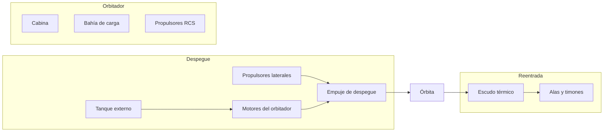
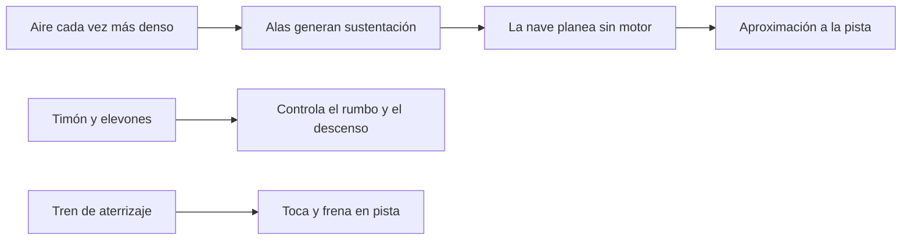

# 🔧 Sistemas mecánicos del transbordador

[🏠 Inicio](../../../README.md) · [🛬 Curso: Transbordadores](../README.md) · 🔧 Sistemas mecánicos

Este módulo abre el transbordador por dentro. Explica cada sistema, como funciona
y cómo se conecta con los demás. Es la base técnica para entender los mandos
(Módulo 4) y la física del planeo (Módulo 5). Todo es **ciencia real**.

---

## 1. 🚀 Grupo de despegue

El transbordador sube gracias a tres sistemas que trabajan juntos al despegar.

| Componente | Función |
| --- | --- |
| Propulsores laterales | Dan gran empuje en los primeros minutos, luego se separan. |
| Tanque externo | Guarda el propelente que usan los motores del orbitador. |
| Motores del orbitador | Queman el propelente del tanque durante el ascenso. |
| Sistema de separación | Suelta primero los propulsores y luego el tanque. |

---

## 2. 🛰️ Orbitador

Es la nave alada que lleva a la tripulación y la carga, y la única parte que
regresa entera.

| Subsistema | Función |
| --- | --- |
| Cabina | Puesto de la tripulación, presurizado. |
| Bahía de carga | Espacio con puertas para desplegar cargas. |
| Brazo robotico | Manipula satélites y módulos en órbita. |
| Propulsores RCS | Orientan y trasladan la nave en el espacio. |
| Motores de maniobra | Cambian la órbita y frenan para desorbitar. |

---

## 3. 🛡️ Escudo térmico

Al reingresar, el aire frena la nave y genera un calor enorme. El escudo protege
la estructura.

- **Losetas ceramicas**: cubren las zonas más calientes de la panza y las alas.
- **Mantas flexibles**: protegen zonas de calor moderado.
- **Borde de ataque reforzado**: soporta las temperaturas más altas.
- **Regla clave**: la nave debe reingresar con el escudo por delante, no las alas.

---

## 4. 🪽 Alas, timones y tren de aterrizaje

En el regreso, el orbitador deja de ser nave y se comporta como planeador.

| Sistema | Función |
| --- | --- |
| Alas | Generan sustentación para planear en el aire denso. |
| Elevones | Superficies que combinan control de cabeceo y alabeo. |
| Timón de dirección | Ayuda a orientar la nave y frenar en la pista. |
| Tren de aterrizaje | Se despliega para el toque final en pista. |
| Paracaídas de frenado | Reduce la velocidad tras tocar tierra. |

---

## 5. 🔋 Energía y soporte vital

Mientras trabaja en órbita, el orbitador debe mantener con vida a su tripulación.

- **Pilas de combustible**: generan electricidad y agua como subproducto.
- **Control de aire**: provee oxígeno y retira el dioxido de carbono.
- **Control térmico**: radiadores que expulsan el calor sobrante al espacio.
- **Agua y residuos**: se gestionan para la duración de la misión.

---

## 🔁 Cómo se conecta todo

1. El **grupo de despegue** lleva el orbitador a la órbita.
2. El **orbitador** trabaja en el espacio con su cabina y su bahía de carga.
3. El **escudo térmico** protege a la nave al reingresar.
4. Las **alas y timones** convierten la reentrada en un planeo controlado.
5. El **tren de aterrizaje** cierra la misión con un toque en pista.

Con esto entendido, el [Módulo 4: Mandos](../mandos/manual-mandos-transbordador.md)
muestra cómo la tripulación opera estos sistemas.

---

[⬅️ Anterior: Características](caracteristicas-transbordador.md) · [➡️ Siguiente: Mandos e instrumentos](../mandos/manual-mandos-transbordador.md)
