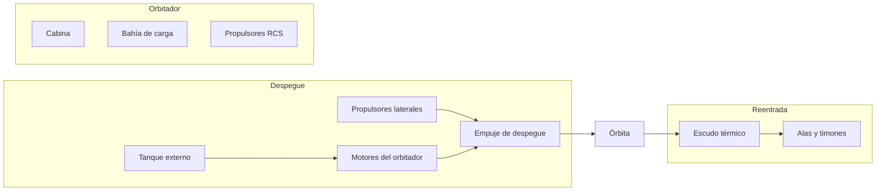
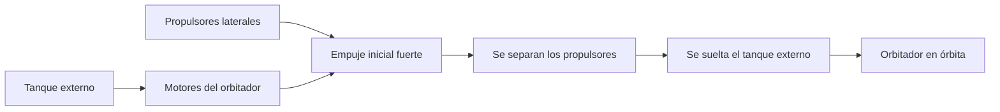
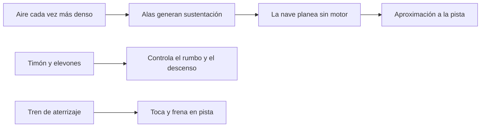
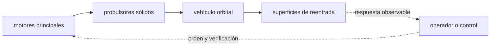

<!-- clase-meta
tipo_documento: clase
clase: 4
codigo: TRANSBORDADO-04
curso: transbordadores
titulo: "Sistemas mecánicos del transbordador"
modalidad: "teórica aplicada"
duracion_minutos: 90
nivel: introductorio
prerrequisito: TRANSBORDADO-03
competencia: "comprension_de_sistemas"
resultados_aprendizaje:
  - "Explicar Grupo de despegue, Orbitador, Escudo térmico y Alas, timones y tren de aterrizaje con vocabulario propio de Transbordadores."
  - "Aplicar esos conceptos a una decisión segura o a un escenario de simulación de Transbordadores."
evidencia: "Esquema con flujos de energía, materia o información anotados."
criterio_aprobacion: "Las conexiones esenciales son correctas y la consecuencia de la falla se propaga de manera coherente."
fuentes: manuales/fuentes.md
ultima_revision: 2026-09-10
-->

# 🔧 Sistemas mecánicos del transbordador

[🏠 Inicio](../../../README.md) · [🛬 Curso: Transbordadores](../README.md) · 🔧 Sistemas mecánicos

Esta clase abre el transbordador por dentro. Explica cada sistema, como funciona
y cómo se conecta con los demás. Es la base técnica para entender los mandos
(Clase 5) y la física del planeo (Clase 6). Todo es **ciencia real**.

```mermaid
flowchart LR
    subgraph Despegue
        Tanque[Tanque externo] --> Motores[Motores del orbitador]
        Propulsores[Propulsores laterales] --> EmpujeD[Empuje de despegue]
        Motores --> EmpujeD
    end
    subgraph Orbitador
        Cabina[Cabina]
        Bahia[Bahía de carga]
        RCS[Propulsores RCS]
    end
    subgraph Reentrada
        Escudo[Escudo térmico]
        Alas[Alas y timones]
    end
    EmpujeD --> Orbita[Órbita]
    Orbita --> Escudo
    Escudo --> Alas
```

---

## 1. 🚀 Grupo de despegue

El transbordador sube gracias a tres sistemas que trabajan juntos al despegar.

```mermaid
flowchart LR
    Propulsores[Propulsores laterales] --> Sube[Empuje inicial fuerte]
    Tanque[Tanque externo] --> Motores[Motores del orbitador]
    Motores --> Sube
    Sube --> Separa1[Se separan los propulsores]
    Separa1 --> Separa2[Se suelta el tanque externo]
    Separa2 --> Orbita[Orbitador en órbita]
```

| Componente | Función |
| --- | --- |
| Propulsores laterales | Dan gran empuje en los primeros minutos, luego se separan. |
| Tanque externo | Guarda el propelente que usan los motores del orbitador. |
| Motores del orbitador | Queman el propelente del tanque durante el ascenso. |
| Sistema de separación | Suelta primero los propulsores y luego el tanque. |

---

## 2. 🛰️ Orbitador

Es la nave alada que lleva a la tripulación y la carga, y la única parte que
regresa entera.

| Subsistema | Función |
| --- | --- |
| Cabina | Puesto de la tripulación, presurizado. |
| Bahía de carga | Espacio con puertas para desplegar cargas. |
| Brazo robotico | Manipula satélites y módulos en órbita. |
| Propulsores RCS | Orientan y trasladan la nave en el espacio. |
| Motores de maniobra | Cambian la órbita y frenan para desorbitar. |

---

## 3. 🛡️ Escudo térmico

Al reingresar, el aire frena la nave y genera un calor enorme. El escudo protege
la estructura.

- **Losetas ceramicas**: cubren las zonas más calientes de la panza y las alas.
- **Mantas flexibles**: protegen zonas de calor moderado.
- **Borde de ataque reforzado**: soporta las temperaturas más altas.
- **Regla clave**: la nave debe reingresar con el escudo por delante, no las alas.

---

## 4. 🪽 Alas, timones y tren de aterrizaje

En el regreso, el orbitador deja de ser nave y se comporta como planeador.

```mermaid
flowchart LR
    Aire[Aire cada vez más denso] --> Alas[Alas generan sustentación]
    Alas --> Planea[La nave planea sin motor]
    Timon[Timón y elevones] --> Controla[Controla el rumbo y el descenso]
    Planea --> Pista[Aproximación a la pista]
    Tren[Tren de aterrizaje] --> Toca[Toca y frena en pista]
```

| Sistema | Función |
| --- | --- |
| Alas | Generan sustentación para planear en el aire denso. |
| Elevones | Superficies que combinan control de cabeceo y alabeo. |
| Timón de dirección | Ayuda a orientar la nave y frenar en la pista. |
| Tren de aterrizaje | Se despliega para el toque final en pista. |
| Paracaídas de frenado | Reduce la velocidad tras tocar tierra. |

---

## 5. 🔋 Energía y soporte vital

Mientras trabaja en órbita, el orbitador debe mantener con vida a su tripulación.

- **Pilas de combustible**: generan electricidad y agua como subproducto.
- **Control de aire**: provee oxígeno y retira el dioxido de carbono.
- **Control térmico**: radiadores que expulsan el calor sobrante al espacio.
- **Agua y residuos**: se gestionan para la duración de la misión.

---

## 🔁 Cómo se conecta todo

1. El **grupo de despegue** lleva el orbitador a la órbita.
2. El **orbitador** trabaja en el espacio con su cabina y su bahía de carga.
3. El **escudo térmico** protege a la nave al reingresar.
4. Las **alas y timones** convierten la reentrada en un planeo controlado.
5. El **tren de aterrizaje** cierra la misión con un toque en pista.

Con esto entendido, el [Clase 5: Mandos](../mandos/manual-mandos-transbordador.md)
muestra cómo la tripulación opera estos sistemas.

## 🧭 Guía de estudio aplicada

### Pregunta guía

¿Cómo ayuda **Grupo de despegue, Orbitador, Escudo térmico y Alas, timones y tren de aterrizaje** a **seguir una alteración desde motores principales hasta superficies de reentrada durante reentrada simulada con energía suficiente pero opciones de pista limitadas**?

### Explicación razonada

El funcionamiento puede leerse como una cadena causal: motores principales entrega o transforma energía; propulsores sólidos la adapta; vehículo orbital la transmite o gobierna; y superficies de reentrada produce el efecto observable. La cadena no es lineal en sentido estricto: sensores, estructura y operador cierran el lazo. Si un eslabón se degrada, la señal importante es cómo cambia el estado de superficies de reentrada y qué margen queda.

```mermaid
flowchart LR
    A["motores principales"] --> B["propulsores sólidos"] --> C["vehículo orbital"] --> D["superficies de reentrada"]
    D -. respuesta observable .-> O["operador o control"]
    O -. orden y verificación .-> A
```

Esta clase se conecta con el resto del curso mediante **una misión combina regímenes irreversibles: ascenso propulsado, órbita y planeo sin motor**. El hilo de
seguridad consiste en reconocer a tiempo **disipar mal la energía o salir del corredor térmico y geométrico** y poder justificar la decisión
**administrar energía y puntos de no retorno antes de cada fase**; en clases posteriores cambiará el ángulo de análisis, no esa relación causal.
La lectura funcional común sigue **motores principales → propulsores sólidos → vehículo orbital → superficies de reentrada**, de modo que cada concepto pueda
ubicarse dentro del funcionamiento completo y no quede como un dato aislado.

**Apoyo documental:** [The Space Shuttle](https://www.nasa.gov/reference/the-space-shuttle/) aporta arquitectura y operación del transbordador;
[Aviation Handbooks and Manuals](https://www.faa.gov/regulations_policies/handbooks_manuals) se usa para aerodinámica, sistemas y operación. Estas fuentes
se contrastan con el alcance de la clase y no sustituyen un manual de equipo concreto.

### Caso resuelto: de la observación a la decisión

1. **Entrada:** identifica el estado inicial de **motores principales** durante **reentrada simulada con energía suficiente pero opciones de pista limitadas**.
2. **Transformación:** explica qué hacen **propulsores sólidos** y **vehículo orbital**, y qué magnitud cambia en cada paso.
3. **Salida:** comprueba el efecto esperado en **superficies de reentrada** y busca una desviación temprana.
4. **Falla razonada:** si aparece **disipar mal la energía o salir del corredor térmico y geométrico**, retrocede por la cadena antes de ordenar otra acción.

### Comprueba tu comprensión

1. Si se degrada **propulsores sólidos**, ¿qué efecto esperarías primero en **vehículo orbital** y después en **superficies de reentrada**?
2. ¿Qué observación ayudaría a diferenciar una falla de **motores principales** de una falla de **vehículo orbital**?
3. ¿Por qué una segunda orden podría agravar **disipar mal la energía o salir del corredor térmico y geométrico**?

Orientación para revisar tus respuestas

- La primera respuesta debe relacionar el eslabón elegido con un efecto posterior, no solo nombrarlo.
- La segunda debe proponer una señal medible u observable y explicar qué tendencia sería preocupante.
- La tercera debe cambiar al menos una variable de capacidad, mando, entorno o margen de seguridad.

## 🎓 Cierre de clase

- **Actividad:** Dibuja un esquema funcional de Transbordadores que conecte Grupo de despegue, Orbitador, Escudo térmico y Alas, timones y tren de aterrizaje; después predice el efecto de una falla simulada.
- **Evidencia:** Esquema con flujos de energía, materia o información anotados.
- **Criterio de aprobación:** Las conexiones esenciales son correctas y la consecuencia de la falla se propaga de manera coherente.
- **Transferencia:** explica qué cambiaría al pasar a otra variante de esta máquina.

### Fuentes de esta clase

- [NASA-SHUTTLE](https://www.nasa.gov/reference/the-space-shuttle/): The Space Shuttle, NASA. Uso: arquitectura y operación del transbordador.
- [US-FAA-HANDBOOKS](https://www.faa.gov/regulations_policies/handbooks_manuals): Aviation Handbooks and Manuals, FAA. Uso: aerodinámica, sistemas y operación.
- [UNOOSA-TREATIES](https://www.unoosa.org/oosa/SpaceLaw/treaties.html): Space Law Treaties and Principles, UNOOSA. Uso: derecho espacial internacional.

> Las fuentes sostienen el marco conceptual y normativo; esta clase no reemplaza el manual
> del fabricante, la formación certificada ni la habilitación exigida para operar equipos reales.

---

[⬅️ Anterior: Modelos y variantes](../modelos/modelos-transbordador.md) · [➡️ Siguiente: Mandos e instrumentos](../mandos/manual-mandos-transbordador.md)
