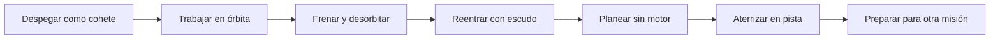

# 🧰 Recursos del transbordador

[🏠 Inicio](../../../README.md) · [🛬 Curso: Transbordadores](../README.md) · 🧰 Recursos

Glosario específico, enlaces y diagramas de apoyo del curso de transbordadores.
Amplia el [glosario general](../../../docs/05-glosario-general.md).

---

## 📖 Glosario específico

| Término | Definición |
| --- | --- |
| Orbitador | Nave alada del transbordador que lleva tripulación y carga y regresa a la pista. |
| Propulsores laterales | Cohetes que dan empuje extra en el despegue y luego se separan. |
| Tanque externo | Depósito que alimenta los motores del orbitador y se desecha en el ascenso. |
| Escudo térmico | Protección de losetas que soporta el calor de la reentrada. |
| Reentrada | Regreso a la atmósfera, con calor por fricción con el aire. |
| Planeo sin motor | Descenso final controlado solo por la aerodinámica, sin empuje. |
| Elevones | Superficies del ala que combinan cabeceo y alabeo. |
| Ángulo de reentrada | Inclinación con que la nave vuelve a la atmósfera. |
| Bahía de carga | Compartimento con puertas para desplegar cargas en órbita. |
| Senda de planeo | Trayectoria de descenso hacia la pista. |

---

## 🗺️ Diagrama del ciclo del transbordador

---

## 🔗 Enlaces y fuentes

- Marco legal: [⚖️ docs/07-marco-legal-chile.md](../../../docs/07-marco-legal-chile.md)
- Seguridad y límites: [🦺 docs/04-seguridad-y-limites.md](../../../docs/04-seguridad-y-limites.md)
- Registro de fuentes: [📚 manuales/fuentes.md](../../../manuales/fuentes.md)

Registrar cada recurso nuevo con su origen y licencia, siguiendo
[`recursos/README.md`](../../../recursos/README.md).

---

[🎓 Portada del curso](../README.md) · [⬅️ Anterior: Diseño de simulación](../simulacion/diseno-simulador-transbordador.md) · [➡️ Siguiente: Ejercicios](../ejercicios/ejercicios-transbordador.md)
