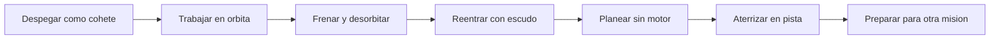

# 🧰 Recursos del transbordador

[🏠 Inicio](../../../README.md) · [🛬 Curso: Transbordadores](../README.md) · 🧰 Recursos

Glosario especifico, enlaces y diagramas de apoyo del curso de transbordadores.
Amplia el [glosario general](../../../docs/05-glosario-general.md).

---

## 📖 Glosario especifico

| Termino | Definicion |
| --- | --- |
| Orbitador | Nave alada del transbordador que lleva tripulacion y carga y regresa a la pista. |
| Propulsores laterales | Cohetes que dan empuje extra en el despegue y luego se separan. |
| Tanque externo | Deposito que alimenta los motores del orbitador y se desecha en el ascenso. |
| Escudo termico | Proteccion de losetas que soporta el calor de la reentrada. |
| Reentrada | Regreso a la atmosfera, con calor por friccion con el aire. |
| Planeo sin motor | Descenso final controlado solo por la aerodinamica, sin empuje. |
| Elevones | Superficies del ala que combinan cabeceo y alabeo. |
| Angulo de reentrada | Inclinacion con que la nave vuelve a la atmosfera. |
| Bahia de carga | Compartimento con puertas para desplegar cargas en orbita. |
| Senda de planeo | Trayectoria de descenso hacia la pista. |

---

## 🗺️ Diagrama del ciclo del transbordador

---

## 🔗 Enlaces y fuentes

- Marco legal: [⚖️ docs/07-marco-legal-chile.md](../../../docs/07-marco-legal-chile.md)
- Seguridad y limites: [🦺 docs/04-seguridad-y-limites.md](../../../docs/04-seguridad-y-limites.md)
- Registro de fuentes: [📚 manuales/fuentes.md](../../../manuales/fuentes.md)

Registrar cada recurso nuevo con su origen y licencia, siguiendo
[`recursos/README.md`](../../../recursos/README.md).

---

[🎓 Portada del curso](../README.md) · [⬅️ Anterior: Diseno de simulacion](../simulacion/diseno-simulador-transbordador.md)
