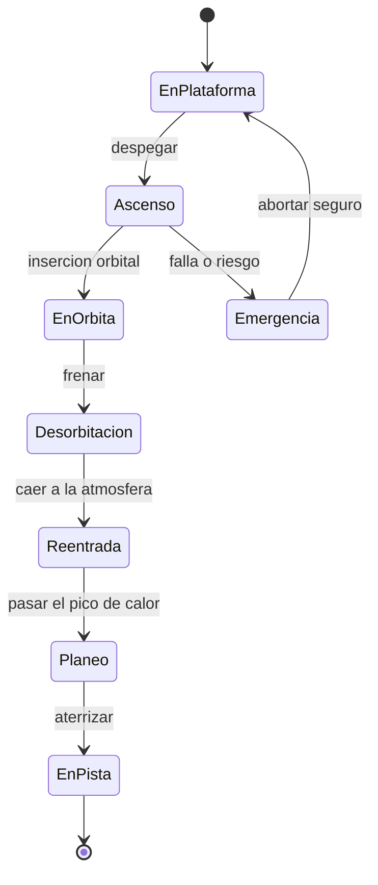

# 🎮 Diseño de simulación del transbordador

[🏠 Inicio](../../../README.md) · [🛬 Curso: Transbordadores](../README.md) · 🎮 Simulación

Simulación educativa del transbordador. Modela con rigor el despegue de cohete, la
órbita y, sobre todo, el reto distintivo: la reentrada con escudo y el planeo sin
motor hasta la pista.

## Objetivo de la simulación

Que el usuario aprenda a despegar como cohete, alcanzar una órbita estable,
desplegar carga, frenar para desorbitar, reingresar con el escudo bien orientado y
completar un planeo sin motor hasta aterrizar en la pista en un solo intento.

## Nivel de realismo

- Nivel elegido: se ofrece del 1 al 3 (ver `docs/03-niveles-de-realismo.md`).
- Justificación: la reentrada alada y el aterrizaje sin motor son de los retos más
  exigentes del repositorio, por lo que se recomienda como vehículo avanzado.

## Variables principales

| Variable | Tipo | Rango | Afecta a | Comentarios |
| --- | --- | --- | --- | --- |
| Altitud | numérica | 0-600 km | Fase de vuelo | Sube al ascender, baja al reingresar. |
| Velocidad | numérica | 0-8 km/s | Órbita y reentrada | Muy alta en órbita, baja en pista. |
| Ángulo de reentrada | numérica | 0-10 grados | Calor y frenado | Ni muy plano ni muy pronunciado. |
| Orientación del escudo | discreta | correcta o incorrecta | Supervivencia | El escudo debe ir por delante. |
| Temperatura del escudo | numérica | 0-1600 grados | Estructura | Crítica en la reentrada. |
| Energía de planeo | numérica | altura más velocidad | Alcance a la pista | Se administra sin motor. |
| Estado de separaciones | discreta | pendiente o hecha | Masa y empuje | Propulsores y tanque. |
| Tren de aterrizaje | discreta | recogido o desplegado | Aterrizaje | Se despliega antes del toque. |

## Ciclo básico

1. Leer entrada del usuario (empuje, actitud, palanca, timón, tren).
2. Actualizar propelente, energía y estado de separaciones.
3. Calcular la física según la fase (cohete, órbita o planeo).
4. Aplicar el entorno (densidad del aire, viento, calor de reentrada).
5. Actualizar altitud, velocidad, órbita y temperatura del escudo.
6. Refrescar instrumentos y alarmas (escudo, senda de planeo, tren).

## Modos de juego futuros

- Tutorial de despegue y órbita básica.
- Práctica de despliegue de carga con el brazo robotico.
- Desafíos de reentrada con ángulo y orientación correctos.
- Reto de planeo y aterrizaje sin motor de un solo intento.
- Escenarios de viento cruzado en la pista.

## Elementos fuera de alcance

- Datos técnicos sensibles de sistemas de lanzamiento reales o militares.
- Detalles que permitan replicar tecnología clasificada.
- Reproducción de operaciones peligrosas como si fueran seguras.

## Pendientes

- [ ] Definir valores por defecto de órbita y calor de reentrada.
- [ ] Prototipar el modelo de planeo sin motor.
- [ ] Ajustar el modelo de calor del escudo según ángulo y velocidad.
- [ ] Agregar fuentes técnicas públicas a [`manuales/fuentes.md`](../../../manuales/fuentes.md).

---

[⬅️ Anterior: Reglamentos](../reglamentos/reglamentos-transbordador.md) · [➡️ Siguiente: Recursos](../recursos/recursos-transbordador.md)
