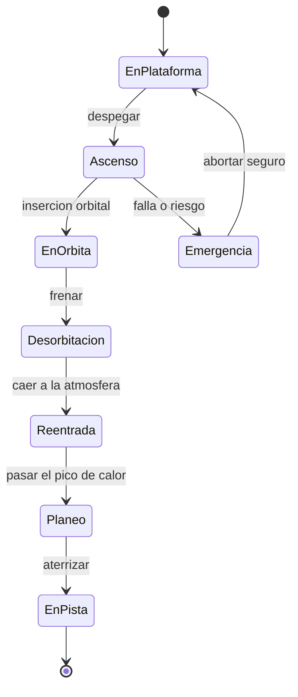

# 🎮 Diseno de simulacion del transbordador

[🏠 Inicio](../../../README.md) · [🛬 Curso: Transbordadores](../README.md) · 🎮 Simulacion

Simulacion educativa del transbordador. Modela con rigor el despegue de cohete, la
orbita y, sobre todo, el reto distintivo: la reentrada con escudo y el planeo sin
motor hasta la pista.

## Objetivo de la simulacion

Que el usuario aprenda a despegar como cohete, alcanzar una orbita estable,
desplegar carga, frenar para desorbitar, reingresar con el escudo bien orientado y
completar un planeo sin motor hasta aterrizar en la pista en un solo intento.

## Nivel de realismo

- Nivel elegido: se ofrece del 1 al 3 (ver `docs/03-niveles-de-realismo.md`).
- Justificacion: la reentrada alada y el aterrizaje sin motor son de los retos mas
  exigentes del repositorio, por lo que se recomienda como vehiculo avanzado.

## Variables principales

| Variable | Tipo | Rango | Afecta a | Comentarios |
| --- | --- | --- | --- | --- |
| Altitud | numerica | 0-600 km | Fase de vuelo | Sube al ascender, baja al reingresar. |
| Velocidad | numerica | 0-8 km/s | Orbita y reentrada | Muy alta en orbita, baja en pista. |
| Angulo de reentrada | numerica | 0-10 grados | Calor y frenado | Ni muy plano ni muy pronunciado. |
| Orientacion del escudo | discreta | correcta o incorrecta | Supervivencia | El escudo debe ir por delante. |
| Temperatura del escudo | numerica | 0-1600 grados | Estructura | Critica en la reentrada. |
| Energia de planeo | numerica | altura mas velocidad | Alcance a la pista | Se administra sin motor. |
| Estado de separaciones | discreta | pendiente o hecha | Masa y empuje | Propulsores y tanque. |
| Tren de aterrizaje | discreta | recogido o desplegado | Aterrizaje | Se despliega antes del toque. |

## Ciclo basico

1. Leer entrada del usuario (empuje, actitud, palanca, timon, tren).
2. Actualizar propelente, energia y estado de separaciones.
3. Calcular la fisica segun la fase (cohete, orbita o planeo).
4. Aplicar el entorno (densidad del aire, viento, calor de reentrada).
5. Actualizar altitud, velocidad, orbita y temperatura del escudo.
6. Refrescar instrumentos y alarmas (escudo, senda de planeo, tren).

## Modos de juego futuros

- Tutorial de despegue y orbita basica.
- Practica de despliegue de carga con el brazo robotico.
- Desafios de reentrada con angulo y orientacion correctos.
- Reto de planeo y aterrizaje sin motor de un solo intento.
- Escenarios de viento cruzado en la pista.

## Elementos fuera de alcance

- Datos tecnicos sensibles de sistemas de lanzamiento reales o militares.
- Detalles que permitan replicar tecnologia clasificada.
- Reproduccion de operaciones peligrosas como si fueran seguras.

## Pendientes

- [ ] Definir valores por defecto de orbita y calor de reentrada.
- [ ] Prototipar el modelo de planeo sin motor.
- [ ] Ajustar el modelo de calor del escudo segun angulo y velocidad.
- [ ] Agregar fuentes tecnicas publicas a [`manuales/fuentes.md`](../../../manuales/fuentes.md).

---

[⬅️ Anterior: Reglamentos](../reglamentos/reglamentos-transbordador.md) · [➡️ Siguiente: Recursos](../recursos/recursos-transbordador.md)
