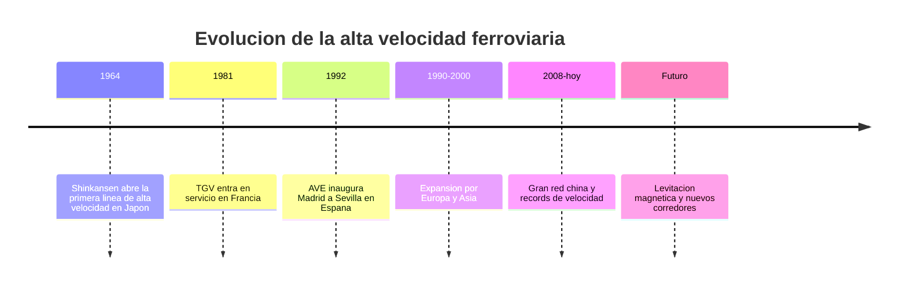

# 📜 Historia del tren de alta velocidad

[🏠 Inicio](../../../README.md) · [🚄 Curso: Tren de alta velocidad](../README.md) · 📜 Historia

## Origen

El tren de alta velocidad nace en Japón en 1964 con el Shinkansen, la primera
línea disenada desde cero para circular a más de 200 km/h con vía dedicada y sin
cruces a nivel. La idea era mover a muchos pasajeros entre grandes ciudades más
rápido que el automóvil y compitiendo con el avión en distancias medias. Francia
siguió con el TGV en 1981 y España con el AVE en 1992, consolidando el modelo en
Europa. Chile aún no tiene alta velocidad comercial; los proyectos locales se
tratan como por confirmar.

## Línea de tiempo

| Periodo | Hito | Importancia |
| --- | --- | --- |
| 1964 | Shinkansen Tokaido en Japón | Primera línea de alta velocidad del mundo. |
| 1981 | TGV en Francia | Lleva la alta velocidad a Europa. |
| 1992 | AVE Madrid a Sevilla en España | Alta velocidad en la península ibérica. |
| 1990-2000 | Expansión por Europa y Asia | Redes en Alemania, Italia, Corea. |
| 2008-presente | Gran red china | La mayor red de alta velocidad del mundo. |
| Futuro | Maglev y nuevos corredores | Levitación magnética y records de velocidad. |

## Evolución tecnológica

- **Tracción**: de la locomotora en cabeza a la tracción distribuida en varios coches.
- **Aerodinámica**: narices cada vez más largas para reducir resistencia y ruido.
- **Vía**: líneas dedicadas con curvas amplias, peralte y sin pasos a nivel.
- **Señalización**: paso de señales laterales a señalización en cabina ETCS/ERTMS.
- **Frenado**: freno regenerativo, dinámico, neumático y de corrientes de Foucault.
- **Materiales**: aluminio y compuestos ligeros para bajar masa y consumo.

## Tipos representativos

| Tipo | Origen | Característica destacada |
| --- | --- | --- |
| Shinkansen | Japón | Tracción distribuida, alta frecuencia de servicio. |
| TGV | Francia | Tracción concentrada con coches remolcados. |
| AVE | España | Trocha internacional sobre red de trocha ibérica. |
| ICE | Alemania | Alta velocidad integrada a la red europea. |
| CRH / CR | China | Mayor red mundial y grandes volumenes. |
| Maglev | Varios | Levitación magnética, sin contacto rueda-riel. |

## Impacto social y económico

La alta velocidad transformó los viajes de media distancia, restando cuota al
avión y al automóvil entre ciudades separadas por algunos cientos de kilómetros.
Impulso el desarrollo regional al acercar ciudades, aunque exige gran inversión
en infraestructura dedicada. Es un símbolo de modernización del transporte
público en varios países.

## Fuentes

- Registrar aquí las fuentes públicas consultadas.
- Enlazar cada fuente también en [`manuales/fuentes.md`](../../../manuales/fuentes.md).

---

[🎓 Portada del curso](../README.md) · [➡️ Siguiente: Características](../operacion/caracteristicas-tren-alta-velocidad.md)
